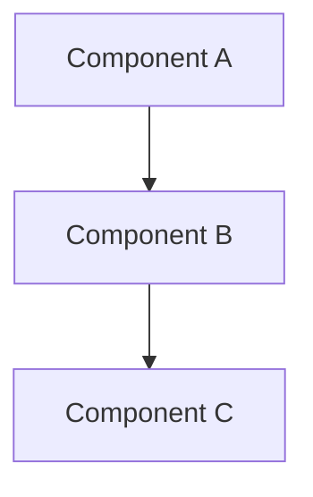
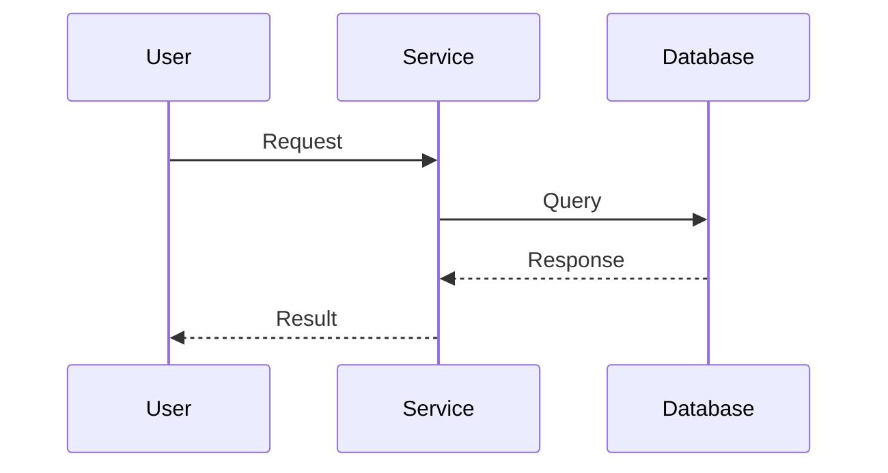
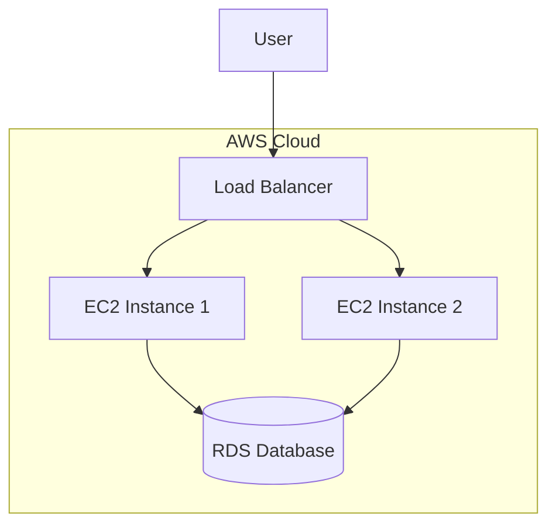
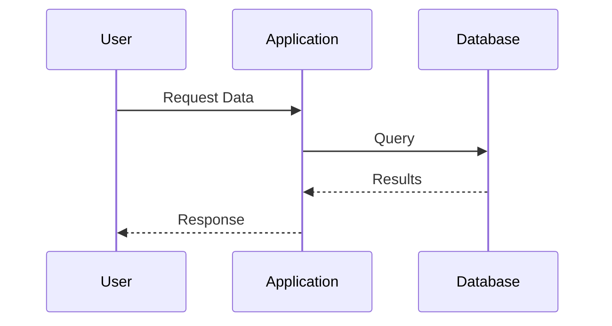
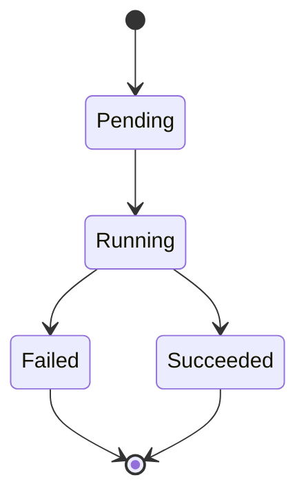
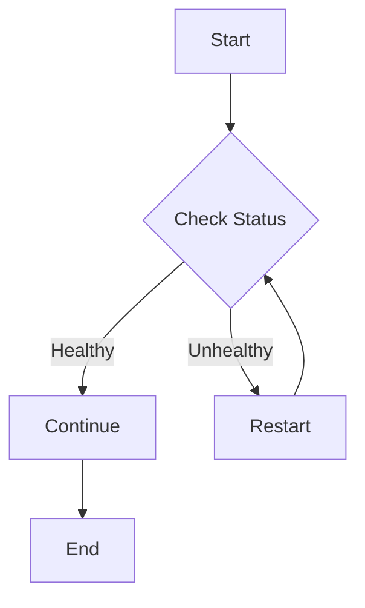
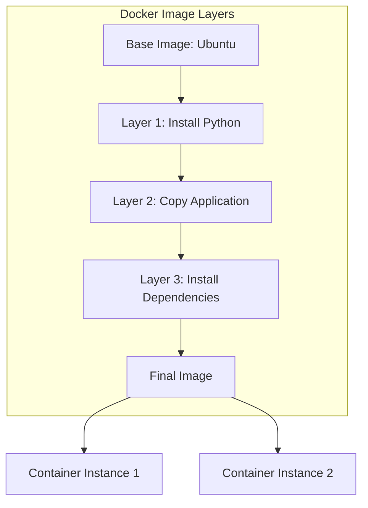

# Lecture Content Generation Rules (EARS Pattern)

## 🎯 Overview

**WHEN** generating educational content for the DevOps curriculum,
**THE SYSTEM SHALL** follow these structured rules for consistency and quality.

**WHERE** daily lectures are created,
**THE SYSTEM SHALL** include four mandatory components:
1. Service Understanding (서비스 이해)
2. Deep Dive
3. Hands-on Lab
4. Quiz

---

## 📚 Component 1: Service Understanding (서비스 이해)

### Mandatory Elements

**WHEN** creating Service Understanding content,
**THE SYSTEM SHALL** include ALL of the following elements:

#### 1. Background Information (배경 정보)
**WHERE** introducing a new service,
**THE SYSTEM SHALL** explain:
- Why this service was created
- What problem it solves
- Historical context and evolution
- Industry needs that led to its development

#### 2. Core Concepts (핵심 개념)
**THE SYSTEM SHALL** define:
- Main architectural components
- Key terminology and definitions
- How the service works (high-level)
- Relationship to other technologies

#### 3. Advantages and Disadvantages (장단점)
**THE SYSTEM SHALL** provide:
- **Advantages**: Minimum 3 benefits with real-world context
- **Disadvantages**: Minimum 2 limitations or challenges
- **Comparison**: When to use vs when NOT to use

#### 4. Common Use Cases (자주 사용되는 사례)
**THE SYSTEM SHALL** list:
- Minimum 3 real-world use cases
- Industry examples (e.g., "Netflix uses X for Y")
- Specific scenarios with context

#### 5. Related Services (연관 서비스)
**THE SYSTEM SHALL** identify:
- Services that integrate with this service
- Complementary technologies
- Alternative solutions
- Ecosystem context

#### 6. Official Documentation Links (공식 문서 링크)
**THE SYSTEM SHALL** provide:
- Official documentation URL
- Getting started guide URL
- API reference URL (if applicable)
- Community resources URL

#### 7. Infographic (인포그래픽)
**THE SYSTEM SHALL** include visual representation using:
- **Mermaid diagrams** for architecture/flow
- **SVG graphics** for concepts
- **ASCII diagrams** when appropriate
- **Image references** with descriptions

**IF** creating architecture diagrams,
**THEN** use Mermaid syntax:


**IF** creating sequence diagrams,
**THEN** use Mermaid syntax:


---

## 🔍 Component 2: Deep Dive

### Troubleshooting Scenarios

**WHEN** creating Deep Dive content,
**THE SYSTEM SHALL** focus on troubleshooting scenarios from official documentation.


### Scenario Structure

**FOR EACH** troubleshooting scenario,
**THE SYSTEM SHALL** include:

#### 1. Scenario Description (시나리오 설명)
**THE SYSTEM SHALL** provide:
- Clear problem statement
- Environment context
- Symptoms observed
- Error messages (if any)

#### 2. Root Cause Analysis (원인 분석)
**THE SYSTEM SHALL** explain:
- What is causing the issue
- Why this problem occurs
- Common misconceptions
- Related configuration issues

#### 3. Diagnosis Steps (원인 확인 방법)
**THE SYSTEM SHALL** provide step-by-step diagnosis:
- Commands to run for investigation
- Logs to check
- Metrics to monitor
- Configuration files to review

**Example format**:
```bash
# Step 1: Check service status
kubectl get pods -n namespace

# Step 2: View logs
kubectl logs pod-name -n namespace

# Step 3: Describe resource
kubectl describe pod pod-name -n namespace
```

#### 4. Resolution Steps (수정 방법)
**THE SYSTEM SHALL** provide detailed fix:
- Step-by-step resolution
- Configuration changes needed
- Commands to execute
- Files to modify

#### 5. Verification Steps (정상 확인 방법)
**THE SYSTEM SHALL** explain how to verify:
- Commands to confirm fix
- Expected output
- Metrics to monitor
- Tests to run


### Deep Dive Requirements

**WHEN** selecting troubleshooting scenarios,
**THE SYSTEM SHALL** prioritize:
- Official documentation troubleshooting sections
- Common production issues
- Configuration mistakes
- Integration problems
- Performance issues

**THE SYSTEM SHALL** include:
- Minimum 2 troubleshooting scenarios per service
- Real-world context for each scenario
- Prevention tips to avoid the issue

---

## 🛠️ Component 3: Hands-on Lab

### Lab Structure Requirements

**WHEN** creating Hands-on Lab content,
**THE SYSTEM SHALL** follow this mandatory structure:

#### 1. Lab Overview (실습 개요)
**THE SYSTEM SHALL** include:
- **Lab Title**: Clear, descriptive title
- **Purpose**: Why this lab is important
- **Learning Objectives**: What skills will be acquired
- **Estimated Time**: Expected completion time
- **Difficulty Level**: Beginner/Intermediate/Advanced

#### 2. Prerequisites (사전 요구사항)
**THE SYSTEM SHALL** clearly specify:
- Required software and versions
- Required accounts (AWS, GitHub, etc.)
- Required knowledge/skills
- Required files or resources

**Example format**:
```markdown
### Prerequisites
- Docker Desktop 24.0+ installed
- AWS CLI configured with credentials
- Basic understanding of containers
- GitHub account
- 2 GB free disk space
```


#### 3. Setup Instructions (환경 설정)
**THE SYSTEM SHALL** provide:
- Installation guides with links
- Configuration steps
- Verification commands
- Troubleshooting common setup issues

**IF** setup is complex,
**THEN** create separate setup documentation and link to it.

#### 4. Lab Steps (실습 단계)

**CRITICAL REQUIREMENTS**:
- **Minimum 7 steps** per lab
- **Maximum 3-4 actions** per step
- Each step must be clear and focused
- Each step must have verification

**WHEN** writing lab steps,
**THE SYSTEM SHALL** follow this format:

```markdown
### Step 1: [Action Description]

**Objective**: What this step accomplishes

**Commands**:
```bash
# Command with explanation
command-to-run --flag value
```

**Expected Output**:
```
Expected result here
```

**Verification**:
```bash
# How to verify this step worked
verification-command
```

**Troubleshooting**:
- Common issue 1: Solution
- Common issue 2: Solution
```

#### 5. Step Granularity Rules

**THE SYSTEM SHALL NOT**:
- Combine multiple major actions in one step
- Skip intermediate verification steps
- Assume implicit knowledge

**THE SYSTEM SHALL**:
- Break complex tasks into atomic steps
- Provide verification after each step
- Explain WHY each step is necessary


**Example of GOOD step breakdown**:
```markdown
### Step 1: Create Project Directory
### Step 2: Initialize Git Repository
### Step 3: Create Dockerfile
### Step 4: Build Docker Image
### Step 5: Test Image Locally
### Step 6: Tag Image for Registry
### Step 7: Push to Container Registry
### Step 8: Verify Image in Registry
```

**Example of BAD step breakdown** (too much in one step):
```markdown
### Step 1: Create project, initialize git, create Dockerfile, build and push image
```

#### 6. Lab Completion (실습 완료)
**THE SYSTEM SHALL** include:
- Summary of what was accomplished
- Key takeaways
- Next steps or advanced challenges
- Cleanup instructions (if applicable)

#### 7. Additional Resources (추가 자료)
**THE SYSTEM SHALL** provide:
- Links to related documentation
- Video tutorials (if available)
- Community resources
- Advanced reading materials

---

## 📝 Component 4: Quiz

### Quiz Structure

**WHEN** creating quiz questions,
**THE SYSTEM SHALL** include multiple question types:

#### Question Type 1: Knowledge Recall (지식 확인)
**THE SYSTEM SHALL** test:
- Basic concepts
- Terminology
- Key features
- Service capabilities

**Example**:
```markdown
**Question 1**: What is the primary purpose of Docker Compose?

A) To build Docker images
B) To orchestrate multi-container applications
C) To scan images for vulnerabilities
D) To manage Docker networks only

**Answer**: B
**Explanation**: Docker Compose is designed to define and run multi-container Docker applications using a YAML file.
```


#### Question Type 2: Scenario-Based (상황 대응)
**THE SYSTEM SHALL** test:
- Problem-solving skills
- Troubleshooting approach
- Best practices application
- Decision-making

**Example**:
```markdown
**Question 2**: Your Docker container keeps restarting with exit code 137. What is the most likely cause?

A) Syntax error in Dockerfile
B) Out of memory (OOM)
C) Port conflict
D) Network connectivity issue

**Answer**: B
**Explanation**: Exit code 137 indicates the container was killed by the system, typically due to out-of-memory (OOM) conditions. The container exceeded its memory limit.
```

#### Question Type 3: Command/Configuration (명령어/설정)
**THE SYSTEM SHALL** test:
- Command syntax knowledge
- Configuration understanding
- Parameter usage
- Best practices

**Example**:
```markdown
**Question 3**: Which command correctly creates a Docker volume named "data-vol"?

A) docker volume create data-vol
B) docker create volume data-vol
C) docker volume new data-vol
D) docker vol create data-vol

**Answer**: A
**Explanation**: The correct syntax is `docker volume create <volume-name>`.
```

#### Question Type 4: Comparison/Analysis (비교/분석)
**THE SYSTEM SHALL** test:
- Understanding of trade-offs
- Service comparison knowledge
- Architecture decisions
- Use case selection


**Example**:
```markdown
**Question 4**: When should you use Docker Swarm instead of Kubernetes?

A) When you need advanced networking features
B) When you want a simpler orchestration solution
C) When you need extensive third-party integrations
D) When managing thousands of containers

**Answer**: B
**Explanation**: Docker Swarm is simpler to set up and manage compared to Kubernetes, making it suitable for smaller deployments or teams that don't need Kubernetes' complexity.
```

### Quiz Requirements

**THE SYSTEM SHALL** include:
- **Minimum 5 questions** per daily topic
- **Minimum 10 questions** if multiple services covered
- Mix of question types (at least 2 types)
- All questions must have 4 answer choices
- All questions must have explanations

**THE SYSTEM SHALL** ensure:
- Questions test understanding, not memorization
- Distractors (wrong answers) are plausible
- Explanations provide learning value
- Questions align with learning objectives

---

## 🔄 Multi-Service Days

**WHEN** a single day covers multiple services,
**THE SYSTEM SHALL** apply the same rules to EACH service:

### Structure for Multi-Service Days

**FOR EACH** service on the day,
**THE SYSTEM SHALL** create:

1. **Service Understanding** section
   - All 7 mandatory elements
   - Infographic for each service

2. **Deep Dive** section
   - Minimum 1 troubleshooting scenario per service
   - Service-specific issues

3. **Hands-on Lab** section
   - Separate lab for each service OR
   - Integrated lab combining services (minimum 10 steps)

4. **Quiz** section
   - Minimum 5 questions per service OR
   - Combined quiz with minimum 10 questions total


### Example: Day with 2 Services

**Day 23: AWS 스토리지 (S3 + EBS)**

```markdown
## 오전: 서비스 이해

### Part 1: Amazon S3
#### 1. 배경 정보
[S3 background...]

#### 2. 핵심 개념
[S3 concepts...]

[... all 7 elements ...]

### Part 2: Amazon EBS
#### 1. 배경 정보
[EBS background...]

[... all 7 elements ...]

## 오후: Deep Dive

### S3 Troubleshooting Scenarios
#### Scenario 1: Access Denied Errors
[Complete troubleshooting flow...]

### EBS Troubleshooting Scenarios
#### Scenario 1: Volume Not Attaching
[Complete troubleshooting flow...]

## Hands-on Lab

### Lab 1: S3 Static Website Hosting (7+ steps)
[Detailed lab...]

### Lab 2: EBS Volume Management (7+ steps)
[Detailed lab...]

## Quiz (10 questions)
[5 S3 questions + 5 EBS questions]
```

---

## 📋 Content Quality Standards

### Language Requirements

**CRITICAL**: All lecture content MUST be written in Korean (한글).

**WHEN** writing content,
**THE SYSTEM SHALL**:
- Write ALL content in Korean (한글)
- Use clear, professional Korean language
- Explain technical terms in Korean with English in parentheses
  - Example: "컨테이너(Container)", "오케스트레이션(Orchestration)"
- Use consistent Korean terminology throughout
- Write in active voice
- Be concise but comprehensive

**THE SYSTEM SHALL NOT**:
- Write content in English (except for code, commands, and technical references)
- Mix Korean and English in sentences unnecessarily
- Use English when Korean equivalent exists

**Language Usage Examples**:

✅ **CORRECT**:
```markdown
## 서비스 이해

### 1. 배경 정보
Docker는 2013년에 등장한 컨테이너 기술입니다. 이전에는 가상 머신(Virtual Machine)을 
사용하여 애플리케이션을 격리했지만, 무겁고 느린 단점이 있었습니다.

### 2. 핵심 개념
- **컨테이너(Container)**: 애플리케이션과 의존성을 패키징한 실행 단위
- **이미지(Image)**: 컨테이너를 생성하기 위한 템플릿
```

❌ **INCORRECT**:
```markdown
## Service Understanding

### 1. Background Information
Docker is a container technology that appeared in 2013...
```

### Technical Terms Translation Guide

**THE SYSTEM SHALL** use these Korean translations:

| English | Korean | Usage |
|---------|--------|-------|
| Container | 컨테이너 | 컨테이너(Container) - first mention only |
| Image | 이미지 | 이미지 |
| Service | 서비스 | 서비스 |
| Deployment | 배포 | 배포(Deployment) |
| Pod | 파드 | 파드(Pod) |
| Node | 노드 | 노드(Node) |
| Cluster | 클러스터 | 클러스터 |
| Namespace | 네임스페이스 | 네임스페이스 |
| Volume | 볼륨 | 볼륨 |
| Network | 네트워크 | 네트워크 |
| Load Balancer | 로드 밸런서 | 로드 밸런서 |
| Auto Scaling | 오토 스케일링 | 오토 스케일링 |
| Pipeline | 파이프라인 | 파이프라인 |
| Repository | 리포지토리 | 리포지토리 |
| Registry | 레지스트리 | 레지스트리 |

### Code and Commands

**WHEN** including code, commands, or configuration files,
**THE SYSTEM SHALL**:
- Keep code/commands in original language (usually English)
- Write explanatory comments in Korean
- Write descriptions and explanations in Korean

**Example**:
```yaml
# docker-compose.yml
# 웹 애플리케이션과 데이터베이스를 정의하는 구성 파일
version: '3.8'

services:
  web:
    image: nginx:latest
    ports:
      - "80:80"  # 호스트 포트 80을 컨테이너 포트 80에 매핑
    depends_on:
      - db
  
  db:
    image: postgres:15
    environment:
      POSTGRES_PASSWORD: example  # 데이터베이스 비밀번호 설정
```


### Section Headings in Korean

**THE SYSTEM SHALL** use these standard Korean headings:

```markdown
# Day X: [주제명]

## 오전: 서비스 이해

### 1. 배경 정보
### 2. 핵심 개념
### 3. 장단점
### 4. 자주 사용되는 사례
### 5. 연관 서비스
### 6. 공식 문서 링크
### 7. 인포그래픽

## 오후: Deep Dive

### 시나리오 1: [문제 설명]
#### 시나리오 설명
#### 원인 분석
#### 원인 확인 방법
#### 수정 방법
#### 정상 확인 방법

## 실습 (Hands-on Lab)

### 실습 개요
### 사전 요구사항
### 환경 설정
### Step 1: [단계 설명]
### 실습 완료
### 추가 자료

## 퀴즈 (Quiz)

**질문 1**: [질문 내용]
**답**: [정답]
**설명**: [설명]
```

### Language and Tone

**WHEN** providing code examples,
**THE SYSTEM SHALL**:
- Use proper syntax highlighting
- Include comments explaining key lines
- Show complete, runnable examples
- Provide context before code
- Explain output after code

**Example format**:
```yaml
# docker-compose.yml
# This configuration defines a web application with database
version: '3.8'

services:
  web:
    image: nginx:latest
    ports:
      - "80:80"  # Map host port 80 to container port 80
    depends_on:
      - db
  
  db:
    image: postgres:15
    environment:
      POSTGRES_PASSWORD: example  # Set database password
```

### Visual Elements

**THE SYSTEM SHALL** include visuals for:
- Architecture diagrams (Mermaid)
- Process flows (Mermaid)
- Concept relationships (Mermaid)
- Data flows (Mermaid)

**Mermaid Diagram Types to Use**:

1. **Architecture Diagrams**:


2. **Sequence Diagrams**:



3. **State Diagrams**:


4. **Flowcharts**:


---

## 🎯 Content Generation Workflow

**WHEN** generating daily lecture content,
**THE SYSTEM SHALL** follow this workflow:

### Step 1: Analyze Day Requirements
**THE SYSTEM SHALL**:
- Review curriculum for the day
- Identify all services/topics
- Determine complexity level
- Check prerequisites

### Step 2: Gather Information
**THE SYSTEM SHALL**:
- Query ChromaDB collections for service documentation
- Extract troubleshooting scenarios from official docs
- Identify common use cases
- Find related services

### Step 3: Generate Service Understanding
**THE SYSTEM SHALL**:
- Create all 7 mandatory elements
- Generate appropriate infographics
- Include official documentation links
- Verify completeness

### Step 4: Create Deep Dive Content
**THE SYSTEM SHALL**:
- Select relevant troubleshooting scenarios
- Structure with 5-part format
- Include commands and verification
- Add prevention tips


### Step 5: Design Hands-on Lab
**THE SYSTEM SHALL**:
- Define clear learning objectives
- List all prerequisites
- Create minimum 7 detailed steps
- Add verification for each step
- Include troubleshooting tips

### Step 6: Create Quiz
**THE SYSTEM SHALL**:
- Generate minimum 5 questions (10 for multi-service)
- Mix question types
- Write clear explanations
- Ensure alignment with objectives

### Step 7: Review and Validate
**THE SYSTEM SHALL**:
- Verify all mandatory elements present
- Check step count (minimum 7)
- Validate code examples
- Ensure visual elements included
- Confirm quiz requirements met

---

## 📊 Quality Checklist

**BEFORE** delivering content,
**THE SYSTEM SHALL** verify:

### Service Understanding Checklist
- [ ] Background information provided
- [ ] Core concepts explained
- [ ] Advantages listed (minimum 3)
- [ ] Disadvantages listed (minimum 2)
- [ ] Use cases provided (minimum 3)
- [ ] Related services identified
- [ ] Official documentation links included
- [ ] Infographic/diagram included

### Deep Dive Checklist
- [ ] Minimum 2 scenarios per service
- [ ] Scenario description clear
- [ ] Root cause explained
- [ ] Diagnosis steps provided
- [ ] Resolution steps detailed
- [ ] Verification steps included
- [ ] Based on official documentation


### Hands-on Lab Checklist
- [ ] Lab overview with purpose
- [ ] Learning objectives stated
- [ ] Prerequisites clearly listed
- [ ] Setup instructions provided
- [ ] Minimum 7 steps included
- [ ] Each step has verification
- [ ] Maximum 3-4 actions per step
- [ ] Troubleshooting tips included
- [ ] Cleanup instructions provided

### Quiz Checklist
- [ ] Minimum 5 questions (10 for multi-service)
- [ ] Multiple question types used
- [ ] All questions have 4 choices
- [ ] All questions have explanations
- [ ] Questions test understanding
- [ ] Aligned with learning objectives

---

## 🔍 Example: Complete Daily Content

### Day 2: Docker 이미지 기초

```markdown
# Day 2: Docker 이미지 기초

## 오전: 서비스 이해

### 1. 배경 정보
Docker 이미지는 컨테이너를 실행하기 위한 템플릿입니다. 2013년 Docker가 등장하기 전에는...
[Complete background]

### 2. 핵심 개념
- **이미지 레이어**: 읽기 전용 파일 시스템 레이어
- **베이스 이미지**: 다른 이미지의 기반이 되는 이미지
[Complete concepts]

### 3. 장단점
**장점**:
- 일관된 환경 제공
- 빠른 배포 가능
- 버전 관리 용이

**단점**:
- 이미지 크기가 클 수 있음
- 레이어 관리 복잡성

### 4. 자주 사용되는 사례
- 웹 애플리케이션 배포
- 마이크로서비스 아키텍처
- CI/CD 파이프라인


### 5. 연관 서비스
- Docker Hub (이미지 레지스트리)
- Docker Compose (멀티 컨테이너 관리)
- Kubernetes (컨테이너 오케스트레이션)

### 6. 공식 문서 링크
- [Docker 이미지 공식 문서](https://docs.docker.com/engine/reference/commandline/images/)
- [Dockerfile 레퍼런스](https://docs.docker.com/engine/reference/builder/)
- [베스트 프랙티스](https://docs.docker.com/develop/dev-best-practices/)

### 7. 인포그래픽



## 오후: Deep Dive

### Scenario 1: 이미지 빌드 실패 - 레이어 캐싱 문제

#### 시나리오 설명
Dockerfile을 수정했는데 변경사항이 반영되지 않고 이전 버전이 계속 실행됩니다.

#### 원인 분석
Docker는 빌드 속도를 높이기 위해 레이어 캐싱을 사용합니다. 파일 내용이 변경되어도 
Dockerfile의 명령어가 동일하면 캐시된 레이어를 재사용합니다.

#### 원인 확인 방법
```bash
# Step 1: 빌드 로그 확인
docker build -t myapp:latest .

# 출력에서 "Using cache" 메시지 확인
# Step 2/5 : RUN apt-get update
#  ---> Using cache
#  ---> abc123def456
```


#### 수정 방법
```bash
# 방법 1: 캐시 없이 빌드
docker build --no-cache -t myapp:latest .

# 방법 2: 특정 시점부터 캐시 무효화
# Dockerfile에 ARG 추가
ARG CACHEBUST=1

# 빌드 시 값 변경
docker build --build-arg CACHEBUST=$(date +%s) -t myapp:latest .
```

#### 정상 확인 방법
```bash
# Step 1: 이미지 빌드 확인
docker images myapp:latest

# Step 2: 컨테이너 실행 및 변경사항 확인
docker run --rm myapp:latest cat /app/version.txt

# Step 3: 이미지 히스토리 확인
docker history myapp:latest
```

### Scenario 2: 이미지 크기가 너무 큼

[Complete second scenario...]

## Hands-on Lab

### Lab: Node.js 애플리케이션 Docker 이미지 생성

**Purpose**: Docker 이미지 생성, 최적화, 레지스트리 푸시 과정을 실습합니다.

**Learning Objectives**:
- Dockerfile 작성 방법 이해
- 멀티 스테이지 빌드 활용
- 이미지 최적화 기법 적용
- Docker Hub에 이미지 푸시

**Estimated Time**: 45분

**Difficulty**: Beginner

### Prerequisites
- Docker Desktop 24.0+ 설치
- Node.js 18+ 설치 (로컬 테스트용)
- Docker Hub 계정
- 텍스트 에디터 (VS Code 권장)


### Step 1: 프로젝트 디렉토리 생성

**Objective**: 실습을 위한 작업 공간을 준비합니다.

**Commands**:
```bash
# 프로젝트 디렉토리 생성
mkdir docker-nodejs-app
cd docker-nodejs-app

# 디렉토리 구조 확인
pwd
```

**Expected Output**:
```
/Users/username/docker-nodejs-app
```

**Verification**:
```bash
ls -la
```

### Step 2: Node.js 애플리케이션 파일 생성

**Objective**: 간단한 Express.js 웹 서버를 생성합니다.

**Commands**:
```bash
# package.json 생성
cat > package.json << 'EOF'
{
  "name": "docker-nodejs-app",
  "version": "1.0.0",
  "main": "server.js",
  "dependencies": {
    "express": "^4.18.0"
  }
}
EOF

# server.js 생성
cat > server.js << 'EOF'
const express = require('express');
const app = express();
const PORT = 3000;

app.get('/', (req, res) => {
  res.json({ message: 'Hello from Docker!' });
});

app.listen(PORT, () => {
  console.log(`Server running on port ${PORT}`);
});
EOF
```

**Verification**:
```bash
# 파일 생성 확인
ls -l
cat package.json
```


### Step 3: 기본 Dockerfile 작성

**Objective**: 첫 번째 Dockerfile을 작성합니다.

**Commands**:
```bash
cat > Dockerfile << 'EOF'
# Node.js 18 베이스 이미지 사용
FROM node:18

# 작업 디렉토리 설정
WORKDIR /app

# package.json 복사 및 의존성 설치
COPY package.json .
RUN npm install

# 애플리케이션 코드 복사
COPY server.js .

# 포트 노출
EXPOSE 3000

# 애플리케이션 실행
CMD ["node", "server.js"]
EOF
```

**Verification**:
```bash
cat Dockerfile
```

### Step 4: Docker 이미지 빌드

**Objective**: Dockerfile로부터 이미지를 빌드합니다.

**Commands**:
```bash
# 이미지 빌드 (태그: v1)
docker build -t nodejs-app:v1 .
```

**Expected Output**:
```
[+] Building 45.2s (10/10) FINISHED
 => [1/5] FROM docker.io/library/node:18
 => [2/5] WORKDIR /app
 => [3/5] COPY package.json .
 => [4/5] RUN npm install
 => [5/5] COPY server.js .
 => exporting to image
Successfully tagged nodejs-app:v1
```

**Verification**:
```bash
# 이미지 확인
docker images nodejs-app

# 이미지 크기 확인
docker images nodejs-app --format "{{.Repository}}:{{.Tag}} - {{.Size}}"
```

**Troubleshooting**:
- Error "Cannot find module 'express'": npm install이 실패했을 수 있습니다. --no-cache로 재빌드하세요.


### Step 5: 컨테이너 실행 및 테스트

**Objective**: 빌드한 이미지로 컨테이너를 실행하고 동작을 확인합니다.

**Commands**:
```bash
# 컨테이너 실행 (백그라운드, 포트 매핑)
docker run -d -p 3000:3000 --name nodejs-container nodejs-app:v1

# 컨테이너 상태 확인
docker ps
```

**Expected Output**:
```
CONTAINER ID   IMAGE           STATUS         PORTS                    NAMES
abc123def456   nodejs-app:v1   Up 5 seconds   0.0.0.0:3000->3000/tcp   nodejs-container
```

**Verification**:
```bash
# 애플리케이션 테스트
curl http://localhost:3000

# 로그 확인
docker logs nodejs-container
```

**Expected Response**:
```json
{"message":"Hello from Docker!"}
```

### Step 6: 멀티 스테이지 빌드로 최적화

**Objective**: 이미지 크기를 줄이기 위해 멀티 스테이지 빌드를 적용합니다.

**Commands**:
```bash
# 기존 컨테이너 정리
docker stop nodejs-container
docker rm nodejs-container

# 최적화된 Dockerfile 생성
cat > Dockerfile.optimized << 'EOF'
# Stage 1: Build
FROM node:18 AS builder
WORKDIR /app
COPY package.json .
RUN npm install --production

# Stage 2: Runtime
FROM node:18-alpine
WORKDIR /app
COPY --from=builder /app/node_modules ./node_modules
COPY server.js .
EXPOSE 3000
CMD ["node", "server.js"]
EOF

# 최적화된 이미지 빌드
docker build -f Dockerfile.optimized -t nodejs-app:v2 .
```


**Verification**:
```bash
# 이미지 크기 비교
docker images nodejs-app

# 예상 결과:
# nodejs-app:v1  ~1GB
# nodejs-app:v2  ~180MB
```

### Step 7: Docker Hub에 이미지 푸시

**Objective**: 생성한 이미지를 Docker Hub에 업로드합니다.

**Commands**:
```bash
# Docker Hub 로그인
docker login

# 이미지 태그 변경 (username을 본인 계정으로 변경)
docker tag nodejs-app:v2 username/nodejs-app:v2

# Docker Hub에 푸시
docker push username/nodejs-app:v2
```

**Expected Output**:
```
The push refers to repository [docker.io/username/nodejs-app]
v2: digest: sha256:abc123... size: 1234
```

**Verification**:
```bash
# 로컬 이미지 삭제 후 다시 풀
docker rmi username/nodejs-app:v2
docker pull username/nodejs-app:v2

# Docker Hub에서 확인
# https://hub.docker.com/r/username/nodejs-app
```

### Step 8: 정리 (Cleanup)

**Objective**: 실습에 사용한 리소스를 정리합니다.

**Commands**:
```bash
# 실행 중인 컨테이너 중지 및 삭제
docker stop nodejs-container 2>/dev/null || true
docker rm nodejs-container 2>/dev/null || true

# 이미지 삭제 (선택사항)
docker rmi nodejs-app:v1 nodejs-app:v2

# 작업 디렉토리 삭제 (선택사항)
cd ..
rm -rf docker-nodejs-app
```


### Lab Summary

**What You Accomplished**:
- Created a Node.js application
- Wrote a Dockerfile
- Built Docker images
- Optimized image size with multi-stage builds
- Pushed images to Docker Hub

**Key Takeaways**:
- Dockerfile은 이미지 생성의 청사진입니다
- 멀티 스테이지 빌드로 이미지 크기를 크게 줄일 수 있습니다
- Alpine 베이스 이미지는 프로덕션에 적합합니다

**Next Steps**:
- .dockerignore 파일 활용하기
- 이미지 보안 스캔 실습
- Docker Compose로 멀티 컨테이너 구성

## Quiz

**Question 1**: Docker 이미지의 레이어는 어떤 특성을 가지고 있습니까?

A) 읽기/쓰기 가능
B) 읽기 전용
C) 쓰기 전용
D) 실행 전용

**Answer**: B
**Explanation**: Docker 이미지의 레이어는 읽기 전용(read-only)입니다. 컨테이너가 실행될 때 
최상위에 쓰기 가능한 레이어가 추가됩니다.

---

**Question 2**: 다음 중 Docker 이미지 크기를 줄이는 방법이 아닌 것은?

A) Alpine 베이스 이미지 사용
B) 멀티 스테이지 빌드 사용
C) 모든 파일을 한 번에 COPY
D) 불필요한 패키지 제거

**Answer**: C
**Explanation**: 모든 파일을 한 번에 COPY하면 불필요한 파일까지 포함되어 이미지 크기가 
커집니다. .dockerignore를 사용하여 필요한 파일만 복사해야 합니다.


---

**Question 3**: Dockerfile에서 `COPY package.json .`과 `COPY . .`의 순서가 중요한 이유는?

A) 보안을 위해
B) 레이어 캐싱 최적화를 위해
C) 파일 권한 설정을 위해
D) 빌드 속도와 무관함

**Answer**: B
**Explanation**: package.json을 먼저 복사하고 npm install을 실행하면, 소스 코드가 변경되어도 
의존성 설치 레이어는 캐시를 사용할 수 있어 빌드 속도가 빨라집니다.

---

**Question 4**: 컨테이너가 exit code 137로 종료되었습니다. 가장 가능성 높은 원인은?

A) 애플리케이션 버그
B) 메모리 부족 (OOM)
C) 디스크 공간 부족
D) 네트워크 오류

**Answer**: B
**Explanation**: Exit code 137은 SIGKILL(128+9)을 의미하며, 일반적으로 메모리 부족으로 
시스템이 컨테이너를 강제 종료했을 때 발생합니다.

---

**Question 5**: 멀티 스테이지 빌드의 주요 장점은 무엇입니까?

A) 빌드 시간 단축
B) 최종 이미지 크기 감소
C) 보안 취약점 제거
D) 네트워크 속도 향상

**Answer**: B
**Explanation**: 멀티 스테이지 빌드는 빌드 도구와 중간 파일을 최종 이미지에서 제외하여 
이미지 크기를 크게 줄일 수 있습니다.
```

---

## 📝 Template Usage

**WHEN** generating content for a specific day,
**THE SYSTEM SHALL**:

1. Copy this template structure
2. Fill in service-specific information
3. Query ChromaDB for official documentation
4. Generate appropriate diagrams
5. Create detailed hands-on labs
6. Write comprehensive quizzes


**THE SYSTEM SHALL** ensure:
- All mandatory elements are present
- Content is accurate and up-to-date
- Examples are tested and working
- Diagrams are clear and informative
- Labs are achievable within time limits
- Quizzes test real understanding

---

## 🚫 Common Mistakes to Avoid

**THE SYSTEM SHALL NOT**:

### Content Mistakes
- Skip any mandatory elements
- Provide outdated information
- Use untested code examples
- Create labs with fewer than 7 steps
- Combine too many actions in one step
- Write quizzes without explanations

### Structure Mistakes
- Mix multiple services without clear separation
- Omit prerequisites for hands-on labs
- Forget verification steps
- Skip troubleshooting tips
- Ignore multi-service day requirements

### Quality Mistakes
- Use vague or unclear language
- Provide incomplete code examples
- Create unrealistic lab scenarios
- Write trivial quiz questions
- Omit visual elements

---

## ✅ Success Criteria

**Content is considered complete WHEN**:

1. **All 4 components present**:
   - ✓ Service Understanding (7 elements)
   - ✓ Deep Dive (2+ scenarios)
   - ✓ Hands-on Lab (7+ steps)
   - ✓ Quiz (5+ questions)

2. **Quality standards met**:
   - ✓ All code examples tested
   - ✓ All diagrams included
   - ✓ All links verified
   - ✓ All prerequisites listed

3. **Educational value delivered**:
   - ✓ Clear learning objectives
   - ✓ Practical, applicable knowledge
   - ✓ Real-world context
   - ✓ Progressive difficulty


---

## 🔄 Continuous Improvement

**WHEN** generating content over time,
**THE SYSTEM SHALL**:
- Learn from previous content quality
- Incorporate feedback
- Update examples with latest versions
- Refine troubleshooting scenarios
- Improve lab clarity

**THE SYSTEM SHALL** maintain:
- Consistency across all days
- Progressive difficulty curve
- Alignment with curriculum goals
- Industry best practices

---

## 📚 Reference Materials

**WHEN** creating content,
**THE SYSTEM SHALL** reference:

### Primary Sources
- Official service documentation (ChromaDB collections)
- Official troubleshooting guides
- Official best practices
- Official API references

### Secondary Sources
- Industry blogs (for use cases)
- Community tutorials (for examples)
- Stack Overflow (for common issues)
- GitHub repositories (for code examples)

### Quality Sources
- AWS Well-Architected Framework
- Docker Best Practices
- Kubernetes Documentation
- CNCF Projects Documentation

---

## 🎓 Educational Principles

**THE SYSTEM SHALL** follow these principles:

### Learning by Doing
- Hands-on labs are primary learning method
- Theory supports practice
- Immediate feedback through verification
- Progressive complexity

### Scaffolding
- Build on previous knowledge
- Clear prerequisites
- Step-by-step guidance
- Gradual independence


### Real-World Relevance
- Use cases from actual companies
- Production-ready examples
- Industry-standard practices
- Career-applicable skills

### Assessment for Learning
- Quizzes reinforce concepts
- Immediate feedback
- Explanations teach
- Multiple question types

---

## 🎯 Final Checklist

**BEFORE** delivering daily content,
**VERIFY**:

```markdown
## Day X: [Topic Name]

### Service Understanding
- [ ] 1. Background Information ✓
- [ ] 2. Core Concepts ✓
- [ ] 3. Advantages (3+) ✓
- [ ] 4. Disadvantages (2+) ✓
- [ ] 5. Use Cases (3+) ✓
- [ ] 6. Related Services ✓
- [ ] 7. Official Links ✓
- [ ] 8. Infographic/Diagram ✓

### Deep Dive
- [ ] Scenario 1 Complete (5 parts) ✓
- [ ] Scenario 2 Complete (5 parts) ✓
- [ ] Based on official docs ✓
- [ ] Commands tested ✓

### Hands-on Lab
- [ ] Overview with objectives ✓
- [ ] Prerequisites listed ✓
- [ ] Setup instructions ✓
- [ ] Step 1-7+ detailed ✓
- [ ] Each step verified ✓
- [ ] Troubleshooting included ✓
- [ ] Cleanup provided ✓

### Quiz
- [ ] 5+ questions ✓
- [ ] Multiple types ✓
- [ ] All have explanations ✓
- [ ] Aligned with objectives ✓

### Quality
- [ ] Code examples tested ✓
- [ ] Links verified ✓
- [ ] Diagrams clear ✓
- [ ] Language professional ✓
```

---

## 📖 Summary

This steering document defines the comprehensive rules for generating high-quality, 
consistent educational content for the DevOps curriculum.

**KEY REQUIREMENTS**:
- 4 mandatory components per day
- 7 elements in Service Understanding
- 2+ troubleshooting scenarios
- 7+ detailed lab steps
- 5+ quiz questions

**APPLY TO**:
- All daily content
- All services
- Multi-service days
- All difficulty levels

**ENSURES**:
- Consistency
- Quality
- Completeness
- Educational value


---

## 🌐 Korean Language Requirement Summary

**CRITICAL RULE**: ALL lecture content MUST be written in Korean (한글).

**THE SYSTEM SHALL**:
- Write all explanations, descriptions, and instructions in Korean
- Use Korean headings and section titles
- Provide Korean translations for technical terms on first use
- Use formal but accessible Korean tone (존댓말)
- Keep code, commands, and URLs in their original language

**EXCEPTIONS** (English allowed):
- Code examples and commands
- Configuration file contents
- URLs and links
- Technical API names
- Error messages in code output

**Example of Correct Language Usage**:

```markdown
# Day 2: Docker 이미지 기초

## 오전: 서비스 이해

### 1. 배경 정보

Docker 이미지(Image)는 컨테이너를 실행하기 위한 읽기 전용 템플릿입니다. 
2013년 Docker가 등장하기 전에는 가상 머신(Virtual Machine)을 사용하여 
애플리케이션을 격리했지만, 무겁고 느린 단점이 있었습니다.

### 실습 Step 1: 프로젝트 디렉토리 생성

**목표**: 실습을 위한 작업 공간을 준비합니다.

**명령어**:
```bash
# 프로젝트 디렉토리 생성
mkdir docker-nodejs-app
cd docker-nodejs-app
```

**예상 출력**:
```
/Users/username/docker-nodejs-app
```

**확인 방법**:
```bash
pwd
ls -la
```

**문제 해결**:
- 권한 오류 발생 시: sudo를 사용하거나 홈 디렉토리에서 실행하세요
```

**REMEMBER**: 
- Content = Korean (한글)
- Code = Original language
- Comments in code = Korean (한글)
