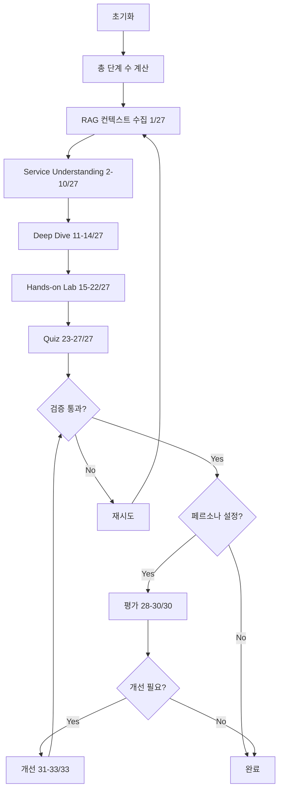

# LangGraph 진행률 추적 가이드

## 📊 개요

LangGraph 워크플로우에 세분화된 진행률 추적 기능이 추가되었습니다. 이제 강의 생성 과정의 각 단계를 실시간으로 모니터링할 수 있습니다.

## 🎯 주요 기능

### 1. 세분화된 단계 추적

각 에이전트의 내부 작업을 개별 단계로 추적합니다:

#### Service Understanding Agent (9 단계)
- 배경 정보 생성 (1단계)
- 핵심 개념 생성 (1단계)
- 장점 생성 (1단계)
- 단점 생성 (1단계)
- 사용 사례 생성 (1단계)
- 연관 서비스 생성 (1단계)
- 공식 문서 링크 생성 (1단계)
- 배경 인포그래픽 생성 (1단계)
- 개념 인포그래픽 생성 (1단계)

**총 9단계**

#### Deep Dive Agent (4 단계)
- 트러블슈팅 시나리오 1 생성 (1단계)
- 트러블슈팅 시나리오 2 생성 (1단계)
- 시나리오 1 인포그래픽 생성 (1단계)
- 시나리오 2 인포그래픽 생성 (1단계)

**총 4단계**

#### Hands-on Lab Agent (8 단계)
- 실습 단계 1-7 생성 (7단계)
- 실습 흐름도 인포그래픽 생성 (1단계)

**총 8단계**

#### Quiz Agent (5 단계)
- 퀴즈 문제 1-5 생성 (5단계)

**총 5단계**

#### Validation Agent (1 단계)
- 강의 내용 검증 (1단계)

**총 1단계**

#### Evaluator Agent (3 단계, 페르소나 설정 시)
- Service Understanding 평가 (1단계)
- Deep Dive 평가 (1단계)
- Quiz 평가 (1단계)

**총 3단계**

#### Improvement (3 단계, 개선 필요 시)
- Service Understanding 개선 (1단계)
- Deep Dive 개선 (1단계)
- Quiz 개선 (1단계)

**총 3단계**

### 2. 전체 단계 수 계산

```python
기본 단계 = 9 (SU) + 4 (DD) + 8 (Lab) + 5 (Quiz) + 1 (Validation) = 27단계

페르소나 설정 시:
  + 3 (Evaluation) = 30단계
  
개선 필요 시:
  + 3 (Improvement) = 33단계
```

### 3. 실시간 진행률 표시

```
================================================================================
📊 진행률: [████████████████████░░░░░░░░░░░░░░░░░░░░] 52.3%
🔄 현재 단계: Hands-on Lab - 실습 단계 생성 중...
✓ 완료: 14/27 단계
================================================================================
```

## 🔧 구현 세부사항

### LectureState 확장

```python
class LectureState(TypedDict):
    # ... 기존 필드들 ...
    
    # Progress tracking
    total_steps: int  # 전체 단계 수
    completed_steps: int  # 완료된 단계 수
    current_phase: str  # 현재 진행 중인 단계 이름
    progress_percentage: float  # 진행률 (0-100)
```

### 진행률 업데이트 함수

```python
def _update_progress(
    self, 
    state: LectureState, 
    phase: str, 
    steps_completed: int = 1
) -> LectureState:
    """진행률 업데이트 및 시각화"""
    state["completed_steps"] = state.get("completed_steps", 0) + steps_completed
    state["current_phase"] = phase
    state["progress_percentage"] = (state["completed_steps"] / state["total_steps"]) * 100
    
    # Progress bar 생성
    bar_length = 40
    filled = int(bar_length * state["progress_percentage"] / 100)
    bar = "█" * filled + "░" * (bar_length - filled)
    
    print(f"\n{'='*80}")
    print(f"📊 진행률: [{bar}] {state['progress_percentage']:.1f}%")
    print(f"🔄 현재 단계: {phase}")
    print(f"✓ 완료: {state['completed_steps']}/{state['total_steps']} 단계")
    print(f"{'='*80}\n")
    
    return state
```

### 각 노드에서의 사용 예시

```python
def _generate_service_understanding(self, state: LectureState) -> LectureState:
    # 시작
    state = self._update_progress(state, "서비스 이해 - 배경 정보 생성 중...", 0)
    
    # 7개 요소 생성
    su = self.su_agent.generate(...)
    state = self._update_progress(state, "서비스 이해 - 7개 요소 생성 완료", 7)
    
    # 인포그래픽 생성
    su_md = self.su_agent.format_markdown(...)
    state = self._update_progress(state, "서비스 이해 - 인포그래픽 생성 완료", 2)
    
    return state
```

## 📈 진행률 추적 흐름



## 🎨 진행률 표시 예시

### 초기 단계
```
================================================================================
📊 진행률: [██░░░░░░░░░░░░░░░░░░░░░░░░░░░░░░░░░░░░░░] 3.7%
🔄 현재 단계: RAG 컨텍스트 수집 중...
✓ 완료: 1/27 단계
================================================================================
```

### 중간 단계
```
================================================================================
📊 진행률: [████████████████████░░░░░░░░░░░░░░░░░░░░] 51.9%
🔄 현재 단계: Hands-on Lab - 실습 단계 생성 중...
✓ 완료: 14/27 단계
================================================================================
```

### 평가 단계 (페르소나 설정 시)
```
================================================================================
📊 진행률: [████████████████████████████████████░░░░] 93.3%
🔄 현재 단계: 평가 - 대학생 페르소나 기반 평가 중...
✓ 완료: 28/30 단계
================================================================================
```

### 완료 단계
```
================================================================================
📊 진행률: [████████████████████████████████████████] 100.0%
🔄 현재 단계: 완료
✓ 완료: 27/27 단계
================================================================================
```

## 🔍 동적 단계 수 조정

### 페르소나 평가 추가
```python
if state.get("persona"):
    base_steps += 3  # evaluation
```

### 개선 단계 추가 (런타임)
```python
if needs_improvement:
    state["total_steps"] = state.get("total_steps", 0) + 3
```

## 💡 사용 팁

### 1. 진행률 모니터링
- 각 단계의 소요 시간을 파악하여 병목 지점 식별
- 전체 프로세스의 예상 완료 시간 추정

### 2. 디버깅
- 특정 단계에서 멈춘 경우 해당 에이전트 로그 확인
- 진행률이 예상과 다른 경우 단계 수 계산 검증

### 3. 사용자 경험 개선
- 실시간 피드백으로 사용자 대기 시간 체감 감소
- 각 단계별 명확한 상태 메시지 제공

## 📊 성능 영향

### 오버헤드
- 진행률 업데이트: 무시할 수 있는 수준 (~1ms per update)
- 프로그레스 바 출력: 터미널 I/O 시간 (~5ms per update)

### 최적화
- 진행률 업데이트는 의미 있는 단계에서만 수행
- 프로그레스 바는 변경이 있을 때만 출력

## 🚀 향후 개선 사항

### 1. 웹 UI 통합
```python
# Gradio 진행률 바 연동
progress_bar = gr.Progress()
progress_bar.update(state["progress_percentage"] / 100)
```

### 2. 로그 파일 저장
```python
# 진행률 로그를 파일로 저장
with open("progress.log", "a") as f:
    f.write(f"{timestamp} - {phase} - {progress}%\n")
```

### 3. 예상 완료 시간 계산
```python
# 평균 단계 소요 시간 기반 ETA 계산
elapsed_time = time.time() - start_time
avg_time_per_step = elapsed_time / completed_steps
remaining_steps = total_steps - completed_steps
eta = avg_time_per_step * remaining_steps
```

### 4. 세부 단계 추가
- 각 인포그래픽 생성을 별도 단계로 추적
- LLM 호출 횟수 추적
- 파일 저장 작업 추적

## 📝 예제 출력

### 전체 실행 로그 예시

```
================================================================================
🚀 LangGraph Workflow: Week 1, Day 3 - Docker 컨테이너 관리
Services: Docker
Max Retries: 2
🎯 Persona: 대학생 (from .env DEFAULT_PERSONA)
================================================================================

📊 총 예상 단계: 30개
================================================================================

================================================================================
📊 진행률: [█░░░░░░░░░░░░░░░░░░░░░░░░░░░░░░░░░░░░░░] 3.3%
🔄 현재 단계: RAG 컨텍스트 수집 중...
✓ 완료: 1/30 단계
================================================================================

📚 Collecting RAG context from ChromaDB...
✓ Collected 15234 characters of context

================================================================================
📊 진행률: [███░░░░░░░░░░░░░░░░░░░░░░░░░░░░░░░░░░░░] 6.7%
🔄 현재 단계: RAG 컨텍스트 수집 완료
✓ 완료: 2/30 단계
================================================================================

🎓 [Service Understanding Agent] Generating...

================================================================================
📊 진행률: [███░░░░░░░░░░░░░░░░░░░░░░░░░░░░░░░░░░░░] 6.7%
🔄 현재 단계: 서비스 이해 - 배경 정보 생성 중...
✓ 완료: 2/30 단계
================================================================================

================================================================================
📊 진행률: [███████████░░░░░░░░░░░░░░░░░░░░░░░░░░░░] 30.0%
🔄 현재 단계: 서비스 이해 - 7개 요소 생성 완료
✓ 완료: 9/30 단계
================================================================================

  📊 Generating infographic for background...
  📊 Generating infographic for concepts...

================================================================================
📊 진행률: [██████████████░░░░░░░░░░░░░░░░░░░░░░░░░] 36.7%
🔄 현재 단계: 서비스 이해 - 인포그래픽 생성 완료
✓ 완료: 11/30 단계
================================================================================

✓ Service Understanding complete
💾 Saved: lectures/week1/day3/service_understanding.md

[... 중간 단계 생략 ...]

================================================================================
📊 진행률: [████████████████████████████████████░░░░] 93.3%
🔄 현재 단계: 평가 - service_understanding 평가 완료
✓ 완료: 28/30 단계
================================================================================

✅ Content is appropriate for persona: 대학생

================================================================================
📊 진행률: [████████████████████████████████████████] 100.0%
🔄 현재 단계: 완료
✓ 완료: 30/30 단계
================================================================================

================================================================================
✅ Lecture generation complete!
📂 Saved 11 files
================================================================================
```

## 🎯 결론

세분화된 진행률 추적 기능으로:
- ✅ 사용자는 실시간으로 진행 상황을 파악할 수 있습니다
- ✅ 각 에이전트의 작업을 개별적으로 모니터링할 수 있습니다
- ✅ 전체 프로세스의 투명성이 향상되었습니다
- ✅ 디버깅과 성능 분석이 용이해졌습니다

이제 LangGraph 워크플로우는 단순히 "생성 중..."이 아닌, 정확히 어떤 단계를 진행하고 있는지 실시간으로 보여줍니다! 🚀
