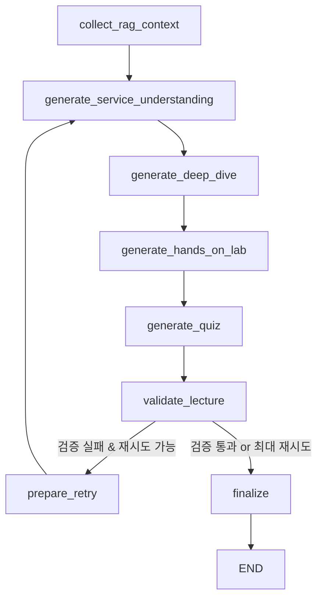

# 🚀 DevOps 교육 과정 AI 강의 생성 시스템

6개월 DevOps 교육 과정을 위한 Multi-Agent RAG 기반 강의 자료 자동 생성 시스템

## 📋 개요

이 프로젝트는 Docker, Kubernetes, AWS, Terraform, CI/CD 등 DevOps 전 영역을 다루는 6개월(26주, 130일) 교육 과정의 강의 자료를 자동으로 생성하는 AI 시스템입니다.

**핵심 기능**:
- 📚 **일별 강의 자료 자동 생성**: 서비스 이해, Deep Dive, 실습, 퀴즈 포함
- 🤖 **Multi-Agent 시스템**: 15개 전문 Agent가 각 기술 영역 담당
- 🔍 **RAG 기반 검색**: ChromaDB를 활용한 공식 문서 기반 답변
- 🎯 **커리큘럼 기반**: 체계적인 6개월 학습 로드맵 제공
- 🎭 **페르소나 기반 평가**: 대상 학습자에 맞는 난이도 자동 조정 🆕

## 🏗️ 시스템 아키텍처

```
사용자 질의
    ↓
Orchestrator Agent (라우팅)
    ↓
┌─────────────────────────────────────────────────┐
│  전문 Agents (병렬 실행)                          │
├─────────────────────────────────────────────────┤
│ Docker | K8s | AWS | Istio | CI/CD | GitOps    │
│ Terraform | FinOps | MSA | Lab | Interview     │
└─────────────────────────────────────────────────┘
    ↓
ChromaDB RAG 검색 (12개 Collection)
    ↓
강의 자료 생성 (한글)
```

## 🎓 교육 과정 구조

### 6개월 커리큘럼 (26주, 130일)

| 기간 | 주제 | 주요 내용 |
|------|------|-----------|
| **1개월차** (1-4주) | Docker & MSA | 컨테이너 기초, Dockerfile, Compose, Swarm, MSA 설계 |
| **2개월차** (5-8주) | AWS 클라우드 | EC2, S3, RDS, VPC, ECS, EKS, Lambda, CloudFormation |
| **3개월차** (9-12주) | Kubernetes 기초 | Pods, Services, Volumes, RBAC, 공식 문서 Deep Dive |
| **4개월차** (13-16주) | K8s 심화 & Istio | EKS, Helm, Operators, Service Mesh, 트래픽 관리 |
| **5개월차** (17-20주) | CI/CD & GitOps | GitHub Actions, Jenkins, ArgoCD, Progressive Delivery |
| **6개월차** (21-26주) | Terraform & FinOps | IaC, State 관리, AWS 배포, 비용 최적화, 최종 프로젝트 |

## 🤖 Multi-Agent 시스템

### 14개 전문 Agent

1. **Orchestrator Agent** - 요청 라우팅 및 응답 통합
2. **Curriculum Agent** - 커리큘럼 관리 및 학습 순서 안내
3. **Docker Agent** - Docker 전문가
4. **Kubernetes Agent** - K8s 전문가
5. **AWS Agent** - AWS 클라우드 전문가
6. **Istio Agent** - Service Mesh 전문가
7. **CICD Agent** - CI/CD 파이프라인 전문가
8. **GitOps Agent** - GitOps & ArgoCD 전문가
9. **Terraform Agent** - IaC 전문가
10. **FinOps Agent** - 비용 최적화 전문가
11. **MSA Agent** - 마이크로서비스 아키텍처 전문가
12. **Lab Agent** - 실습 가이드 제공
13. **Interview Agent** - 기술 면접 준비 지원
14. **Validation Agent** - 강의 품질 검증 및 자동 재생성
15. **Evaluator Agent** - 페르소나 기반 난이도 평가 및 콘텐츠 개선 🆕

각 Agent는 독립적인 ChromaDB Collection을 사용하여 전문 영역의 공식 문서를 검색합니다.

## 📚 강의 자료 구성 (EARS 패턴)

매일 생성되는 강의 자료는 4가지 필수 컴포넌트로 구성됩니다:

### 1. 서비스 이해 (오전)
- 배경 정보 및 역사
- 핵심 개념 및 아키텍처
- 장단점 분석
- 실제 사용 사례
- 연관 서비스
- 공식 문서 링크
- 인포그래픽 (Mermaid 다이어그램)

### 2. Deep Dive (오후)
- 공식 문서 기반 트러블슈팅 시나리오 (최소 2개)
- 시나리오 설명 → 원인 분석 → 진단 방법 → 해결 방법 → 검증

### 3. Hands-on Lab (실습)
- 실습 개요 및 학습 목표
- 사전 요구사항
- **최소 7단계** 상세 실습 (각 단계당 3-4개 액션)
- 단계별 검증 및 트러블슈팅
- 정리 및 추가 자료

### 4. Quiz (퀴즈)
- **최소 5문제** (멀티 서비스 시 10문제)
- 4가지 질문 유형: 지식 확인, 시나리오 대응, 명령어/설정, 비교/분석
- 모든 문제에 상세 설명 포함

## 🎨 Gradio UI

### 웹 기반 파이프라인 시각화

Gradio UI를 통해 강의 생성 파이프라인을 시각적으로 모니터링하고 제어할 수 있습니다.

**주요 기능**:
- 📚 **커리큘럼 선택**: 드롭다운에서 Week/Day 선택 (130일 전체 지원)
- 🔄 **재시도 설정**: 검증 실패 시 재생성 횟수 조정 (0-5)
- 🚀 **두 가지 생성 모드**:
  - **LangGraph 워크플로우** (권장): 상태 기반, 자동 피드백 및 재생성
  - **전통적 방식**: 단순 재시도 루프, 빠른 실행
- 📊 **실시간 로그**: 파이프라인 실행 과정 실시간 모니터링
- ✅ **검증 결과**: 품질 점수 및 이슈 상세 정보
- 📂 **파일 목록**: 생성된 강의 파일 경로 표시

### 🆕 강의 보기 & 재생성 기능 (신규!)

`app_with_viewer.py`는 기존 기능에 **강의 파일 보기**와 **섹션별 재생성** 기능을 추가한 확장 버전입니다.

**추가 기능**:
- 📂 **강의 파일 보기**: 생성된 강의를 UI에서 직접 확인
  - 4개 섹션별 탭: 서비스 이해, Deep Dive, 실습 가이드, 퀴즈
  - 파일 크기 및 상태 정보 표시
- 🔄 **섹션별 재생성**: 특정 섹션만 선택하여 재생성
  - 전체 강의를 재생성할 필요 없이 특정 섹션만 수정
  - 시간과 리소스 절약
- 💬 **커스텀 프롬프트**: 추가 요구사항을 반영하여 재생성
  - 예: "실습 단계를 10개로 늘려줘"
  - 예: "퀴즈를 더 어렵게 만들어줘"
  - 예: "Deep Dive에 성능 최적화 시나리오 추가"
- 🔁 **자동 리로드**: 재생성 후 파일 자동 새로고침

**사용 시나리오**:
1. **강의 생성 후 확인**: 생성된 강의를 UI에서 바로 확인
2. **실습 가이드 보강**: 실습 단계를 늘리거나 트러블슈팅 팁 추가
3. **퀴즈 난이도 조정**: 퀴즈를 더 어렵게 만들거나 문제 수 증가
4. **Deep Dive 시나리오 추가**: 특정 트러블슈팅 시나리오 추가
5. **반복 개선**: 생성 → 확인 → 재생성 → 확인 사이클로 품질 향상

📖 **상세 가이드**: [LECTURE_VIEWER_GUIDE.md](./LECTURE_VIEWER_GUIDE.md)

### Gradio UI 실행

```bash
# 기본 UI (강의 생성만)
python app.py
# http://localhost:7860

# 확장 UI (강의 생성 + 보기 + 재생성) 🆕
python app_with_viewer.py
# http://localhost:7861
```

**사용 방법**:
1. 커리큘럼 드롭다운에서 생성할 강의 선택
2. 재시도 횟수 설정 (권장: 2)
3. 생성 방식 선택 (LangGraph 워크플로우 권장)
4. 버튼 클릭하여 강의 생성 시작
5. 실시간 로그 및 결과 확인

📖 **기본 UI 가이드**: [GRADIO_UI_GUIDE.md](./GRADIO_UI_GUIDE.md)

## 🚀 빠른 시작

### 1. 사전 요구사항

- Python 3.10+
- Ollama (로컬 LLM 실행)
- Docker & Docker Compose (ChromaDB 실행)

### 2. 설치

```bash
# 1. 저장소 클론
git clone <repository-url>
cd kdt_devops_lecture_2026

# 2. Python 가상환경 생성 및 활성화
python -m venv .venv

# Windows
.venv\Scripts\activate

# Linux/Mac
source .venv/bin/activate

# 3. 의존성 설치
pip install -r requirements.txt

# 4. ChromaDB 시작 (Docker)
docker-compose up -d

# 5. Ollama 모델 다운로드
ollama pull qwen3:8b

# 6. 환경 변수 설정
cp .env.example .env
# .env 파일 편집하여 필요한 설정 추가
```

### 3. 데이터 수집 (최초 1회)

```bash
# 공식 문서 크롤링 및 ChromaDB 저장
python src/ingest_official_docs.py
```

### 4. 사용 방법

#### 방법 1: Gradio UI (권장)

```bash
# Gradio 웹 인터페이스 시작
python app.py

# 브라우저에서 접속
# http://localhost:7860
```

**Gradio UI 기능**:
- 📚 커리큘럼 드롭다운에서 Week/Day 선택
- 🔄 재시도 횟수 설정 (0-5, 권장: 2)
- 🚀 생성 방식 선택:
  - **LangGraph 워크플로우** (권장): 상태 기반, 자동 피드백
  - **전통적 방식**: 단순 재시도 루프
- 📊 실시간 로그 모니터링
- ✅ 검증 결과 및 품질 점수 확인
- 📂 생성된 파일 목록 표시

#### 방법 2: CLI (명령줄)

```bash
# LangGraph 워크플로우로 강의 생성 (권장)
python generate_lecture.py --week 1 --day 2 --use-langgraph

# 전통적 방식으로 강의 생성
python generate_lecture.py --week 1 --day 2

# 재시도 횟수 설정
python generate_lecture.py --week 1 --day 2 --use-langgraph --max-retries 3

# 검증 스킵 (권장하지 않음)
python generate_lecture.py --week 1 --day 2 --skip-validation

# 커리큘럼 목록 보기
python generate_lecture.py --list
```

#### 방법 3: 강의 보기 & 재생성 (신규! 🆕)

```bash
# 확장 UI 실행 (포트 7861)
python app_with_viewer.py

# 브라우저에서 접속
http://localhost:7861
```

**주요 기능**:
- 📂 **강의 파일 보기**: 생성된 강의를 UI에서 직접 확인
- 🔄 **섹션별 재생성**: 특정 섹션만 선택하여 재생성
- 💬 **커스텀 프롬프트**: 추가 요구사항을 반영하여 재생성
- 🔁 **자동 리로드**: 재생성 후 파일 자동 새로고침

**사용 예시**:
1. 강의 생성 탭에서 Week 1, Day 3 생성
2. 강의 보기 & 재생성 탭으로 이동
3. Week 1, Day 3 선택 후 "강의 파일 로드"
4. 각 섹션 내용 확인 (서비스 이해, Deep Dive, 실습, 퀴즈)
5. 수정이 필요한 섹션 선택 (예: "퀴즈")
6. 추가 요구사항 입력 (예: "퀴즈를 10개로 늘려줘")
7. "섹션 재생성" 클릭
8. 업데이트된 내용 자동 표시

📖 **상세 가이드**: [LECTURE_VIEWER_GUIDE.md](./LECTURE_VIEWER_GUIDE.md)

#### 방법 4: 독립 검증

```bash
# 생성된 강의 검증
python validate_lecture.py --week 1 --day 2

# 자동 수정 포함 검증
python validate_lecture.py --week 1 --day 2 --auto-fix

# 피드백 표시
python validate_lecture.py --week 1 --day 2 --show-feedback
```

```bash
# Python 3.9+
python --version

# Docker Desktop
docker --version
```

### 2. 설치

```bash
# 저장소 클론
git clone <repository-url>
cd kdt_devops_lecture_2026

# 가상환경 생성 및 활성화
python -m venv .venv
.venv\Scripts\activate  # Windows
# source .venv/bin/activate  # Linux/Mac

# 의존성 설치
pip install -r requirements.txt
```

### 3. ChromaDB 실행

```bash
# Docker Compose로 ChromaDB 시작
docker-compose up -d

# 연결 확인
docker ps | findstr chromadb
```

### 4. 환경 변수 설정

```bash
# .env 파일 생성
copy .env.example .env

# .env 파일 편집하여 API 키 입력
notepad .env
```

`.env` 파일 예시:
```env
# LLM Provider: "openai" or "ollama"
LLM_PROVIDER=openai

# OpenAI 설정 (LLM_PROVIDER=openai인 경우)
OPENAI_API_KEY=sk-your-api-key-here
OPENAI_MODEL=gpt-4o

# Ollama 설정 (LLM_PROVIDER=ollama인 경우)
OLLAMA_BASE_URL=http://localhost:11434
OLLAMA_MODEL=qwen2.5:7b

# ChromaDB 설정
CHROMA_HOST=localhost
CHROMA_PORT=8000
```

### 5. 데이터 수집

```bash
# 커리큘럼 데이터 수집
python src/data_ingestion.py

# 공식 문서 크롤링 (선택사항, 10-20분 소요)
python src/ingest_official_docs.py --service all

# 또는 개별 서비스만
python src/ingest_official_docs.py --service docker
python src/ingest_official_docs.py --service kubernetes
```

### 6. 강의 자료 생성

#### 방법 1: LangGraph 워크플로우 (권장) 🚀

LangGraph를 사용하면 상태 기반 워크플로우로 검증과 재생성이 자동으로 처리됩니다:

```bash
# LangGraph 워크플로우로 강의 생성
python generate_lecture.py --week 1 --day 3 --use-langgraph

# 재시도 횟수 조정
python generate_lecture.py --week 1 --day 3 --use-langgraph --max-retries 3
```

**LangGraph 워크플로우 장점**:
- ✅ 상태 기반 워크플로우로 명확한 흐름 제어
- ✅ 검증 실패 시 자동으로 피드백 생성 및 재생성
- ✅ 각 단계별 상태 추적 및 디버깅 용이
- ✅ 조건부 분기로 효율적인 재시도 로직

**워크플로우 흐름**:
```
RAG 수집 → 서비스 이해 생성 → Deep Dive 생성 → 실습 생성 → 퀴즈 생성
    ↓
검증 (Validation Agent) - Auto-fix 실행
    ↓
[통과] → 완료
[실패] → 피드백 생성 → 재생성 (최대 max_retries 회)
```

### 🔍 Validation Agent 기능

**Validation Agent**는 생성된 강의의 품질을 검증하고 자동으로 일반적인 오류를 수정합니다:

#### 검증 항목

- ✅ **파일 존재**: 필수 파일 확인 (service_understanding.md, deep_dive.md, quiz.md, 7+ handson_step*.md)
- ✅ **콘텐츠 길이**: 섹션별 최소 글자 수 확인
- ✅ **필수 섹션**: 모든 필수 섹션 포함 여부
- ✅ **Mermaid 다이어그램**: 올바른 백틱 문법 (```) 확인
- ✅ **최소 개수**:
  - 장점: 3개 이상
  - 단점: 2개 이상
  - 사용 사례: 3개 이상
  - 트러블슈팅 시나리오: 2개 이상
  - 실습 단계: 7개 이상
  - 퀴즈 문제: 5개 이상

#### 자동 수정 (Auto-Fix)

검증 전에 자동으로 일반적인 오류를 수정합니다:

- 🔧 **Mermaid 백틱 수정**: 잘못된 백틱 개수를 올바른 형식(3개)으로 변환
  - `mermaid → ```mermaid
  - ``mermaid → ```mermaid
  - ````mermaid → ```mermaid
  - `````mermaid → ```mermaid
  - 닫는 백틱: `, ``, ````, ````` → ```

#### 품질 점수

- **점수 범위**: 0-100
- **통과 기준**: 점수 ≥ 70 AND Critical 이슈 없음
- **감점**:
  - Critical: -15점
  - Warning: -5점
  - Info: -1점

자세한 내용은 [VALIDATION_IMPROVEMENTS.md](./VALIDATION_IMPROVEMENTS.md)를 참조하세요.

### 🎯 Evaluator Agent 기능 (신규! 🆕)

**Evaluator Agent**는 페르소나 기반으로 강의 내용의 난이도와 이해도를 평가하고 자동으로 개선합니다:

#### 8가지 페르소나

- 📚 **초등학생**: 매우 쉬운 설명, 많은 비유, 단계별 상세 설명
- 📚 **중학생**: 쉬운 설명, 실생활 비유, 개념 중심 설명
- 📚 **고등학생**: 명확한 설명, 기술 용어 설명 포함, 실습 중심
- 🎓 **대학생**: 기술적 설명, 이론과 실습 균형, 심화 내용 포함
- 💼 **주니어_DevOps_1년차**: 실무 중심, 트러블슈팅, 베스트 프랙티스
- 💼 **주니어_DevOps_2년차**: 고급 패턴, 아키텍처 설계, 성능 최적화
- 🏆 **시니어_DevOps**: 아키텍처 패턴, 엔터프라이즈 솔루션, 고급 최적화
- 🔄 **IT_비전공자**: 매우 상세한 설명, 용어 정의, 단계별 가이드

#### 평가 기준

- ✅ **난이도 평가**: 너무 어려움/약간 어려움/적절함/약간 쉬움/너무 쉬움
- ✅ **이해도 평가**: 우수/양호/보통/미흡/불량
- ✅ **구체적 문제점**: 전문 용어, 개념 설명, 예시, 단계별 설명, 사전 지식
- ✅ **개선 제안**: 추가 설명, 보완 예시, 단순화, 배경 지식

#### 워크플로우 통합

```
검증 통과 → 페르소나 평가 → [개선 필요] → 콘텐츠 개선 → 재검증
                          → [적절함] → 완료
```

#### 사용 방법

**🔧 기본 페르소나 설정 (.env 파일)**:
```bash
# .env 파일에서 기본 페르소나 설정
DEFAULT_PERSONA=대학생

# 또는 평가 비활성화
DEFAULT_PERSONA=
```

**CLI**:
```bash
# DEFAULT_PERSONA 사용 (자동)
python generate_lecture.py --week 1 --day 3 --use-langgraph

# 특정 페르소나로 오버라이드
python generate_lecture.py --week 1 --day 3 --use-langgraph --persona "대학생"

# 사용 가능한 페르소나 확인
python generate_lecture.py --help
```

**Gradio UI**:
1. "대상 페르소나" 드롭다운에서 선택 (기본값: DEFAULT_PERSONA)
2. "LangGraph 워크플로우" 버튼 클릭
3. 평가 결과 로그 확인

**프로그래밍**:
```python
from src.lecture_graph import create_lecture_workflow

workflow = create_lecture_workflow()
saved_files = workflow.generate_lecture(
    week=1, day=3,
    topic="Docker 이미지 기초",
    services=["Docker Images"],
    collections=["docker_collection"],
    persona="대학생"  # 페르소나 지정 (None이면 DEFAULT_PERSONA 사용)
)
```

**우선순위**: CLI 인자 > DEFAULT_PERSONA (.env) > None (평가 비활성화)

📖 **상세 가이드**: 
- [EVALUATOR_AGENT_GUIDE.md](./EVALUATOR_AGENT_GUIDE.md) - 페르소나 평가 시스템
- [DEFAULT_PERSONA_INTEGRATION.md](./DEFAULT_PERSONA_INTEGRATION.md) - 환경 변수 설정 가이드 🆕

#### 방법 2: 전통적인 재시도 루프

```bash
# 기본 강의 생성 (검증 포함)
python generate_lecture.py --week 1 --day 3

# 재시도 횟수 조정
python generate_lecture.py --week 1 --day 3 --max-retries 3

# 검증 건너뛰기 (권장하지 않음)
python generate_lecture.py --week 1 --day 3 --skip-validation
```

#### 기타 옵션

```bash
# 커리큘럼 목록 보기
python generate_lecture.py --list

# 대화형 모드
python main.py
```

## 📁 프로젝트 구조

```
kdt_devops_lecture_2026/
├── src/
│   ├── agents/              # Multi-Agent 시스템
│   │   ├── orchestrator.py  # 오케스트레이터
│   │   ├── lecture_agents/  # 강의 생성 Agents (모듈화)
│   │   │   ├── __init__.py  # 모듈 초기화
│   │   │   ├── models.py    # Pydantic 모델
│   │   │   ├── infographic.py # 인포그래픽 Agent
│   │   │   ├── service_understanding.py # 서비스 이해 Agent
│   │   │   ├── deep_dive.py # Deep Dive Agent
│   │   │   ├── hands_on_lab.py # Hands-on Lab Agent
│   │   │   └── quiz.py      # Quiz Agent
│   │   ├── evaluator_agent.py # 평가 Agent (페르소나 기반)
│   │   ├── validation_agent.py # 검증 Agent
│   │   └── specialized_agents.py # 전문 Agents
│   ├── crawlers/            # 공식 문서 크롤러
│   │   ├── docker_crawler.py
│   │   ├── kubernetes_crawler.py
│   │   ├── aws_crawler.py
│   │   ├── terraform_crawler.py
│   │   ├── istio_crawler.py
│   │   └── argocd_crawler.py
│   ├── config.py            # 설정
│   ├── vectorstore.py       # ChromaDB 관리
│   ├── graph.py             # Q&A LangGraph 워크플로우
│   ├── lecture_graph.py     # 강의 생성 LangGraph 워크플로우 🆕
│   └── lecture_generator.py # 강의 생성 로직 (전통적 방식)
├── lectures/                # 생성된 강의 자료
│   └── week1/
│       ├── day1/
│       │   ├── service_understanding.md
│       │   ├── deep_dive.md
│       │   ├── handson_step1.md
│       │   └── quiz.md
│       └── day2/
├── scripts/                 # 유틸리티 스크립트
│   ├── backup_chromadb.sh
│   ├── reset_chromadb.sh
│   └── verify_persistence.py
├── .kiro/steering/          # Steering 문서
│   ├── lecture-content-generation-rules.md
│   └── devops-curriculum-guide.md
├── docker-compose.yml       # ChromaDB 컨테이너
├── requirements.txt
├── main.py                  # 메인 실행 파일
└── generate_lecture.py      # 강의 생성 스크립트
```

## 💡 사용 예시

### 강의 자료 생성 (검증 포함)

```bash
# Week 1, Day 1 강의 생성 (자동 검증 및 재생성)
python generate_lecture.py --week 1 --day 1

# 검증 없이 생성 (빠르지만 품질 보장 안 됨)
python generate_lecture.py --week 1 --day 1 --skip-validation

# 재시도 횟수 조정 (기본값: 2)
python generate_lecture.py --week 1 --day 1 --max-retries 3

# 생성된 파일 확인
ls lectures/week1/day1/
# service_understanding.md
# deep_dive.md
# handson_step1.md ~ handson_step7.md
# quiz.md
```

### 강의 검증만 실행

```bash
# 이미 생성된 강의 검증 (자동 수정 포함)
python validate_lecture.py --week 1 --day 1

# 검증 전 자동 수정 실행
python validate_lecture.py --week 1 --day 1 --auto-fix

# 검증 실패 시 재생성 피드백 표시
python validate_lecture.py --week 1 --day 1 --show-feedback

# 검증 결과 예시:
# 🔧 Auto-fixing common issues...
#   ✓ Fixed: service_understanding.md (백틱 1개 → 3개)
#   ✓ Fixed: deep_dive.md (백틱 2개 → 3개)
# ✓ Auto-fixed 2 file(s)
#
# ✅ 통과 (점수: 95.0/100)
# ❌ 실패 (점수: 65.0/100)
#   - Critical: 2개 (Mermaid 문법 오류, 실습 단계 부족)
#   - Warning: 3개 (내용 부족, 링크 누락)
```

### 대화형 질의응답

```bash
python main.py

> Docker와 가상 머신의 차이점은?
> Kubernetes에서 Pod가 재시작되는 이유는?
> AWS EKS 클러스터 생성 방법은?
> Terraform State 파일 관리 방법은?
```

### 특정 Agent 직접 호출

```python
from src.agents.specialized_agents import DockerAgent

agent = DockerAgent()
response = agent.answer("Dockerfile 멀티 스테이지 빌드 예제")
print(response)
```

## 🔧 고급 설정

### Ollama 사용 (로컬 LLM)

```bash
# Ollama 설치 및 모델 다운로드
ollama pull qwen2.5:7b
ollama pull nomic-embed-text

# .env 설정
LLM_PROVIDER=ollama
OLLAMA_MODEL=qwen2.5:7b
EMBEDDING_PROVIDER=ollama
```

### ChromaDB 백업 및 복구

```bash
# 백업
bash scripts/backup_chromadb.sh

# 복구
bash scripts/restore_chromadb.sh

# 초기화
bash scripts/reset_chromadb.sh
```

### 크롤링 진행 상황 확인

```bash
# 크롤링 인덱스 확인
python scripts/manage_crawl_index.py --list

# 특정 서비스 재크롤링
python scripts/manage_crawl_index.py --reset docker
python src/ingest_official_docs.py --service docker
```

## 📊 데이터 검증

```bash
# ChromaDB 데이터 확인
python scripts/verify_persistence.py

# 출력 예시:
# ✓ curriculum_collection: 130 documents
# ✓ docker_collection: 245 documents
# ✓ kubernetes_collection: 512 documents
# ✓ aws_collection: 389 documents
```

## 🎯 주요 기능

### 1. LangGraph 기반 강의 생성 워크플로우 (NEW! 🚀)

**상태 기반 워크플로우**로 강의 생성, 검증, 재생성을 자동화합니다.

#### 워크플로우 노드 구조



#### 상태 관리 (LectureState)

```python
{
    # 입력 파라미터
    "week": 1,
    "day": 3,
    "topic": "Docker 이미지 기초",
    "services": ["Docker Images"],
    "collections": ["docker_collection"],
    "max_retries": 2,
    
    # RAG 컨텍스트
    "rag_context": "...",
    
    # 생성된 콘텐츠
    "service_understanding": "...",
    "deep_dive": "...",
    "hands_on_steps": [...],
    "quiz": "...",
    
    # 검증 결과
    "validation_result": ValidationResult(...),
    "feedback": "피드백 메시지",
    "attempt_count": 1,
    
    # 제어 흐름
    "should_retry": False,
    "is_complete": True
}
```

#### 조건부 분기 로직

```python
def _should_retry_or_finish(state: LectureState) -> str:
    """검증 결과에 따라 재시도 또는 완료"""
    if state["should_retry"]:
        return "retry"  # prepare_retry 노드로 이동
    return "finish"     # finalize 노드로 이동
```

#### 장점

1. **명확한 상태 추적**: 각 단계의 상태를 명시적으로 관리
2. **자동 재시도**: 검증 실패 시 피드백과 함께 자동 재생성
3. **디버깅 용이**: 각 노드의 입출력 상태 확인 가능
4. **확장 가능**: 새로운 노드 추가 및 분기 로직 수정 용이

### 2. 자동 강의 생성
- 커리큘럼 기반 일별 강의 자료 자동 생성
- 한글로 작성된 전문적인 교육 자료
- 공식 문서 기반 정확한 정보

### 3. 강의 품질 검증
- **자동 검증**: Mermaid 문법, 내용 충실도, 구조 완성도 검사
- **자동 수정**: 잘못된 Mermaid 백틱 패턴 자동 수정 (`mermaid → ```mermaid)
- **품질 점수**: 0-100점 스케일로 강의 품질 평가
- **자동 재생성**: 검증 실패 시 피드백 기반 자동 재생성 (최대 2회)
- **검증 항목**:
  - Mermaid 다이어그램 문법 및 완성도 (백틱 개수, 문법 오류)
  - 필수 섹션 존재 여부
  - 최소 콘텐츠 길이 (장점 3개, 단점 2개, 사용 사례 3개 등)
  - 실습 단계 개수 (최소 5개, 커맨드 기반으로 1개씩 단위로 나누기)
  - 퀴즈 문제 개수 (최소 5개)
  - 코드 예제 및 공식 문서 링크

### 3. Multi-Agent RAG
- 13개 전문 Agent가 각 영역 담당
- ChromaDB 벡터 검색으로 관련 문서 자동 검색
- LangGraph 기반 워크플로우 오케스트레이션

### 4. 실습 중심 학습
- 최소 7단계 상세 실습 가이드
- 단계별 검증 및 트러블슈팅
- 실제 프로덕션 환경 시나리오

### 5. 공식 문서 크롤링
- Docker, Kubernetes, AWS, Terraform, Istio, ArgoCD 공식 문서
- 자동 업데이트 및 버전 관리
- 증분 크롤링 지원

## 🛠️ 기술 스택

- **LangGraph**: Agent 워크플로우 오케스트레이션 (상태 기반 워크플로우)
- **LangChain**: LLM 체인 및 RAG 구현
- **ChromaDB**: 벡터 데이터베이스
- **OpenAI GPT-4o / Ollama**: LLM 모델

## 🧪 테스트

### LangGraph 워크플로우 테스트

```bash
# 워크플로우 구조 테스트
python test_langgraph_workflow.py

# 출력 예시:
# ================================================================================
# LangGraph Workflow Tests
# ================================================================================
#
# 🧪 Testing LangGraph workflow creation...
# ✅ Workflow created successfully
#    Type: <class 'src.lecture_graph.LectureGenerationWorkflow'>
#
# 🧪 Testing workflow structure...
# ✅ Workflow structure validated
#    Expected nodes: 8
#
# 🧪 Testing state initialization...
# ✅ State initialized successfully
#    Week: 1, Day: 3
#    Topic: Docker 이미지 기초
#
# ================================================================================
# Test Summary
# ================================================================================
#
# ✅ PASS: Workflow Creation
# ✅ PASS: Workflow Structure
# ✅ PASS: State Initialization
#
# 3/3 tests passed
# 🎉 All tests passed!
```

### 강의 검증 테스트

```bash
# 생성된 강의 검증
python validate_lecture.py --week 1 --day 3

# 자동 수정 포함 검증
python validate_lecture.py --week 1 --day 3 --auto-fix
```
- **Docker Compose**: ChromaDB 컨테이너 관리
- **Python 3.9+**: 구현 언어
- **BeautifulSoup4**: 웹 크롤링

## 📖 문서

- [전체 커리큘럼](DevOps_6개월_교육과정_커리큘럼.md) - 130일 상세 커리큘럼
- [Agent 아키텍처](agents-architecture.md) - Multi-Agent 시스템 설계
- [설치 가이드](SETUP_GUIDE.md) - 상세 설치 및 설정
- [Ollama 설정](OLLAMA_SETUP.md) - 로컬 LLM 사용 가이드
- [강의 생성 규칙](.kiro/steering/lecture-content-generation-rules.md) - EARS 패턴 상세
- [Evaluator Agent 가이드](EVALUATOR_AGENT_GUIDE.md) - 페르소나 기반 평가 시스템 🆕
- [DEFAULT_PERSONA 설정](DEFAULT_PERSONA_INTEGRATION.md) - 환경 변수 설정 가이드 🆕
- [콘텐츠 생성 설정](CONTENT_GENERATION_CONFIG.md) - 최소 요구사항 커스터마이징 🆕
- [진행률 추적 가이드](PROGRESS_TRACKING_GUIDE.md) - LangGraph 워크플로우 상세 진행률 🆕

## 🤝 기여

이슈 및 PR은 언제나 환영합니다!

## 📝 라이선스

MIT License

## 👥 개발자

DevOps 교육 과정 개발팀

---

**🎓 6개월 만에 DevOps 전문가로 성장하세요!**
