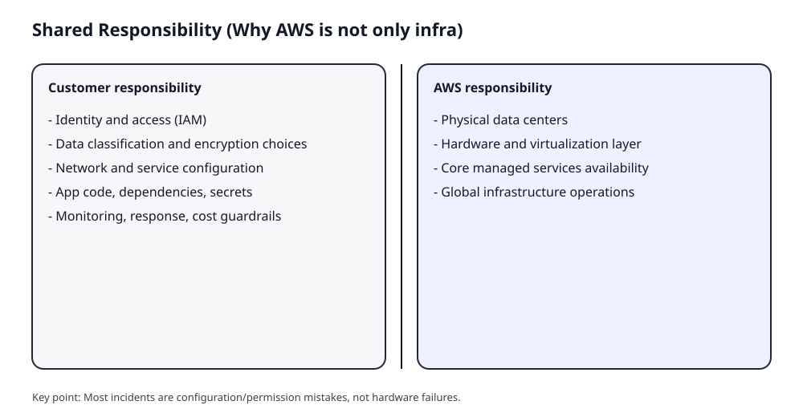
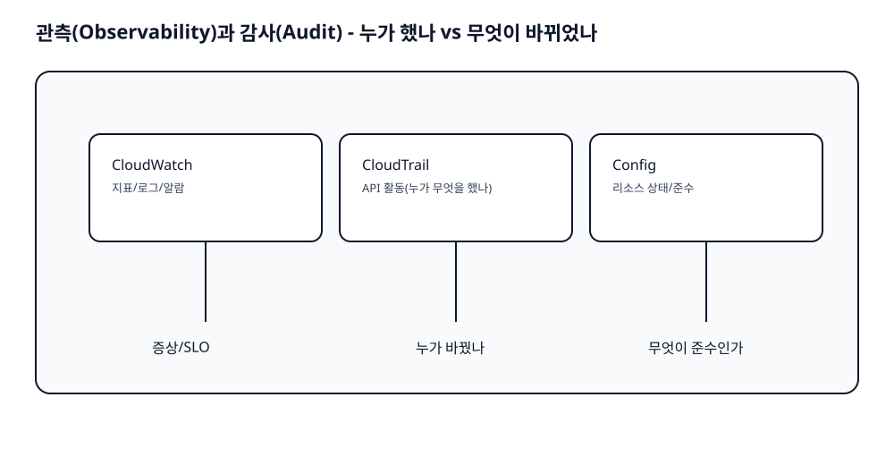
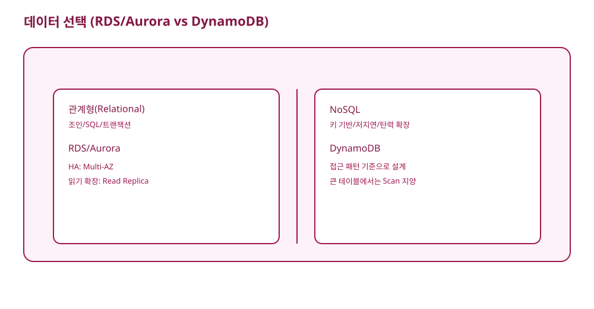

# AWS OT (Pre-Course Orientation)

본 OT는 "본 과정 들어가기 전 1회" 진행하는 AWS 오리엔테이션이다. 개발자/기획자/온프레 운영자 모두가 같은 용어로 의사결정할 수 있게 만드는 것이 목표다.

## When

- 2026년 3월~4월 본 과정 시작 직전(과정 전 1회)

## Audience And Why AWS (by role)

- Developer
  - 인프라 의존 리드타임을 줄이고, 표준 서비스로 보안/운영 부담을 낮춰 제품 실험 속도를 올린다.
  - "키 공유 금지, 역할 기반 권한 위임, 비동기/캐시" 같은 패턴을 알면 장애와 보안사고를 크게 줄일 수 있다.
- PM or Planner
  - 요구사항이 리드타임과 비용 구조(사용량 기반, 데이터 전송, NAT 등)에 직접 연결된다.
  - AWS 용어로 질문을 던질 수 있으면(가용성/보안/비용) 일정과 리스크를 현실적으로 조정할 수 있다.
- On-prem Ops
  - 운영의 초점이 장비 관리에서 "정책(IAM), 관측(CloudWatch/CloudTrail), 자동화(ASG)"로 이동한다.
  - 장애 대응은 "서버"보다 "설정/권한/변경 이력"이 원인이 되는 경우가 많다.

## Outcomes (Must)

- AWS 기본 용어(Region/AZ, VPC/Subnet, IAM role)로 시스템을 설명한다.
- 보안/비용의 대표 함정(키 공유, NAT/전송 비용, 권한 상한선)을 피한다.
- "왜 이 선택이 맞는지" 근거로 설명하는 방법을 익힌다(외우기 대신 규칙).

## Timebox (4h)

- Theory: 2h 30m
- Console demo/workshop: 1h
- Quiz and review: 30m

## Core Concepts (with images)

### 1) Shared Responsibility (왜 비 인프라도 알아야 하나)



- 근거
  - AWS가 책임지는 건 물리/기반 인프라다.
  - 실제 사고의 많은 비율은 "권한/설정 실수"에서 난다.
- 결론
  - 기능팀도 IAM/설정/데이터 보호를 "업무 언어"로 알아야 한다.

### 2) AWS Basics Map (VPC, EC2, S3, IAM)


- 왜 헷갈리나
  - VPC 안에 "모든 것이 있다"라고 착각하기 쉽다.
- 정리(시험/실무 공통 규칙)
  - S3는 보안 그룹으로 제어하지 않는다: 정책(IAM/bucket policy)과 엔드포인트 관점으로 푼다.
  - 워크로드 권한은 IAM user 키가 아니라 role로 간다(키 공유 금지).

### 3) IAM Evaluation (AccessDenied를 외우지 않고 푸는 법)


- 규칙(근거)
  - 기본은 Deny
  - Explicit deny가 있으면 항상 Deny
  - Allow가 있어야 통과
  - 상한선(SCP/permissions boundary)이 있으면 그 안에서만 허용
- 그래서 이렇게 된다
  - "Allow를 붙였는데도 안 된다"라는 증상은 상한선/리소스 정책/조건을 의심해야 한다.

### 4) Compute Choice (Lambda vs Containers vs EC2)


- 자주 헷갈리는 포인트
  - Lambda는 무조건 빠르고 싸다? 아니다. 실행 모델/제한이 설계를 가른다.
- 근거(결정적인 제한)
  - Lambda 최대 실행 시간은 15 minutes다.
  - "15분 이상" 신호가 있으면 오케스트레이션 + 다른 컴퓨트(ECS/Batch 등)로 분해하는 게 정답 방향이 된다.

### 5) Observability And Audit (CloudWatch vs CloudTrail vs Config)



- 왜 헷갈리나
  - 모두 "로그"처럼 보이지만 질문이 다르다.
- 규칙(근거)
  - CloudWatch: 지표/로그/알람(증상과 추세)
  - CloudTrail: 누가 무엇을 했나(API activity)
  - Config: 리소스가 어떤 상태인가(구성/준수)

### 6) Cost Guardrails (태그/버짓/계정, NAT 함정)


- 왜 "비용"은 기획/개발/운영 모두의 문제인가
  - 비용은 드라이버(컴퓨트/스토리지/전송)에서 나오고, 대부분 설계 선택으로 결정된다.
- 자주 나오는 함정(근거)
  - NAT와 데이터 전송은 "트래픽이 커지면" 비용이 급증할 수 있다.
  - 태그가 없으면 팀/프로젝트별 비용을 정확히 나누기 어렵다.

### (Optional) Data Choice (RDS vs DynamoDB)



- 규칙
  - 조인/트랜잭션/SQL이면 RDS/Aurora 후보
  - 키 기반/저지연/탄력 확장이면 DynamoDB 후보

## Console Demo Or Workshop (1h)

1. 콘솔에서 Region 변경을 해보고 "리전별 리소스" 개념을 확인한다.
2. IAM에서 Users/Roles/Policies 메뉴 위치를 확인하고, "키 공유" 위험을 토론한다.
3. S3에서 bucket policy/Block public access 위치를 확인한다.
4. (권한이 있으면) Cost Explorer/Budgets 메뉴를 확인하고 NAT/전송 비용 함정을 사례로 말한다.

## Quiz (10)

1. Shared responsibility에서 고객 책임에 해당하는 것은?
2. S3 접근 제어를 보안 그룹으로 하려는 제안이 틀린 이유는?
3. "Allow를 붙였는데 AccessDenied"일 때 가장 먼저 의심할 것 2가지는?
4. Lambda 단독으로 30분 배치를 돌리려는 설계가 위험한 이유는?
5. CloudTrail과 Config의 차이를 한 문장으로 설명하라.
6. 태그가 없을 때 팀별 비용을 보기 어려운 이유는?
7. NAT 비용이 숨은 폭탄이 되는 조건은?
8. VPC/서브넷/라우팅 테이블의 역할을 한 문장으로 말하라.
9. role 기반 권한 위임이 키 공유보다 안전한 이유는?
10. "캐시 가능 정적 콘텐츠"에서 비용/성능을 동시에 개선할 수 있는 방향은?

## Mermaid Lint

```powershell
powershell -File scripts/mermaid_lint.ps1 -Path aws-ot
```
