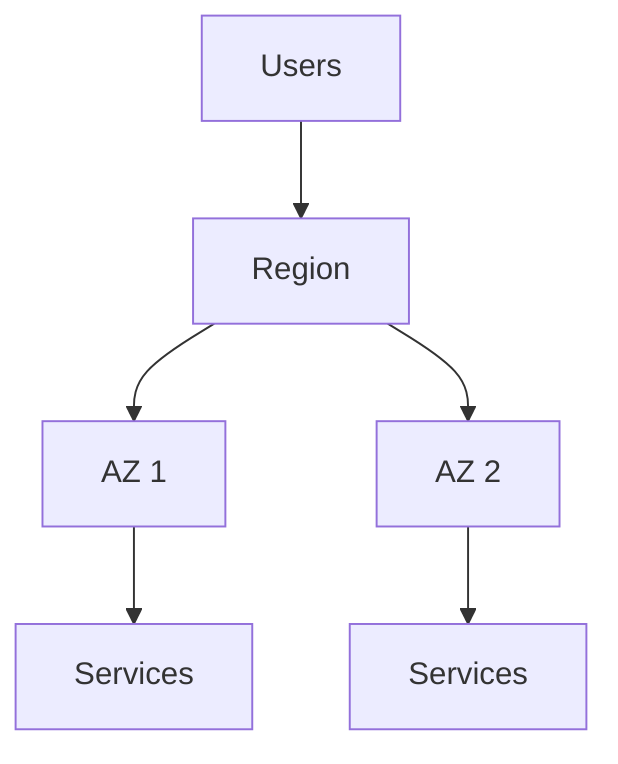

# Theory

## Core Concepts

- 클라우드의 본질
  - "빌리는 컴퓨터"가 아니라 "표준 기능을 조합하는 플랫폼"
  - 속도, 안정성, 비용 모델, 보안 책임의 재분배가 핵심
- Shared responsibility model
  - AWS 책임: 인프라와 기반 서비스의 보안
  - 고객 책임: 계정, 권한, 데이터, 애플리케이션, 설정
- AWS 글로벌 인프라
  - Region: 물리적으로 분리된 큰 단위
  - AZ: 리전 내 장애 격리 단위

## Key Takeaways (Must know)

- 보안 논의는 "누가 책임지는가"를 먼저 합의해야 한다.
- 가용성 논의는 "몇 개의 AZ로 분산하는가"부터 시작한다.
- 클라우드 비용은 "쓰는 만큼"이며, 작은 실험이 가능하지만 방치 비용도 생긴다.

## Vocabulary Map (on prem to AWS)

| On prem term | AWS mapping idea | Notes |
|---|---|---|
| 데이터센터 | Region | 물리적 위치와 장애 분리 |
| 랙, 스위치 | VPC, Subnet | 논리적 네트워크로 모델링 |
| 방화벽 | Security group, NACL | SG는 상태 저장, NACL은 무상태 |
| 인증서 | ACM | 관리형 인증서 발급 |

## Common Misconceptions

- "AWS가 알아서 보안해준다"는 오해: 계정과 권한은 고객 책임이다.
- "멀티 AZ면 무조건 된다"는 오해: 상태 저장 DB, 세션, 배포 방식이 함께 설계돼야 한다.

