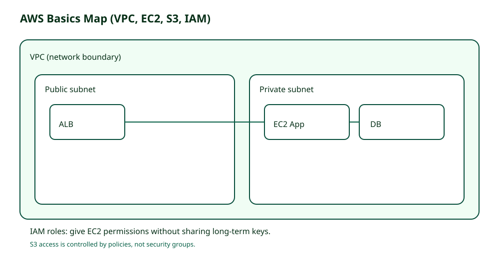

# Theory

## Core Concepts

### VPC is a boundary, not "a bunch of IPs"

- VPC의 목적은 "네트워크 격리"와 "경로 통제"다.
- Subnet은 AZ에 종속된다(즉, AZ 분산은 Subnet부터 시작한다).
- Route table은 "어디로 나가나"를 결정한다. 보안 그룹이 라우팅을 하진 않는다.

### S3 is not inside your VPC

- S3는 VPC 안의 인스턴스가 아니다.
- 그래서 "보안 그룹으로 S3를 막자"는 생각은 틀린 방향이다.
- S3 접근 제어의 기본 위치
  - IAM(Identity policy)
  - Bucket policy(Resource policy)
  - (사설 경로가 필요하면) VPC endpoint policy

### IAM user vs role: 키 공유가 정답을 가른다

- IAM user access key를 애플리케이션에 넣으면
  - 유출 위험이 커지고
  - 회수/회전/감사가 어렵다
- IAM role은
  - 임시 자격 증명 기반(AssumeRole)으로
  - 키 공유 없이 워크로드 권한을 위임한다

## Key Takeaways (Must know)

- 네트워크 경계(VPC)와 권한 경계(IAM)를 같이 본다.
- S3는 정책 기반으로 접근을 제어한다.
- 워크로드 권한은 user key가 아니라 role로 간다.

## Frequently Confused (and why)

- Security group으로 S3 접근을 제어하려는 시도
  - 왜 틀린가: S3는 SG의 적용 대상이 아니며, 정책/엔드포인트가 제어 지점이다.
- Route table을 "보안 정책"으로 착각
  - 왜 틀린가: 라우팅은 경로, 보안은 SG/NACL/정책이 담당한다.

## Minimum Vocabulary (one-liners)

| Term | One line |
|---|---|
| VPC | 논리 네트워크 경계 |
| Subnet | AZ에 속한 네트워크 구간 |
| Route table | 트래픽이 나갈 경로 |
| SG | 인스턴스 단위 stateful firewall |
| IAM role | 키 공유 없는 권한 위임 단위 |

