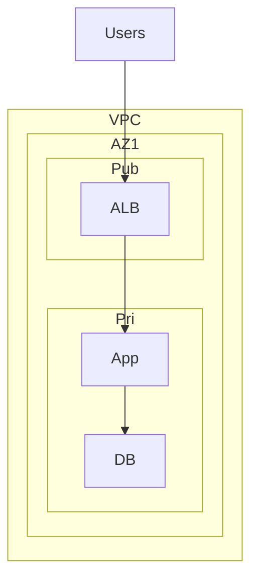

# Theory

## Core Concepts

- VPC는 논리적 네트워크 경계다.
- Subnet은 AZ에 속한다.
- Security group은 인스턴스 단위의 상태 저장 방화벽이다.
- IAM role은 키 공유 없이 워크로드 권한을 위임하는 기본 단위다.

## Key Takeaways (Must know)

- S3는 보안 그룹으로 제어하지 않는다. 정책과 엔드포인트 관점으로 푼다.
- 워크로드 권한은 IAM user 키가 아니라 IAM role로 간다.
- VPC 설계는 나중에 바꾸기 어렵다. 처음에 기본 질문을 한다.
  - 인터넷 연결이 필요한가
  - DB는 어디에 두는가
  - 누가 무엇에 접근하는가

