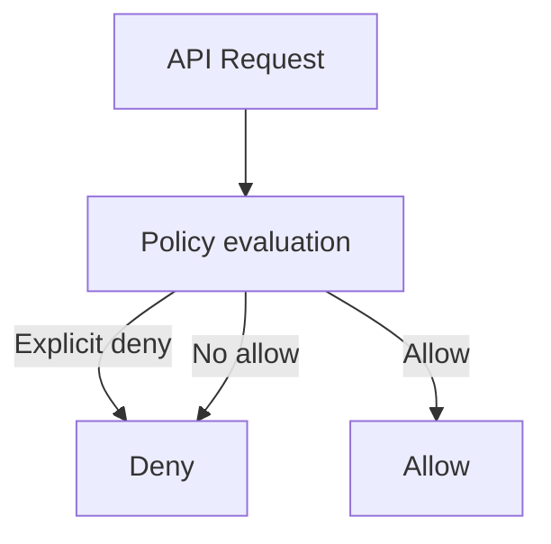

# Theory

## Core Concepts

- IAM의 기본은 Deny다. Allow가 있어야만 통과한다.
- Explicit deny가 있으면 항상 Deny다.
- 시크릿은 "파일이나 코드"가 아니라 "서비스"로 관리한다.

## Key Takeaways (Must know)

- Secret rotation 요구가 있으면 Secrets Manager가 정답 후보가 된다.
- SSE KMS 같은 통합 암호화는 "S3 권한만으로 안 될 수 있다"가 함정 포인트다.
- 감사는 CloudTrail, 구성은 Config로 구분한다.

