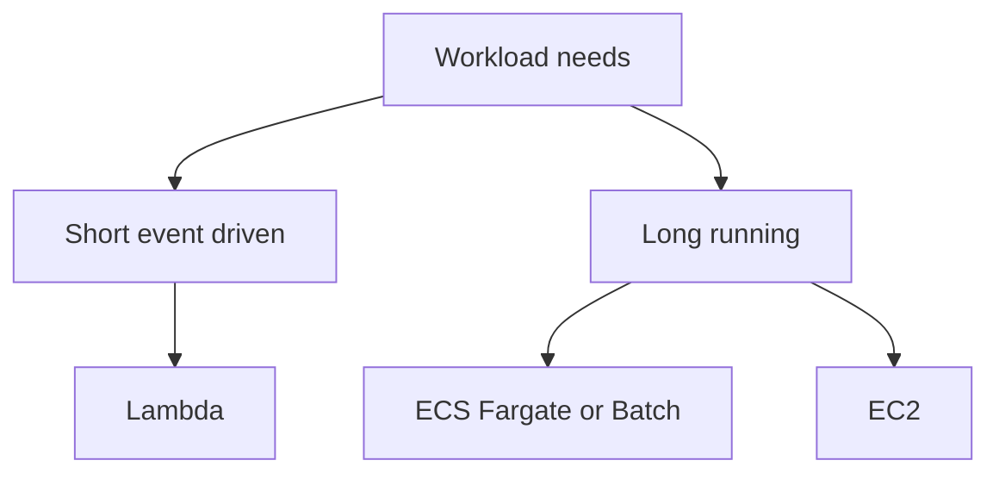

# Theory

## Core Concepts

- Lambda는 이벤트 기반 함수 실행이다.
- 컨테이너는 이미지 기반 배포다.
- EC2는 가장 자유도가 높지만 운영 부담이 크다.

## Key Takeaways (Must know)

- Lambda max execution time은 15 minutes다.
- 15분 이상이면 Step Functions와 컨테이너 또는 Batch로 분해한다.
- 비동기 처리에서 SQS는 버퍼링과 재시도를 제공한다.

