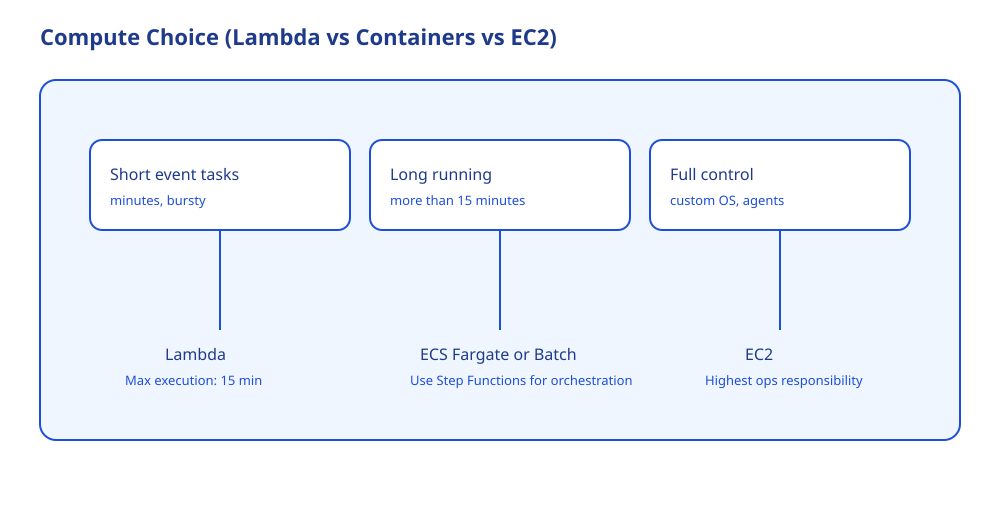

# Theory

## Core Concepts

### Execution model decides everything

- Lambda: 이벤트 기반, 짧은 작업, 운영 부담이 낮음
- Containers(ECS Fargate): 이미지 기반, 긴 실행 가능, 런타임 제어 가능
- EC2: 가장 자유도 높음, 운영 부담도 가장 큼

### Lambda 15 minutes: 왜 시험에서 "정답을 가르는 한 줄"인가

- Lambda는 함수 실행 시간이 최대 15 minutes다.
- 문제에서 다음 신호가 나오면 Lambda 단독은 오답이 되기 쉽다
  - "15분 이상 실행"
  - "긴 배치"
  - "대규모 ETL"

근거:
- 제한을 넘으면 설계가 실패한다.
- 따라서 긴 실행은 "오케스트레이션 + 다른 컴퓨트"로 분해해야 한다.

### Step Functions: 흐름 제어(오케스트레이션)

- Step Functions는 "어떤 일을 어떻게 순서/재시도/분기"할지 정의한다.
- 실제 작업은 Lambda/ECS/Batch 같은 컴퓨트가 실행한다.

## Key Takeaways (Must know)

- 짧고 이벤트 기반이면 Lambda가 후보.
- 길거나 상태/재시도/분기가 많으면 Step Functions로 오케스트레이션을 분리한다.
- "15분 이상" 문장이 있으면 Lambda 단독을 의심한다.

## Frequently Confused (and why)

- Step Functions를 "실행 엔진"으로 착각
  - 왜 틀린가: Step Functions는 흐름, 실행은 컴퓨트가 한다.
- 긴 작업을 Lambda로 밀어 넣는 선택
  - 왜 위험한가: 제한 때문에 구조가 깨진다.

