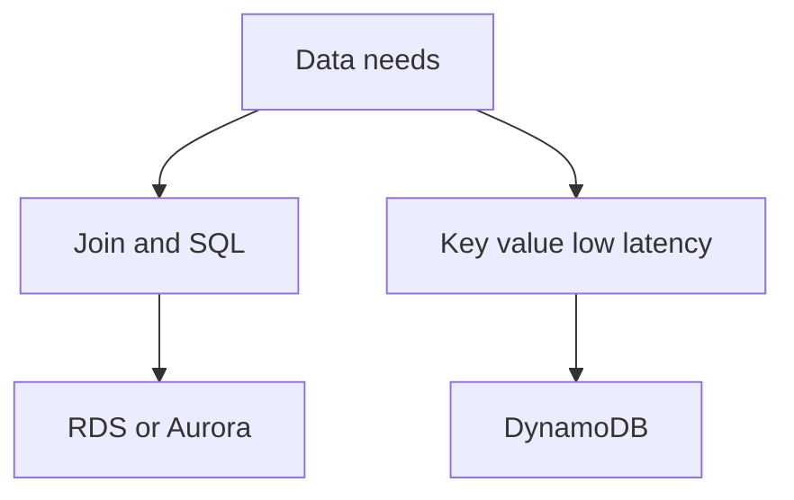

# Theory

## Core Concepts

- 관계형은 조인과 트랜잭션 중심이다.
- NoSQL은 액세스 패턴과 키 설계가 핵심이다.

## Key Takeaways (Must know)

- 가용성은 Multi AZ, 읽기 확장은 Read replica다.
- DynamoDB는 Query 중심 설계가 중요하며 Scan은 함정이 될 수 있다.

