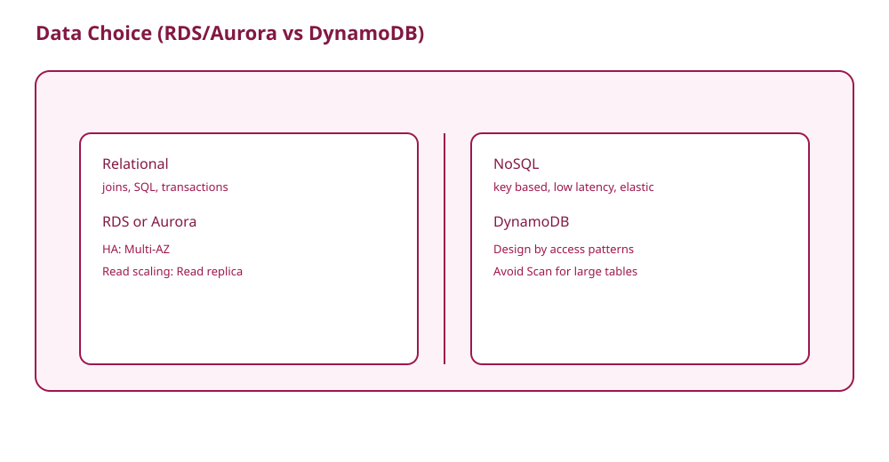

# Theory

## Core Concepts

### 요구사항으로 DB를 고른다(감으로 고르지 않는다)

- 조인/복잡한 쿼리/강한 트랜잭션
  - 관계형(RDS/Aurora) 후보
- 키 기반 조회, 초저지연, 탄력 확장
  - DynamoDB 후보

### HA vs Read scaling: Multi-AZ와 Read replica는 목적이 다르다

- Multi-AZ: 가용성(자동 장애 조치)
- Read replica: 읽기 확장(성능)

왜 헷갈리나:
- 둘 다 "복제"처럼 보이지만, 복제가 목적이 아니라 "어떤 문제를 푸는가"가 다르다.

### DynamoDB: 키 설계가 성능이다

- Query는 키 기반으로 좁힌다.
- Scan은 전체 탐색이라 데이터가 커지면 비용/성능 함정이 된다.

## Key Takeaways (Must know)

- HA는 Multi-AZ, 읽기 성능은 Read replica다.
- DynamoDB는 액세스 패턴 중심으로 모델링한다.
- Scan은 큰 테이블에서 함정이 된다.

## Frequently Confused (and why)

- "Read replica로 HA를 만든다"
  - 왜 틀린가: Read replica는 주로 읽기 확장이고, 자동 failover 목적이 아니다.
- "DynamoDB는 아무 조건이나 검색 가능"
  - 왜 틀린가: 키 기반(Query)로 설계해야 한다. 검색 요구가 있으면 인덱스 설계를 한다.

