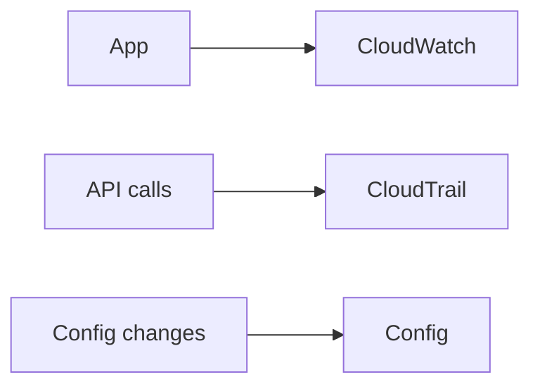

# Theory

## Core Concepts

- CloudWatch는 metrics, logs, alarms의 중심이다.
- CloudTrail은 API 활동을 기록한다.
- Config는 리소스 구성을 추적한다.

## Key Takeaways (Must know)

- 장애 대응은 먼저 관측 지점부터 정리한다.
  - 사용자가 느끼는 증상
  - 지표 변화
  - 배포 변경
  - 권한 변경

