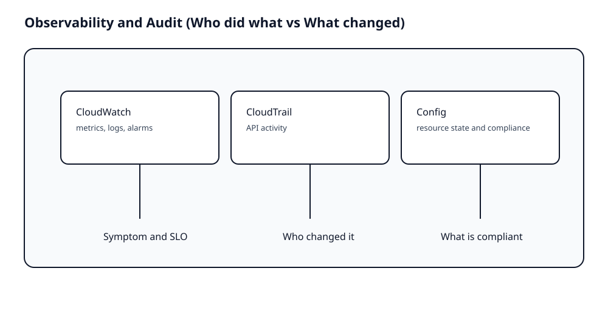

# Theory

## Core Concepts

### Observability is a workflow, not a tool list

- "사용자가 느끼는 증상" -> "지표 변화" -> "최근 변경" -> "권한 변경" 순서로 좁힌다.
- CloudWatch는 지표/로그/알람의 기본 허브다.

### CloudTrail vs Config: 서로 대체되지 않는다

- CloudTrail: 누가 무엇을 했나(API activity)
- Config: 리소스 상태와 준수

근거:
- 장애나 보안 사고에서 필요한 질문이 다르다.
  - "누가 바꿨지"는 CloudTrail
  - "현재 뭐가 열려 있지"는 Config

## Key Takeaways (Must know)

- 모니터링은 "어디서부터 좁힐지" 순서가 핵심이다.
- CloudTrail과 Config는 역할이 다르다.

## Frequently Confused (and why)

- 로그가 있으면 원인이 보인다고 착각
  - 왜 위험한가: 지표, 로그, 변경 이력의 조합이 필요하다.

