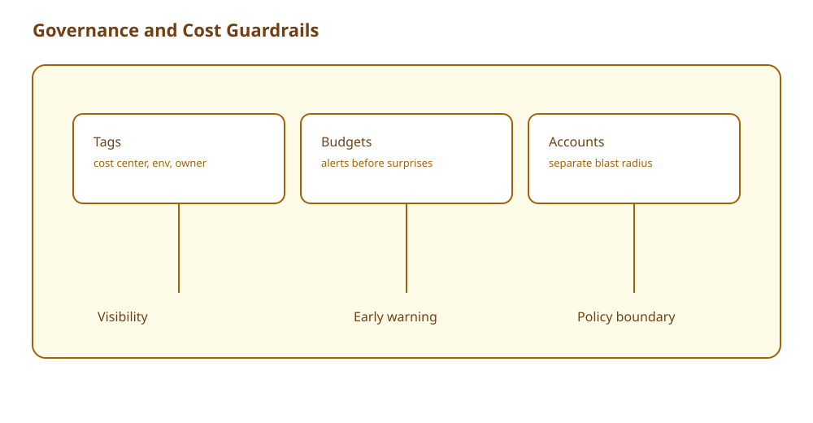

# Theory

## Core Concepts

### Governance: 속도를 올리기 위한 규칙

- 규칙이 없으면
  - 권한이 과도하게 열리고
  - 비용이 어디서 나가는지 모르게 된다
- 규칙이 있으면
  - 팀이 더 안전하게 빠르게 실험할 수 있다

### Cost guardrails: 놀라지 않기 위한 기본장치

- Tags: 어디서 쓰는지 식별(차지백/쇼백)
- Budgets: 초과 알림
- Accounts: 블래스트 레디우스와 비용 경계 분리

## Key Takeaways (Must know)

- 태그가 없으면 팀별 비용을 정확히 보기 어렵다.
- NAT와 데이터 전송은 숨은 비용 드라이버가 될 수 있다.

## Frequently Confused (and why)

- "비용 최적화 = 무조건 cheapest"
  - 왜 틀린가: 요구사항을 깨면 비용이 아니라 사고 비용이 늘어난다.

