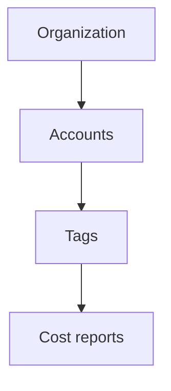

# Theory

## Core Concepts

- 거버넌스는 "누가 무엇을 만들 수 있는가"와 "어떻게 비용을 나눌 것인가"의 문제다.
- 비용 최적화는 드라이버를 제거하는 설계다.

```mermaid
flowchart TB
  Org[Organization] --> Accounts[Accounts]
  Accounts --> Tags[Tags]
  Tags --> Reports[Cost reports]
```

## Key Takeaways (Must know)

- NAT 비용은 자주 숨은 폭탄이다.
- 태그 없이 팀별 비용을 정확히 보기 어렵다.

