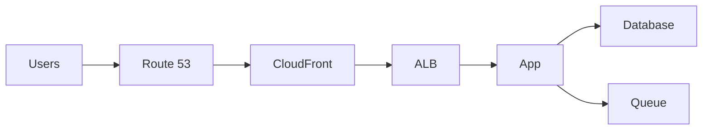

# Workshop Guide

## Workshop Prompt

요구사항:

- 전 세계 사용자, 정적 콘텐츠와 API 제공
- 로그인과 결제
- 트래픽 스파이크가 있다
- 보안과 감사가 중요하다
- 비용은 제한적이다

## Deliverables

- 아키텍처 다이어그램 1장
- "선택 이유" 10줄
- 비용 함정 3개와 대응 3개

## Facilitation Notes

- 정답보다 "선택 기준"을 말하게 한다.
- 보안과 비용을 꼭 같이 묻게 한다.

