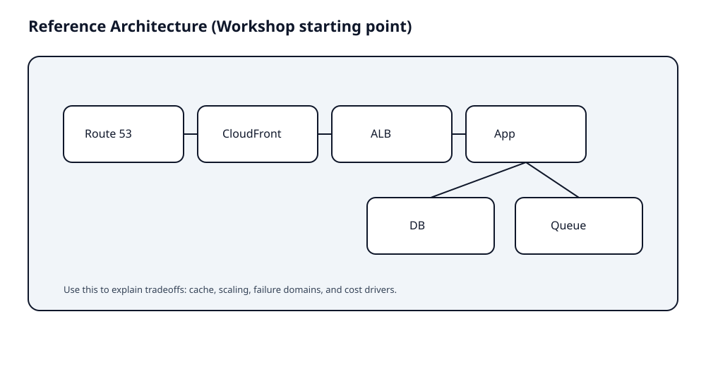

# Workshop Guide

## Core Concepts

이 세션은 정답을 맞히는 시간이 아니라, "선택 기준을 말하는 연습"을 하는 시간이다.

## Workshop Prompt

요구사항:

- 전 세계 사용자, 정적 콘텐츠와 API 제공
- 로그인과 결제
- 트래픽 스파이크가 있다
- 보안과 감사가 중요하다
- 비용은 제한적이다

## Deliverables

- 아키텍처 다이어그램 1장
- "선택 이유" 10줄
- 비용 함정 3개와 대응 3개

## Facilitation Notes (Why this works)

- 다이어그램은 팀 커뮤니케이션 비용을 낮춘다.
- "왜 이 선택이 정답인가"를 말하면, 비슷한 문제도 풀 수 있다.
- 보안과 비용은 항상 같이 묻는다. 하나만 보면 시험과 실무 모두 실패한다.

