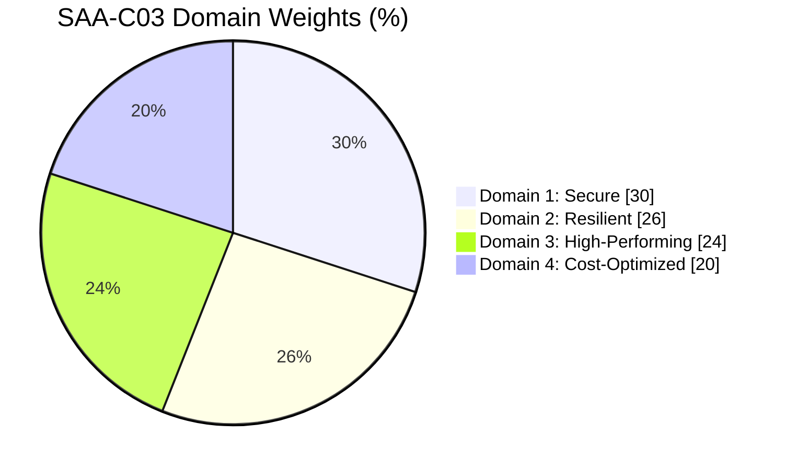
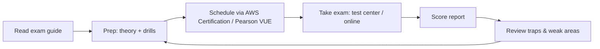
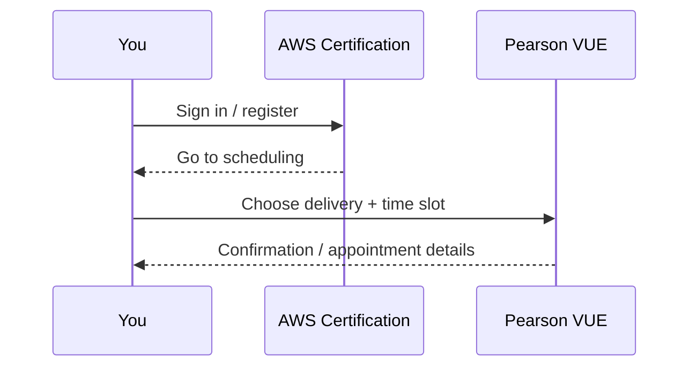

# AWS SAA Exam Guide (SAA-C03)

시험 응시/준비에 필요한 “시험 정보(시간/문항/범위/가격/응시 방식/합격점수)”를 한곳에 모아둔 레퍼런스입니다.

## Visual summary (Marp-friendly)

### 시험 개요 (Table)

| Item | Value |
|---|---|
| Exam code | `SAA-C03` |
| Duration | 130 minutes |
| Questions | 65 |
| Format | Multiple choice, multiple response |
| Score range | 100–1000 (scaled) |
| Passing score | 720 |
| Scored / Unscored | 50 / 15 |
| Price | USD 150 (tax 별도) |
| Delivery | Pearson VUE test center / online proctored |

### 도메인 가중치 (Table)

| Domain | Weight |
|---|---:|
| Domain 1: Design Secure Architectures | 30 |
| Domain 2: Design Resilient Architectures | 26 |
| Domain 3: Design High-Performing Architectures | 24 |
| Domain 4: Design Cost-Optimized Architectures | 20 |

### 도메인 가중치 (Mermaid pie)

### 응시 흐름 (Mermaid flowchart)

### 예약/응시 동선 (Mermaid sequence)

## 시험 개요

- 시험 코드: `SAA-C03` (AWS Certified Solutions Architect – Associate)
- 시험 시간(Duration): 130 minutes
- 문항 수(Number of questions): 65
- 문항 형식(Format): Multiple choice, multiple response
- 점수: 100–1000 (scaled score)
- 합격점수(Minimum passing score): 720
- Scored/Unscored: 50 scored + 15 unscored (unscored는 점수에 반영되지 않지만 시험 중 구분 불가)

## 가격(응시료)

- Associate-level exam: USD 150 (세금 별도, 국가/지역에 따라 결제 통화/세금 정책이 달라질 수 있음)

## 응시 방식(Online/Offline)

- 시험 센터(오프라인): Pearson VUE test center
- 온라인: Pearson VUE online proctored

## 범위(도메인/가중치)

- Domain 1: Design Secure Architectures (30%)
- Domain 2: Design Resilient Architectures (26%)
- Domain 3: Design High-Performing Architectures (24%)
- Domain 4: Design Cost-Optimized Architectures (20%)

추가로, 공식 Exam Guide에는 “In-scope / Out-of-scope AWS services” 목록이 포함되어 있습니다.
- 리포 내 정리: `aws-saa/references/aws-services.md`

## 응시/준비 체크리스트(요약)

- 계정/보안: `aws-saa/references/aws-account-create.md` 참고(루트 계정 MFA, IAM 관리자 분리, Budgets 등)
- 시험 예약: AWS Certification 계정에서 Pearson VUE로 일정 예약
- 온라인 응시: 카메라/마이크/네트워크/환경 요구사항 사전 점검(시스템 테스트/정숙한 환경)
- 결과/재응시: 결과 확인, 재응시/재예약 정책은 공식 정책 페이지 기준으로 확인

## AWS Skill Builder(학습/실전 대비)

공식 시험 페이지에 “AWS Skill Builder exam prep” 섹션이 있으며, 대표적으로 아래 형태의 리소스를 안내합니다.
- 4-step exam prep plan (학습 순서 가이드)
- Official practice question set / practice exam
- Exam Prep 과정(핵심 개념/문제 유형/시간 관리)
- Hands-on(실습) 리소스(Builder Labs 등) 및 관련 트레이닝

참고 링크
- AWS Skill Builder: https://skillbuilder.aws/
- SAA 시험 페이지의 “AWS Skill Builder exam prep” 섹션(4-step plan 등으로 바로 이동 가능): https://aws.amazon.com/certification/certified-solutions-architect-associate/

## 공식 링크 모음

- 시험 페이지(시험 정보/준비 링크 포함): https://aws.amazon.com/certification/certified-solutions-architect-associate/
- Exam pricing(응시료): https://aws.amazon.com/certification/pricing/
- Exam guide(문항/점수/도메인/정책 상세)
  - PDF (Korean): https://d1.awsstatic.com/ko_KR/training-and-certification/docs-sa-assoc/AWS-Certified-Solutions-Architect-Associate_Exam-Guide.pdf
  - PDF (English): https://d1.awsstatic.com/training-and-certification/docs-sa-assoc/AWS-Certified-Solutions-Architect-Associate_Exam-Guide.pdf
  - HTML(Exam guide index): https://docs.aws.amazon.com/certifications/latest/solution-architect-associate-certification-guide/home.html
- 시험 예약/응시(FAQ 포함): https://aws.amazon.com/certification/faqs/
- 시험 정책/안내(공식): https://aws.amazon.com/certification/policies/
