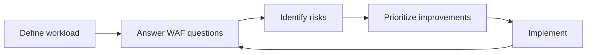

# AWS Well-Architected Framework (WAF)

SAA 학습/설계 문제에서 “이 아키텍처가 좋은가?”를 판단할 때, AWS가 권장하는 평가 프레임워크를 요약한 레퍼런스입니다.

## 한 줄 요약

- Well-Architected Framework는 **6개 Pillar** 기준으로 워크로드를 점검하고, 위험/개선안을 도출하는 기준점이다.

## 왜 SAA에서 중요하나

- 문제에서 “best practice”, “trade-off”, “운영/보안/복원력/성능/비용/지속가능성” 같은 단어가 나오면, 결국 **Pillar 관점으로 요구사항을 분해**해 정답을 고르게 된다.
- 특히 **Security / Reliability / Cost Optimization**은 SAA 시나리오에서 빈도가 높다.

## 구성 요소(개념)

- **Workload(워크로드)**: 비즈니스 가치를 제공하는 리소스/애플리케이션의 단위(리뷰의 대상).
- **Pillars(6대 축)**: Operational Excellence, Security, Reliability, Performance Efficiency, Cost Optimization, Sustainability.
- **Lenses(렌즈)**: 특정 도메인(예: Serverless, SaaS 등)에 맞춘 추가 질문/가이드.
- **AWS Well-Architected Tool**: 질문 기반으로 워크로드를 평가하고, 위험 항목과 개선 계획을 정리하는 도구.

## 6 Pillars 요약(빠른 인덱스)

| Pillar | 핵심 포인트(암기용) | 시험에서 자주 보이는 신호 |
|---|---|---|
| Operational Excellence | 운영 자동화/관측/지속 개선 | 모니터링, 자동화, 운영 절차/런북, 변경 관리 |
| Security | 최소권한/데이터 보호/추적 | IAM, KMS, 암호화, 로깅, 네트워크 격리 |
| Reliability | 장애 복구/변화 관리/용량 관리 | Multi-AZ, DR, 백업/복구, 분산/느슨한 결합 |
| Performance Efficiency | 자원 효율/확장/적합한 선택 | 캐싱, 오토스케일, 적절한 스토리지/DB 선택 |
| Cost Optimization | 비용 가시화/최적화/거버넌스 | 구매 옵션, 스토리지 클래스, right-sizing, 태그 |
| Sustainability | 환경 영향 최소화 | 자원 효율, 사용량 최적화, 관리형 서비스 활용 |

## 일반 설계 원칙(General design principles)

Well-Architected Framework의 “일반 설계 원칙”은 아래 키워드로 자주 요약된다.

- 용량을 추정으로 결정하지 말고(Stop guessing capacity) 데이터로 판단
- 프로덕션 규모로 테스트(Test at production scale)
- 실험/개선을 자동화(Automate experimentation)
- 진화 가능한 아키텍처(Evolutionary architectures)
- 데이터 기반 의사결정(Drive using data)
- 게임데이 등으로 지속 개선(Improve through game days)

## 리뷰 흐름(개념도)

## 함께 보면 좋은 리포 내 문서

- `aws-saa/references/aws-services.md` (서비스 범위/공식 링크)
- `aws-saa/references/glossary.md` (용어)
- `aws-saa/exam-trap-bank.md` (연계/유사 서비스 함정)

## 공식 링크

- Well-Architected Framework (Korean): https://aws.amazon.com/ko/architecture/well-architected/?ref=wellarchitected-wp
- Well-Architected Framework docs: https://docs.aws.amazon.com/wellarchitected/latest/framework/welcome.html
- AWS Well-Architected Tool docs: https://docs.aws.amazon.com/wellarchitected/latest/userguide/intro.html
