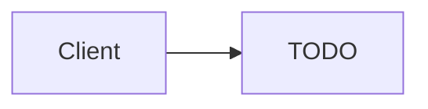

# TODO - (서비스명)

> 이 문서는 `01-theory.md`에서 링크되는 “서비스별 챕터”용 템플릿이다.

## 소개 (이 서비스는 무엇인가?)

- TODO (1~2문장)

## Core (핵심만)

- 규칙: TODO (선택 기준 1~2줄)
- 함정: TODO (가장 흔한 오답 1줄)

## Deep Dive

- When to use / When not to use
- Key limits & tradeoffs
- Security & IAM integration
- Cost drivers
- Common architectures
- Exam must-know
  - Key point: TODO
  - Why: TODO
  - Alternative: TODO

## Exam Traps (3-5)

- TODO

## TL;DR (한 줄 정리)

- TODO

## Back

- `../01-theory.md`
