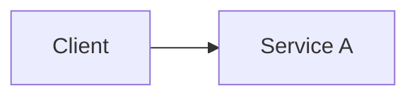

# Theory

## Exam Guide Mapping

- Domain: TODO
- Objectives: TODO (시험 가이드 문구를 그대로 붙이지 말고, 의미 단위로 요약)

## Core Concepts

- 최소 1개 이미지를 포함한다(코어 개념은 “암기”가 아니라 “근거로 설명” 가능해야 한다).
- 예시(weekNN/dayDD/01-theory.md 기준 상대경로):

- TODO

## Deep Dive

### Service A

- When to use / When not to use
- Key limits & tradeoffs
- Security & IAM
- Cost drivers
- Common architectures
- Exam must-know (시험 포인트)
  - Key point: TODO
  - Why: TODO (근거/원리 1~2줄)
  - Alternative: TODO (제약을 넘기 위한 대안 서비스/패턴)

### Service B

- TODO

## Quick Comparison Table

| Topic | Option 1 | Option 2 | Notes |
|---|---|---|---|
| TODO | TODO | TODO | TODO |

## Exam Traps (5-8)

- TODO
