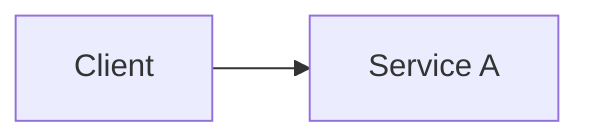

# Theory

## Exam Guide Mapping

- Domain: TODO
- Objectives: TODO (시험 가이드 문구를 그대로 붙이지 말고, 의미 단위로 요약)

## Core Concepts

- TODO

## Deep Dive

### Service A

- When to use / When not to use
- Key limits & tradeoffs
- Security & IAM
- Cost drivers
- Common architectures

### Service B

- TODO

## Quick Comparison Table

| Topic | Option 1 | Option 2 | Notes |
|---|---|---|---|
| TODO | TODO | TODO | TODO |

## Exam Traps (5-8)

- TODO

