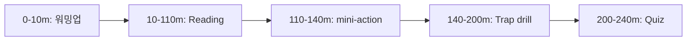
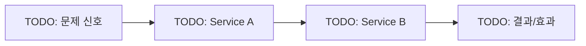

# Day NN - TODO (Day Index)

## Quick Links

- [오늘의 이야기](#오늘의-이야기)
- [Timeline](#timeline-오늘-학습-타임라인)
- [Flow](#flow-서비스-연결-흐름)
- [Reading](#reading-서비스별-theory)
- [Quiz](#quiz)

## 오늘의 이야기

> 1000~1200자 내외. Day에 언급되는 모든 서비스를 “사무실 실생활”처럼 자연스럽게 섞어서, 읽기 쉬운 구어체로 서술한다.

TODO: (스토리 본문)

## Timeline (오늘 학습 타임라인)

## Flow (서비스 연결 흐름)

## Reading (서비스별 theory)

- TODO: `[Service A](01-service-a.md)`
- TODO: `[Service B](02-service-b.md)`

## Quiz

- `03-quiz.md`

## Back

- `../README.md`
