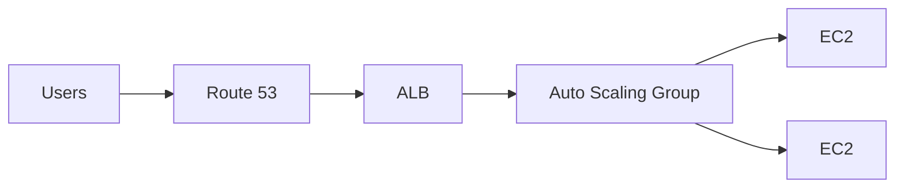
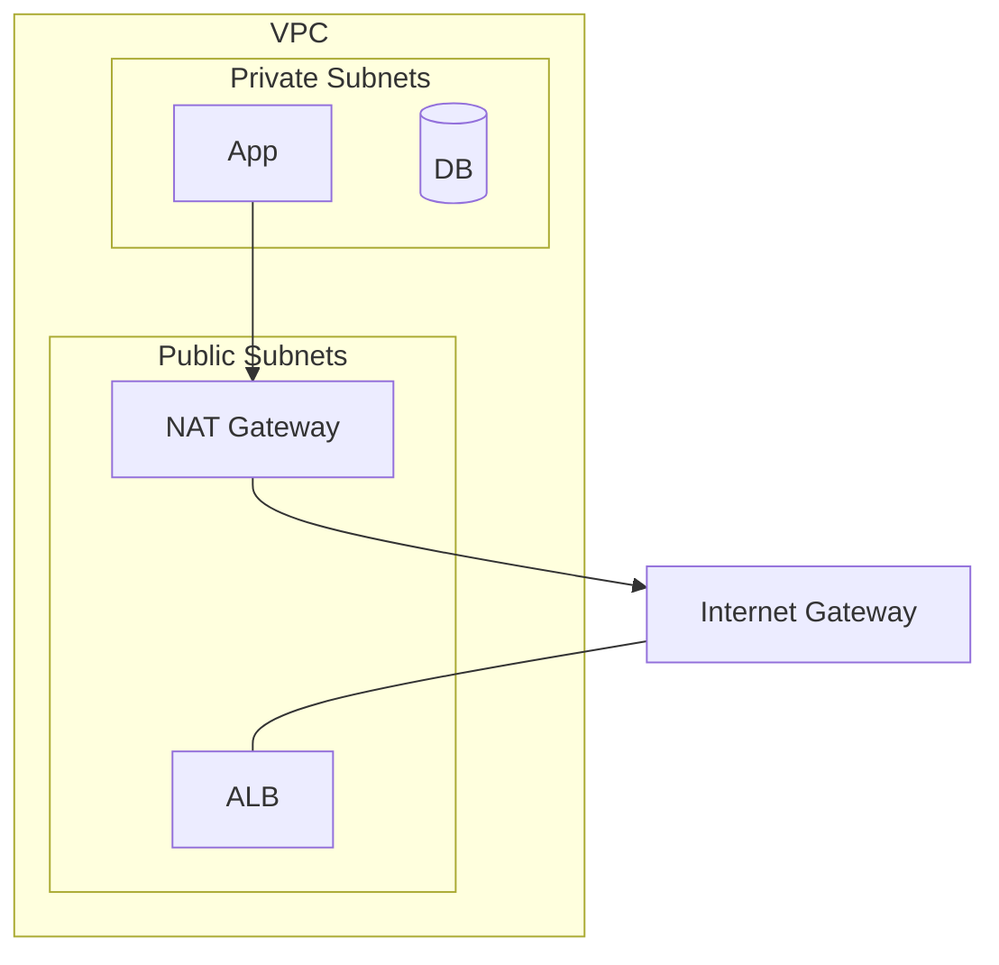

# Mermaid Snippets (Reusable)

## ALB + ASG (Basic)

```mermaid
flowchart LR
  U[Users] --> R53[Route 53]
  R53 --> ALB[ALB]
  ALB --> ASG[Auto Scaling Group]
  ASG --> EC2a[EC2]
  ASG --> EC2b[EC2]
```

## VPC Public/Private With NAT (Basic)

```mermaid
flowchart TB
  subgraph VPC
    subgraph PublicSubnets[Public Subnets]
      ALB[ALB]
      NAT[NAT Gateway]
    end
    subgraph PrivateSubnets[Private Subnets]
      APP[App]
      DB[(DB)]
    end
  end
  IGW[Internet Gateway] --- ALB
  APP --> NAT --> IGW
```

