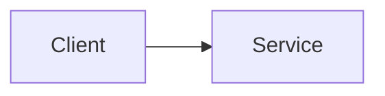

# TODO - 특강 (Special Lecture)

## 소개 (이 특강은 무엇을 정리하나?)

- TODO (1~2문장)

## Impact 범위 (어디에 영향을 주나?)

- Security: TODO
- Cost: TODO
- Reliability: TODO
- Performance: TODO
- Operations: TODO

## Exam Guide (Badges)

## Why This Matters On The Exam

- TODO (출제 빈도/자주 나오는 함정/선택 기준)

## VAKOG Anchors

- V(Visual): TODO (비교표/다이어그램)
- A(Auditory): TODO (토크 트랙 3~6줄 + 토론 질문 1개)
- O(Olfactory, smell test): TODO (레드 플래그/안티패턴 3~5개)
- G(Gustatory, taste test): TODO (1~3분 미니 확인 1개)

## Services In Scope (Top 10~15)

- TODO

## Core Patterns (Exam-Heavy)

- Pattern 1: TODO
- Pattern 2: TODO

## Confusing Similar Cases (Choose-This-Not-That)

| Scenario | Best choice | Why | Common wrong choice | Why it's wrong |
|---|---|---|---|---|
| TODO | TODO | TODO | TODO | TODO |

## Deep Dive (Service-by-Service)

### Service: TODO

- When to use / When not to use
- Key limits & tradeoffs
- Security model & IAM integration
- Cost drivers
- Reference architectures

## Best Practices (Actionable)

- TODO

## Alternatives (Tradeoffs)

- Option A: TODO
- Option B: TODO

## Drill (Mini Mock)

### Q1

**Scenario:** TODO

A. TODO  
B. TODO  
C. TODO  
D. TODO  

**Answer:** TODO  
**Explanation:** TODO  

**Tags:** `domain:TODO` `services:TODO`

## TL;DR (이 특강의 선택 기준)

- TODO (기술 핵심만: Choose-this-not-that의 규칙 1줄)
