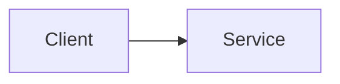

# Special Lecture - Title

## Why This Matters On The Exam

- TODO (출제 빈도/자주 나오는 함정/선택 기준)

## Services In Scope (Top 10~15)

- TODO

## Core Patterns (Exam-Heavy)

- Pattern 1: TODO
- Pattern 2: TODO

## Confusing Similar Cases (Choose-This-Not-That)

| Scenario | Best choice | Why | Common wrong choice | Why it's wrong |
|---|---|---|---|---|
| TODO | TODO | TODO | TODO | TODO |

## Deep Dive (Service-by-Service)

### Service: TODO

- When to use / When not to use
- Key limits & tradeoffs
- Security model & IAM integration
- Cost drivers
- Reference architectures

## Best Practices (Actionable)

- TODO

## Alternatives (Tradeoffs)

- Option A: TODO
- Option B: TODO

## Drill (Mini Mock)

### Q1

**Scenario:** TODO

A. TODO  
B. TODO  
C. TODO  
D. TODO  

**Answer:** TODO  
**Explanation:** TODO  

**Tags:** `domain:TODO` `services:TODO`

