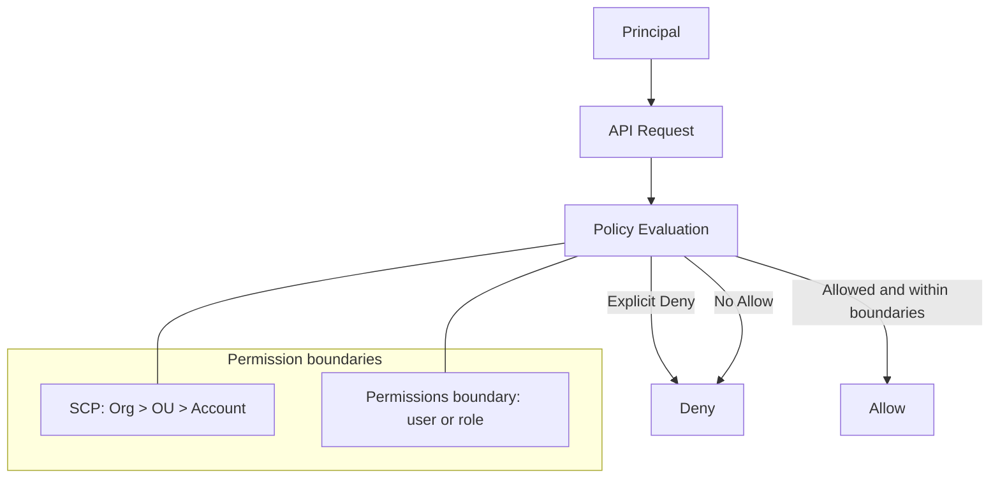
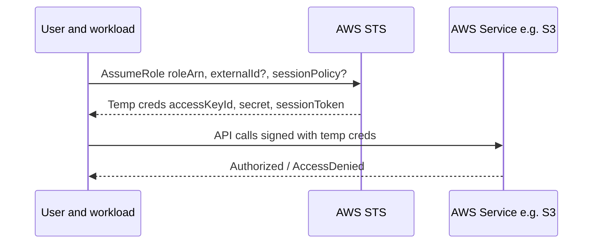
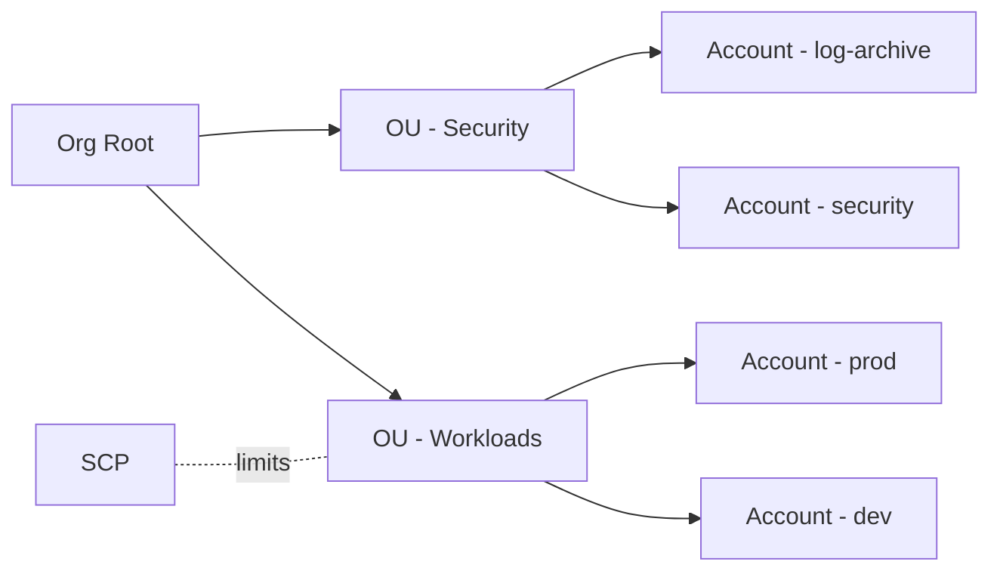

# Theory

## Exam Guide Mapping

- Domain: Domain 1: Design Secure Architectures
- Task focus:
  - 1.1 AWS 리소스에 대한 보안 액세스 설계 (IAM, STS, 교차 계정, SCP, 리소스 정책)

## Core Concepts

- Authentication vs Authorization
  - 인증: “누구인가” 확인 (예: IAM Identity Center로 IdP 연동)
  - 인가: “무엇을 할 수 있는가” 결정 (예: IAM 정책 평가)
- Policy types (시험 빈출)
  - Identity-based policy: 사용자/그룹/역할에 부여
  - Resource-based policy: 리소스에 부여 (예: S3 bucket policy, KMS key policy)
  - Permissions boundary: “최대 권한 상한선” (특히 역할/사용자에 적용)
  - SCP(Organizations): 계정/OU 단위 “최대 허용 상한선” (권한을 ‘부여’하지는 않음)
- Policy evaluation 핵심
  - 기본은 Deny
  - Explicit Deny 는 항상 승리
  - Allow 가 있어야만 통과
  - 여러 정책이 겹칠 때, “경계(SCP/Boundary)”가 최종 권한을 제한

## Deep Dive

### IAM: Least Privilege 를 설계하는 단위

- When to use
  - 권한을 “사람(Identity)” 또는 “워크로드(역할)”에 부여해야 할 때
  - 서비스 간 호출(예: Lambda -> S3)에 장기 키 없이 권한을 위임해야 할 때
- When not to use
  - 애플리케이션 코드에 액세스 키를 하드코딩하는 방식으로 IAM을 쓰지 않는다.
- 핵심 모델
  - Principal(주체) = 사용자/역할/서비스(예: ec2.amazonaws.com)
  - Action/Resource/Condition으로 정책을 구성
  - ABAC: 태그 기반 조건(`aws:ResourceTag/*`, `aws:PrincipalTag/*`)으로 확장
- 시험에서 자주 헷갈리는 포인트
  - “그룹은 리소스에 붙지 않는다.” 그룹은 사용자 권한 관리를 위한 컨테이너다.
  - “역할(role)은 임시 자격 증명”을 통해 사용된다. (STS)

### STS: AssumeRole 로 “키 공유”를 제거한다

- What it is
  - 역할을 인수(Assume)해 “임시” 액세스 키/시크릿/세션 토큰을 발급받는 서비스
- When to use
  - 교차 계정 액세스 (prod 계정 리소스를 ops 계정에서 관리)
  - 임시 권한 부여 (운영자 on-call, break-glass)
  - 워크로드가 다른 서비스에 접근 (권한 위임)
- Security deep points (시험 포인트)
  - Trust policy(역할 신뢰 정책)가 “누가 이 역할을 Assume할 수 있는지”를 정의
  - ExternalId: 제3자(파트너) 교차계정 접근에서 confused deputy 완화
  - Session policy: AssumeRole 시점에 권한을 “추가로 제한”할 수 있음

### Organizations/SCP: 멀티계정의 “상한선”

- SCP는 “허용 가능한 최대 범위”를 제한한다.
- SCP는 권한을 부여하지 않는다. (SCP로 Allow 해도 IAM에 Allow가 없으면 Deny)
- 권장 멀티계정 기본 형태(개념)
  - Security/Log archive 계정 분리
  - Workload 계정(prod/stage/dev) 분리

## Quick Comparison Table

| Topic | Option 1 | Option 2 | Notes |
|---|---|---|---|
| 권한 부여 단위 | IAM Role | IAM User | 운영/워크로드는 Role 우선, 장기 키 최소화 |
| 정책 부착 위치 | Identity policy | Resource policy | 교차계정/리소스 단위 공유는 resource policy가 유리 |
| 권한 상한선 | SCP | Permission boundary | SCP는 계정/OU 단위, boundary는 identity 단위 |
| 임시 권한 | STS AssumeRole | 액세스 키 공유 | 시험 정답은 거의 STS 쪽 |

## Exam Traps

- SCP를 적용했는데 “정책을 붙였는데도” 안 된다: SCP는 상한선, IAM Allow가 별도로 필요
- S3 접근을 막고 싶은데 security group으로 해결하려 함: S3는 SG 대상이 아님(대신 bucket policy/VPC endpoint policy)
- Cross-account에서 “액세스 키 공유”가 정답처럼 보이면 의심: 대부분 AssumeRole + trust policy
- Role trust policy와 permission policy를 혼동: trust는 “누가 Assume”, permission은 “Assume 후 무엇을”
