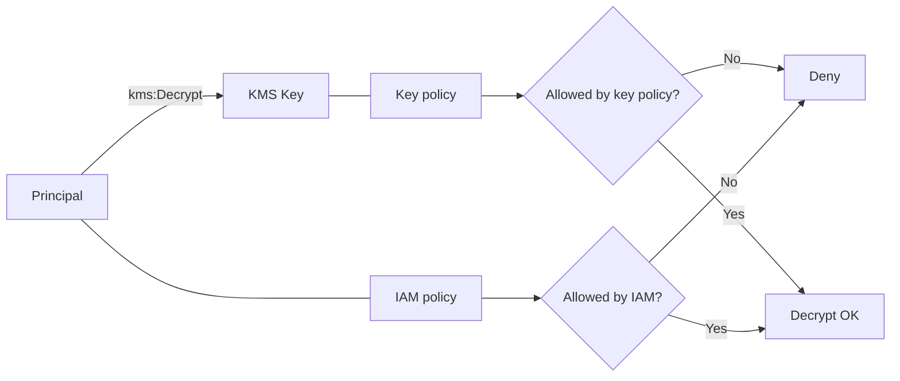
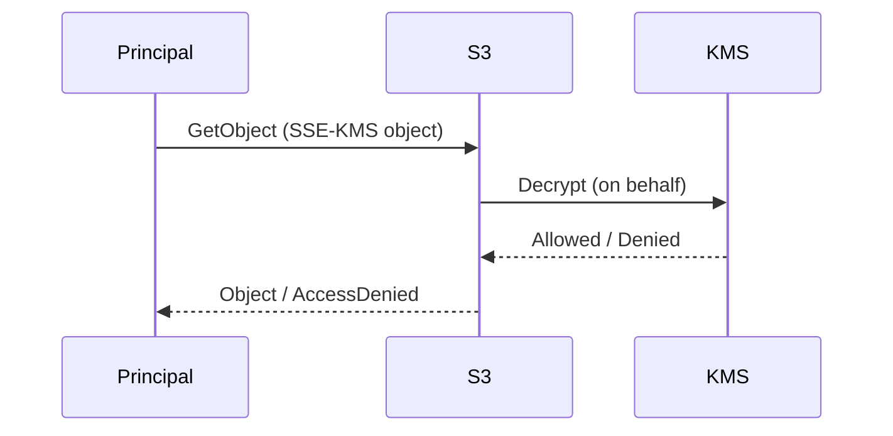

# Theory

## Exam Guide Mapping

- Domain: Domain 1: Design Secure Architectures
- Task focus:
  - 1.1 Design secure access to AWS resources (권한/정책 경계)
  - 1.3 Determine appropriate data security controls (암호화/시크릿)

## Core Concepts

- 데이터 보호 통제 3종 세트(시험형 사고)
  - Encryption at rest: KMS/SSE-KMS/Secrets encryption
  - Access control: IAM/리소스 정책/경계
  - Audit: CloudTrail(누가 키/시크릿을 썼는지)
- KMS가 “정책”에 민감한 이유
  - 암호화/복호화는 KMS API 호출로 귀결되고, KMS는 key policy를 중심으로 통제한다.
  - 다른 서비스(S3, EBS, Secrets Manager)가 KMS를 “호출 대행”할 때도 권한 경계가 중요하다.

## Deep Dive

### KMS: key policy가 핵심(그리고 함정)

- When to use
  - 중앙에서 키 사용을 통제해야 할 때(조직/계정 표준)
  - SSE-KMS, Secrets, EBS 암호화처럼 AWS 서비스와 통합될 때
- When not to use
  - 암호화를 “앱에서 직접 구현”해야 한다면(특수 요구) KMS만으로는 끝나지 않는다(설계 범위 확장).
- Key policy vs IAM policy (시험 필수)
  - IAM policy: “이 주체가 kms:Decrypt을 호출할 수 있다”는 의도
  - Key policy: “이 키가 이 주체의 요청을 허용한다”는 실제 gate 역할을 하는 경우가 많음
  - 결론: IAM Allow가 있어도 key policy가 막으면 실패할 수 있다(문제에서 AccessDenied 힌트로 자주 등장)
- Grants(개념)
  - 일시적/위임형 권한 부여로 등장할 수 있다(서비스 통합/권한 위임의 힌트).

### Secrets Manager vs Parameter Store(SecureString)

- Secrets Manager가 시험에서 자주 정답인 이유
  - rotation/통합 관리(요구사항에 rotation이 있으면 강력 힌트)
  - 시크릿 수명/교체 운영을 “서비스”로 처리
- Parameter Store(SecureString)의 포지션
  - 단순 구성 값/파라미터에 적합(특히 애플리케이션 설정)
  - 시크릿 운영 기능이 요구되면 Secrets Manager가 더 자연스럽다.

## S3 SSE-KMS: “S3 권한만 주면 되지 않나요?” 함정

- SSE-KMS로 암호화된 S3 객체는 “S3 GetObject 권한” 외에 “KMS Decrypt 권한”이 연동될 수 있다.
- 시험에서는 다음 형태로 출제
  - “S3 정책은 맞는데 AccessDenied가 난다” -> KMS 권한/키 정책을 의심

## Quick Comparison Table

| Scenario | Best choice | Why | Common trap |
|---|---|---|---|
| 시크릿 rotation 요구 | Secrets Manager | 운영 기능/통합 | Parameter Store만으로 해결하려 함 |
| 단순 설정 값 | Parameter Store | 경량/단순 | 시크릿까지 한곳에 무작정 몰기 |
| S3 객체 보관 암호화 | SSE-KMS | 중앙 키 통제 | S3 권한만 주면 된다고 착각 |

## Exam Traps

- “KMS는 IAM만 보면 된다”는 오답 유도: key policy가 포인트다.
- “SSE-KMS는 S3만 권한 주면 된다”는 오답 유도: KMS decrypt 경로가 있다.
- “시크릿을 S3/코드/환경변수에 저장” 같은 답안이 보이면 거의 오답(요구사항 따라 예외는 있지만 SAA는 대부분 관리형 선택).

