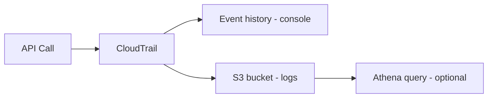
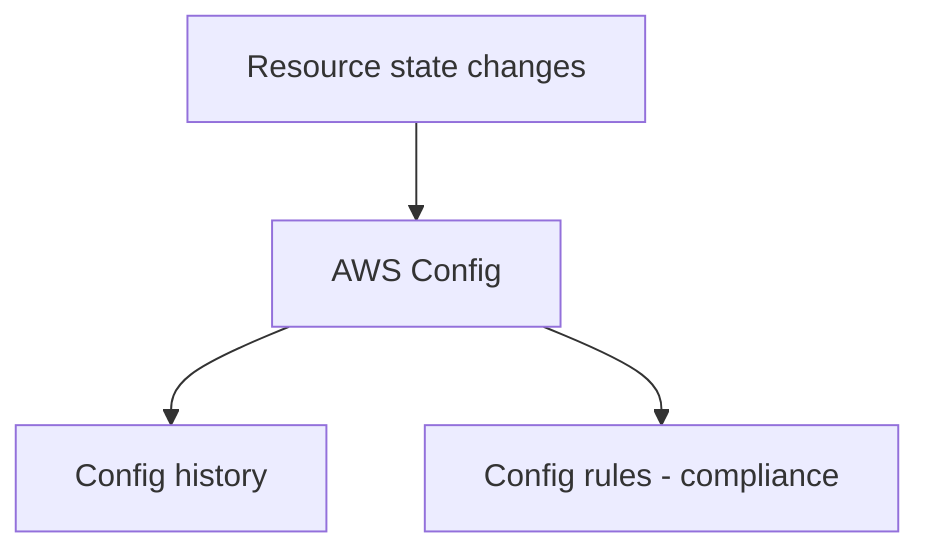
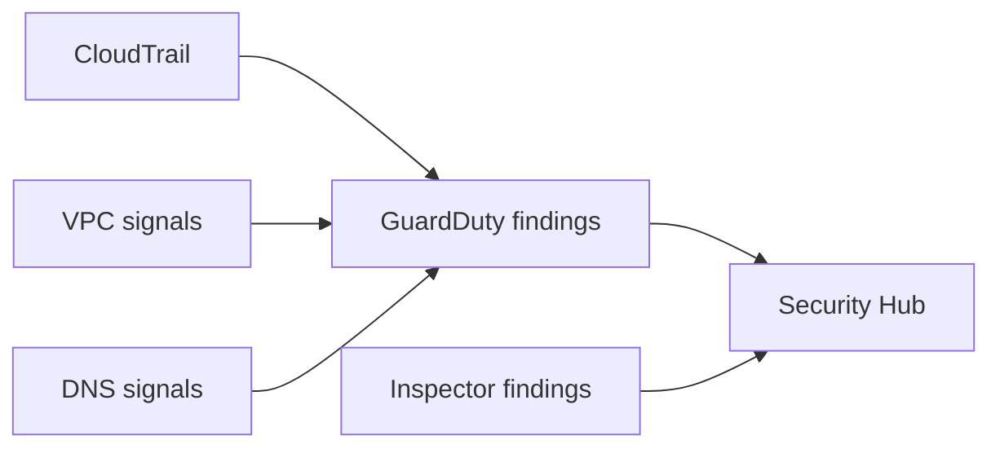

# Theory

## Exam Guide Mapping

- Domain: Domain 1: Design Secure Architectures
- Task focus:
  - 1.2 Design secure workloads and applications (감사/탐지로 운영 보안)
  - 1.3 Determine appropriate data security controls (감사/추적)

## Core Concepts

- Audit vs Compliance vs Detection
  - Audit: “누가/언제/무엇을 했는가”를 재구성할 수 있어야 함(CloudTrail)
  - Compliance/Config state: “리소스가 어떤 구성인지/규칙 위반인지”(Config)
  - Detection: “이상 행위/위협”을 찾아 알림/조치를 연결(GuardDuty/Security Hub 등)

## Deep Dive

### CloudTrail: API 활동의 근거 자료

- What it captures(개념)
  - 관리 이벤트(Management events): 대부분의 제어 plane API 호출
  - (필요 시) 데이터 이벤트(Data events): 예: S3 object-level API (요구사항/비용/범위가 다름)
- Event history vs Trail
  - Event history: 콘솔에서 최근 이벤트를 빠르게 확인(기본 제공 범위)
  - Trail: S3로 장기 보관/검색/감사 체계 구축(조직 표준)
- 시험 포인트
  - “누가 삭제했는지/누가 정책을 바꿨는지”는 CloudTrail
  - “S3 데이터 이벤트를 켤지 말지”는 비용/요구사항 트레이드오프
- Exam must-know (포인트 + Why + 대안)
  - Key point: “누가 이 변경을 했나”는 CloudTrail, “현재/과거 구성 상태가 어땠나”는 Config다.
  - Why: CloudTrail은 API 호출(행위)의 증거이고, Config는 리소스 구성(상태)의 스냅샷/이력이다. 둘은 질문의 축이 다르다.
  - Alternative: “탐지/알림” 요구가 명시되면 GuardDuty/Security Hub 같은 탐지/집계 계층을 붙인다(CloudTrail 자체는 탐지 엔진이 아니다).

### AWS Config: 구성 변화와 준수(Compliance) 관점

- What it captures(개념)
  - 리소스 구성(configuration items) 변경 이력
  - 규칙 기반 준수 평가(Config rules)
- CloudTrail과의 차이(시험형 문장)
  - CloudTrail: “행위(Who did what)”
  - Config: “상태(What is the current/was the configuration)”
- Exam must-know (포인트 + Why + 대안)
  - Key point: “준수/규칙 위반” 문장이 있으면 Config(규칙/준수)가 정답 후보로 올라간다.
  - Why: 준수는 이벤트(행위)보다 리소스의 속성/구성 기준으로 판단된다(예: public S3, 0.0.0.0/0 인바운드 등).
  - Alternative: “누가 그 설정을 바꿨는지”까지 묻는다면 CloudTrail을 함께 써야 한다(둘 중 하나로만 해결하려는 답은 함정일 수 있음).

### Detection 서비스 연결(개념 수준)

- GuardDuty: 위협 탐지(여러 로그 소스 기반) 후 findings 생성
- Security Hub: 다양한 보안 결과를 집계/표준화/점수화(허브)
- Inspector: 취약점/구성 평가(서비스/에이전트 기반 패턴이 선택지로 출제될 수 있음)

## Quick Comparison Table

| Question | Best tool | Why |
|---|---|---|
| 누가 보안 그룹 인바운드를 열었나 | CloudTrail | API 호출 근거 |
| 현재 보안 그룹 규칙이 기준 위반인가 | Config | 구성/준수 |
| 의심스러운 활동을 탐지/알림하고 싶다 | GuardDuty/Security Hub | 탐지/집계 |

## Exam Traps

- CloudTrail과 Config를 “둘 다 로그니까 동일”로 보는 선택지: 기록 목적이 다르다.
- “탐지 서비스가 곧 로그 저장소”라는 오해: 탐지는 소스(CloudTrail 등) 위에서 동작한다.
- 데이터 이벤트/고급 기능을 무조건 켜는 답: 요구사항/비용 트레이드오프를 본다.
