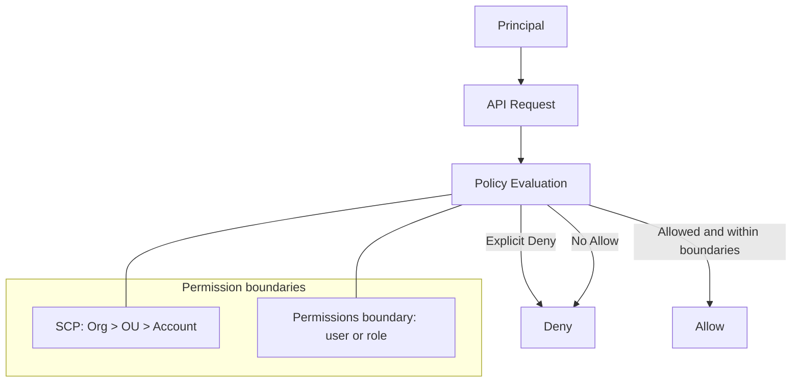

# IAM (정책 평가 + 최소 권한)

## 소개 (이게 뭔가요?)

- IAM은 “누가(Principal) 무엇을(Action) 어디에(Resource) 어떤 조건에서(Condition) 할 수 있는지”를 정책으로 정의하는 접근 제어 계층이다.
- 시험에서는 IAM 자체보다 **정책 평가 규칙**과 **권한 경계(상한선)**를 읽는 능력을 본다.

## 고객 사례 (스토리, 600~1000자)

사내 플랫폼 팀이 “권한 기능”을 만들라는 요구를 받았다. 팀/프로젝트/환경(dev·prod)마다 권한이 다르고, 화면이 늘어날수록 예외가 폭발한다. 처음엔 DB에 role 테이블을 만들고 if 문으로 막았지만, AWS 리소스 권한(예: S3 읽기, EC2 조회)까지 들어오자 ‘앱 권한’과 ‘클라우드 권한’이 뒤엉켰다. 더 무서운 건, 배포가 빠를수록 권한 변경도 잦아서 “어제는 됐는데 오늘은 AccessDenied” 같은 이슈가 반복된다는 점이다. 담당자는 한 명뿐이라, 매번 코드 배포로 권한을 고치는 방식은 지속 가능하지 않다.

여기서 IAM을 “권한 로직”이 아니라 “권한 템플릿”으로 보면 판이 바뀐다. 팀별로 managed policy를 템플릿처럼 만들어 Role에 붙이고, 사용자는 그 Role을 통해서만 작업하게 만든다. 그리고 중요한 건 ‘허용 목록’을 늘리는 게 아니라, 실수로 퍼블릭 S3를 열거나 위험한 API를 호출하지 못하도록 **경계(Explicit Deny, permissions boundary, SCP 같은 상한선)**를 먼저 잡는 것이다. 권한은 코드가 아니라 정책으로 바뀌고, 변경은 템플릿 교체로 관리된다. “누가 어떤 정책을 바꿨는지”는 CloudTrail로 감사 가능해진다.

당신 팀이 지금 겪는 `AccessDenied`는 “Allow가 부족해서”일까요, 아니면 “어딘가의 Deny/상한선”일까요?

## Impact 범위 (어디에 영향을 주나?)

- Security: 최소 권한, 권한 경계(상한선), 리소스 정책까지 포함한 접근 통제의 핵심
- Operations: `AccessDenied` 트러블슈팅 속도를 좌우(정책 평가 순서를 이해해야 한다)

## Exam Guide (Badges)

Exam guide mapping (details)

- Domain: Domain 1: Design Secure Architectures
- Task focus: 1.1 AWS 리소스에 대한 보안 액세스 설계 (정책 평가/권한 경계/리소스 정책)

## Why This Matters (시험/실무에서 걸리는 지점)

- 시험은 “Allow를 줬는데 왜 안 되지?”로 시작해서, 정답을 **Deny/경계/리소스 정책**에서 찾게 만든다.
- 실무에서도 문제의 80%는 권한이 ‘없어서’가 아니라 ‘막혀서’다.

## VAKOG Anchors

- V(Visual): 정책 평가 흐름 그림으로 “어디서 막혔는지”를 한 번에 본다.
- A(Auditory): “기본 Deny → Explicit Deny 우선 → 상한선은 못 뚫음”을 3문장으로 말해본다.
- O(Olfactory, smell test): “AccessDenied면 Allow 추가”만 하는 습관은 위험 신호다.
- G(Gustatory, taste test): 1분 안에 “deny vs allow 부족”을 구분하는 미니 판정.

## Core Concepts

- 정책 평가는 기본 Deny에서 시작한다(Allow가 없으면 끝).
- Explicit Deny는 모든 Allow를 이긴다.
- 권한 경계(permissions boundary, SCP)는 “상한선”이라 Allow로 뚫을 수 없다.

## Deep Dive

### Least Privilege 를 설계하는 단위

- When to use
  - 권한을 “사람(Identity)” 또는 “워크로드(역할)”에 부여해야 할 때
  - 서비스 간 호출(예: Lambda -> S3)에 장기 키 없이 권한을 위임해야 할 때
- When not to use
  - 애플리케이션 코드에 액세스 키를 하드코딩하는 방식으로 IAM을 쓰지 않는다.
- 핵심 모델
  - Principal(주체) = 사용자/역할/서비스(예: ec2.amazonaws.com)
  - Action/Resource/Condition으로 정책을 구성
  - ABAC: 태그 기반 조건(`aws:ResourceTag/*`, `aws:PrincipalTag/*`)으로 확장
- 시험에서 자주 헷갈리는 포인트
  - “그룹은 리소스에 붙지 않는다.” 그룹은 사용자 권한 관리를 위한 컨테이너다.
  - “역할(role)은 임시 자격 증명”을 통해 사용된다. (STS)
- Exam must-know (포인트 + Why + 대안)
  - Key point: “AccessDenied”는 대부분 “Allow가 없어서”가 아니라 “Explicit Deny/경계/리소스 정책”에 막힌 케이스다.
  - Why: 정책 평가는 기본 Deny이며, Explicit Deny는 어떤 Allow보다 우선한다. 또한 상한선은 IAM Allow로 뚫을 수 없다.
  - Alternative: 교차 계정/워크로드 접근은 액세스 키 공유가 아니라 STS AssumeRole로 설계한다.

## Quick Comparison Table

| Topic | Option 1 | Option 2 | Notes |
|---|---|---|---|
| 권한 부여 단위 | IAM Role | IAM User | 운영/워크로드는 Role 우선, 장기 키 최소화 |
| 정책 부착 위치 | Identity policy | Resource policy | 리소스 단위 공유/교차계정은 resource policy 힌트가 자주 등장 |
| 권한 상한선 | Boundary/SCP | “Allow 더 붙이기” | 상한선에 막히면 Allow는 의미가 없다 |

## Exam Traps (5-8)

- `AccessDenied`를 보면 무조건 Allow를 추가하는 선택지
- “그룹을 리소스에 붙인다”는 식의 모델 혼동
- 상한선(SCP/boundary)을 무시하고 정책만 만지는 답안

## Taste Test (1~3분)

아래 문장 2개를 “정답/오답”으로만 판정해보자(이유는 한 줄로).

1) “IAM Allow가 있으니 접근 가능하다.”  
2) “Explicit Deny가 있으면 다른 Allow로 상쇄할 수 있다.”

## TL;DR (한 줄 정리)

- IAM의 정답은 “Allow 더 붙이기”가 아니라 **평가 규칙 + Deny/상한선 + 리소스 정책**을 먼저 보는 것이다.

## Back

- `./00-theory-index.md`
