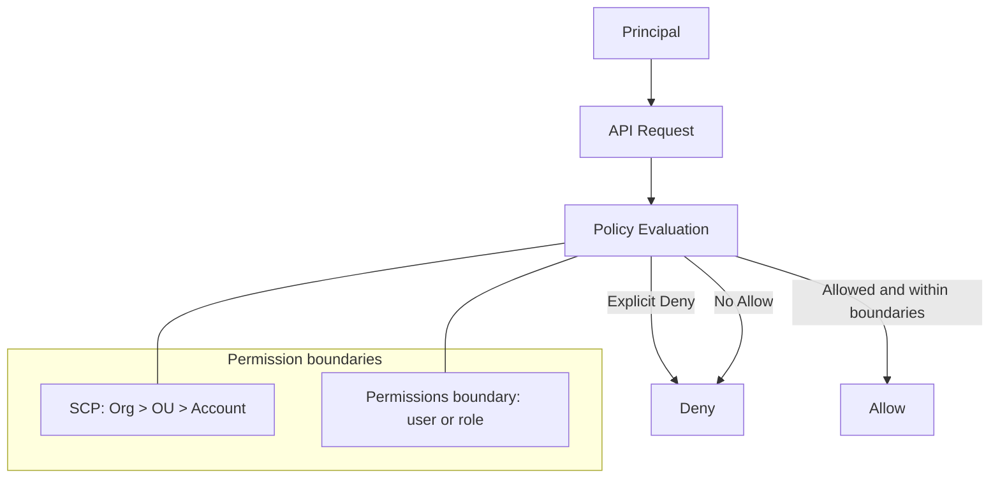
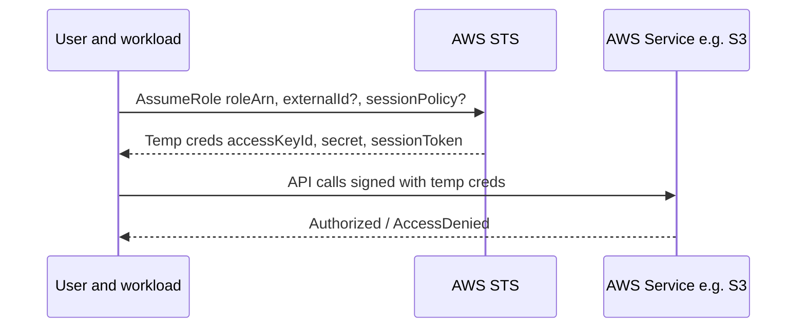
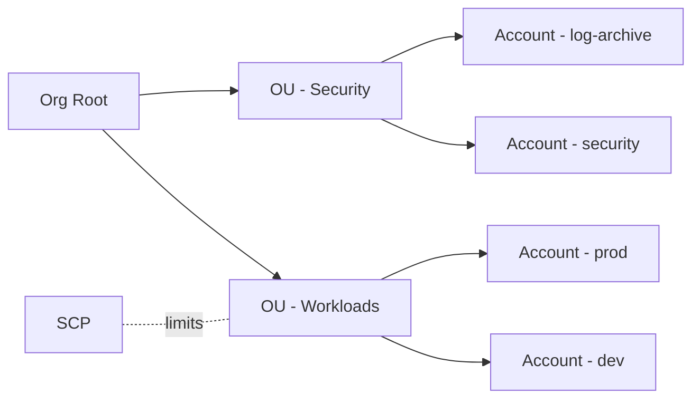

# IAM/STS 기초

## 소개 (이게 뭔가요?)

- IAM은 “누가 무엇을 할 수 있는지”를 정책으로 정의하는 접근 제어 계층이다.
- STS는 역할(Role)을 Assume 해서 “임시 자격 증명”으로 접근하게 만들어 키 공유를 없앤다.

## Impact 범위 (어디에 영향을 주나?)

- Security: 최소 권한/키 공유 금지/감사(CloudTrail)까지 설계에 직결
- Operations: AccessDenied 트러블슈팅(정책 평가/경계/리소스 정책)을 좌우
- Reliability/Cost/Performance: 직접 기능은 아니지만, “권한/설정 실수”가 장애/비용 폭탄으로 이어질 수 있음

## Exam Guide (Badges)

Exam guide mapping (details)

- Domain: Domain 1: Design Secure Architectures
- Task focus: 1.1 AWS 리소스에 대한 보안 액세스 설계 (IAM, STS, 교차 계정, SCP, 리소스 정책)

## Why This Matters (시험/실무에서 걸리는 지점)

- 시험 문제는 자주 이렇게 출제된다: “Allow를 줬는데 왜 안 돼요?” → 정답은 대개 **Explicit Deny / SCP / permissions boundary / resource policy / trust policy** 쪽에 있다.
- 실무에서도 키 공유는 사고로 이어진다. 그래서 “Role + STS 임시 자격 증명”이 기본 패턴이다.

## Core Concepts

IAM을 외우는 가장 쉬운 방식은 “용어”가 아니라 “질문”으로 잡는 것이다.

- 인증(Authentication): “누구인가?” (예: Identity Center로 SSO)
- 인가(Authorization): “무엇을 할 수 있나?” (예: IAM 정책 평가)

정책은 크게 4종류가 핵심이다(시험 빈출).

- Identity-based policy: 사용자/그룹/역할에 부착
- Resource-based policy: 리소스에 부착 (예: S3 bucket policy, KMS key policy)
- Permissions boundary: **identity의 최대 권한 상한선**(부여가 아니라 제한)
- SCP(Organizations): **계정/OU의 최대 권한 상한선**(부여가 아니라 제한)

## Decision Rules (정답을 가르는 규칙 3개)

1. 기본은 Deny다. → **Allow가 없으면 무조건 Deny**
2. Explicit Deny는 항상 이긴다. → Allow가 10개 있어도 Deny 하나면 끝
3. 상한선은 뚫을 수 없다. → **SCP/boundary에 막히면 IAM Allow로는 풀 수 없다**

## Deep Dive

### IAM: Least Privilege 를 설계하는 단위

- When to use
  - 권한을 “사람(Identity)” 또는 “워크로드(역할)”에 부여해야 할 때
  - 서비스 간 호출(예: Lambda -> S3)에 장기 키 없이 권한을 위임해야 할 때
- When not to use
  - 애플리케이션 코드에 액세스 키를 하드코딩하는 방식으로 IAM을 쓰지 않는다.
- 핵심 모델
  - Principal(주체) = 사용자/역할/서비스(예: ec2.amazonaws.com)
  - Action/Resource/Condition으로 정책을 구성
  - ABAC: 태그 기반 조건(`aws:ResourceTag/*`, `aws:PrincipalTag/*`)으로 확장
- 시험에서 자주 헷갈리는 포인트
  - “그룹은 리소스에 붙지 않는다.” 그룹은 사용자 권한 관리를 위한 컨테이너다.
  - “역할(role)은 임시 자격 증명”을 통해 사용된다. (STS)
- Exam must-know (포인트 + Why + 대안)
  - Key point: “AccessDenied”는 대부분 “Allow가 없어서”가 아니라 “Explicit Deny/경계/리소스 정책”에 막힌 케이스다.
  - Why: 정책 평가는 기본 Deny이며, Explicit Deny는 어떤 Allow보다 우선한다. 또한 SCP/permissions boundary 같은 상한선은 IAM Allow로 뚫을 수 없다.
  - Alternative: 교차 계정/워크로드 접근은 액세스 키 공유가 아니라 STS AssumeRole(=role 기반 임시 자격증명)로 설계한다.

### STS: AssumeRole 로 “키 공유”를 제거한다

- What it is
  - 역할을 인수(Assume)해 “임시” 액세스 키/시크릿/세션 토큰을 발급받는 서비스
- When to use
  - 교차 계정 액세스 (prod 계정 리소스를 ops 계정에서 관리)
  - 임시 권한 부여 (운영자 on-call, break-glass)
  - 워크로드가 다른 서비스에 접근 (권한 위임)
- Security deep points (시험 포인트)
  - Trust policy(역할 신뢰 정책)가 “누가 이 역할을 Assume할 수 있는지”를 정의
  - ExternalId: 제3자(파트너) 교차계정 접근에서 confused deputy 완화
  - Session policy: AssumeRole 시점에 권한을 “추가로 제한”할 수 있음

### Organizations/SCP: 멀티계정의 “상한선”

- SCP는 “허용 가능한 최대 범위”를 제한한다.
- SCP는 권한을 부여하지 않는다. (SCP로 Allow 해도 IAM에 Allow가 없으면 Deny)
- 권장 멀티계정 기본 형태(개념)
  - Security/Log archive 계정 분리
  - Workload 계정(prod/stage/dev) 분리

## Smell Test (헷갈리는 지점 / 레드 플래그)

- “키를 공유하자”가 보이면 거의 틀렸다 → 보통 **AssumeRole**이 정답 방향
- “SCP로 Allow했으니 됐다” → SCP는 부여가 아니라 **상한선**이다
- “trust policy에 S3 권한을 넣자” → trust는 “누가 Assume”, permission은 “Assume 후 무엇을”
- “S3를 SG로 막자” → S3는 SG 대상이 아니다(정책/엔드포인트 관점)

## Quick Comparison Table

| Topic | Option 1 | Option 2 | Notes |
|---|---|---|---|
| 권한 부여 단위 | IAM Role | IAM User | 운영/워크로드는 Role 우선, 장기 키 최소화 |
| 정책 부착 위치 | Identity policy | Resource policy | 교차계정/리소스 단위 공유는 resource policy가 유리 |
| 권한 상한선 | SCP | Permission boundary | SCP는 계정/OU 단위, boundary는 identity 단위 |
| 임시 권한 | STS AssumeRole | 액세스 키 공유 | 시험 정답은 거의 STS 쪽 |

## Exam Traps

- SCP를 적용했는데 “정책을 붙였는데도” 안 된다: SCP는 상한선, IAM Allow가 별도로 필요
- S3 접근을 막고 싶은데 security group으로 해결하려 함: S3는 SG 대상이 아님(대신 bucket policy/VPC endpoint policy)
- Cross-account에서 “액세스 키 공유”가 정답처럼 보이면 의심: 대부분 AssumeRole + trust policy
- Role trust policy와 permission policy를 혼동: trust는 “누가 Assume”, permission은 “Assume 후 무엇을”

## Taste Test (1~2분)

아래 문장 2개를 “정답/오답”으로만 판정해보자(이유는 한 줄로).

1) “SCP에서 Allow 했으니 이제 접근 가능하다.”  
2) “교차 계정 운영은 access key 공유가 가장 단순하다.”

## TL;DR (한 줄 정리)

- IAM은 “Allow 목록”이 아니라 **정책 평가 규칙 + 상한선(SCP/boundary) + 리소스 정책**의 조합이다. 그래서 AccessDenied는 대부분 “Allow를 더 붙이면 된다”가 아니다.
