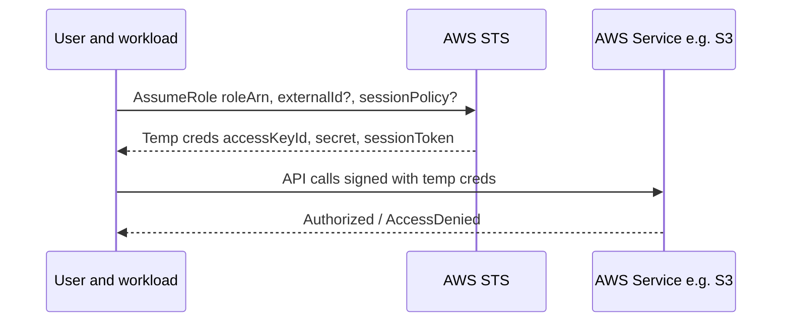

# STS (AssumeRole: 임시 자격 증명)

## 소개 (이게 뭔가요?)

- STS(Security Token Service)는 Role을 Assume 해서 **임시 자격 증명(Access key/Secret/Session token)**을 발급하는 서비스다.
- 한 문장으로: “영구 키를 들고 다니지 않게” 만드는 표준 패턴이다.

## 고객 사례 (스토리, 600~1000자)

운영자들이 슬슬 액세스 키를 공유하기 시작했다. “급해서요, 지금만요.” 처음엔 한 명의 키로 서버를 만지고, 문제가 생기면 키를 회수하려 했지만 이미 여러 곳에 복사돼 있다. 그리고 감사팀이 물었다. “이 작업, 누가 한 건가요? 개인 키인가요, 팀 키인가요?” 답이 애매해지는 순간부터 위험하다. 더군다나 외부 파트너가 특정 리소스에 접근해야 하는 상황도 생겼다. 파트너에게 우리 계정의 사용자 키를 발급하는 건, 문을 열어주고 열쇠까지 주는 느낌이다.

여기서 STS AssumeRole로 전환하면 게임이 달라진다. 사용자는 자기 계정/SSO로 인증만 하고, 실제 작업은 Role을 빌려서(Assume) 한다. 권한이 필요할 때만 임시로 발급받고, 일정 시간이 지나면 자동으로 만료된다. 은행 OTP처럼 “시간 제한된 권한”이 되는 것이다. 교차 계정 운영도 같은 방식이다. prod 계정의 리소스를 ops 계정에서 관리하려면, prod에 Role을 만들고 trust policy로 ops를 신뢰하도록 한 뒤 AssumeRole로 접속한다. 외부 파트너라면 ExternalId 같은 장치를 붙여 confused deputy 위험을 줄인다. 결국 핵심은 ‘키를 나눠주지 않는다’는 원칙을 기술로 구현하는 것이다.

지금 문제에서 “키 공유/외부 접근/교차 계정” 신호가 보이나요? 그럼 첫 선택지는 무엇일까요?

## Impact 범위 (어디에 영향을 주나?)

- Security: 장기 키 노출/공유를 제거하고, 권한 수명/범위를 제한한다
- Operations: break-glass, on-call 같은 임시 권한 운영을 표준화한다

## Exam Guide (Badges)

Exam guide mapping (details)

- Domain: Domain 1: Design Secure Architectures
- Task focus: 1.1 교차 계정/임시 권한/Role 기반 접근 설계 (AssumeRole)

## Why This Matters (시험/실무에서 걸리는 지점)

- “키 공유가 보이면 대부분 오답”이라는 규칙이 STS에서 나온다.
- 시험은 trust policy와 permission policy를 섞어서 낚는다.

## Core Concepts

- Trust policy: “누가 이 Role을 Assume할 수 있는가?”
- Permission policy: “Assume한 후 무엇을 할 수 있는가?”
- Session policy: Assume 순간에 권한을 “추가로 제한”할 수 있다.

## Deep Dive

### AssumeRole (시험 포인트)

- When to use
  - 교차 계정 액세스 (prod 계정 리소스를 ops 계정에서 관리)
  - 임시 권한 부여 (운영자 on-call, break-glass)
  - 워크로드가 다른 서비스에 접근 (권한 위임)
- Security deep points
  - Trust policy가 “누가 Assume”을 정의
  - ExternalId는 제3자 교차계정 접근에서 confused deputy 완화 힌트
  - Session policy는 “더 좁게” 만들 때 사용

### 언제 “AssumeRole” 말고 다른 STS 흐름이 나오나

시험에서 STS는 대부분 AssumeRole로 풀리지만, 문장이 아래처럼 바뀌면 “어떤 Assume인가”를 묻는 문제로 바뀐다.

| 신호 | 자연스러운 STS 흐름 | 포인트 |
|---|---|---|
| “웹/모바일 사용자가 OIDC/Social로 로그인” | AssumeRoleWithWebIdentity | 영구 키 없이 토큰 기반 |
| “사내 IdP(SAML)로 연동” | SAML 기반 연합(Identity Center/페더레이션) | 사용자 입구 통일 |
| “MFA로 단기 세션만 필요” | (케이스에 따라) GetSessionToken/AssumeRole | ‘강한 인증’ 신호 |

### Best Practices (운영 관점)

- 교차 계정 접근은 “키 발급”이 아니라 **Role(신뢰) + 최소 권한(권한 정책)**로 설계한다.
- 제3자(파트너 SaaS) 접근이면, trust policy에 조건을 넣어 **confused deputy** 위험을 줄이는 방향이 자주 정답이 된다.
- “권한을 넓혀서 해결”이 아니라, 먼저 **Deny/상한선/SCP** 같은 관문이 있는지 확인하는 습관이 중요하다.

### 핵심 정리 (Deep Dive)

- STS는 “키 공유 금지”를 구현하는 표준 도구다.
- 문제를 “trust(입구) 문제인가, permission(출구) 문제인가”로 나누면 진단/소거가 빨라진다.

## Quick Comparison Table

| Topic | Option 1 | Option 2 | Notes |
|---|---|---|---|
| 임시 권한 | STS AssumeRole | 액세스 키 공유 | 시험 정답은 거의 STS 쪽 |
| 교차 계정 접근 | Role + trust policy | 사용자 키 발급 | 키는 회수/감사/범위 제한이 어렵다 |

## Exam Traps (확장)

- 더 많은 연계/고급 함정: `../../exam-trap-bank.md`
- trust policy에 “S3 권한”을 넣으려는 선택지(역할 혼동)
- 교차 계정 운영인데 access key 공유가 정답처럼 보이는 선택지
- ExternalId가 필요한 시나리오(제3자)인데 아무 장치도 없는 답안

## Exam Trap Drill (O/X, 1~3분)

아래 문장을 보고 “어디를 고칠지”만 고르자.

- “AssumeRole은 되는데 S3 GetObject가 안 된다.” → trust policy? permission policy?

## TL;DR (한 줄 정리)

- “키 공유/교차 계정/임시 접근” 신호가 보이면 대부분 **Role + STS AssumeRole(임시 자격 증명)**이 정답 방향이다.

## Back

- `./README.md`
