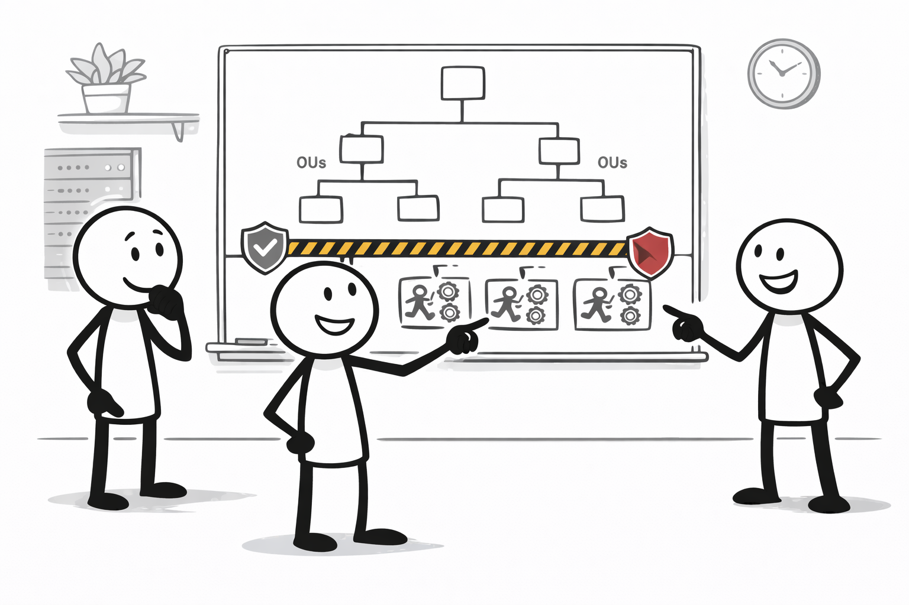
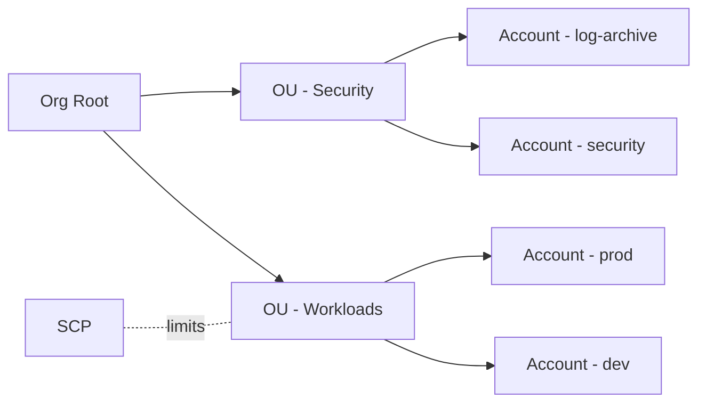

# Organizations + OU/SCP (멀티계정 거버넌스)

## 소개 (이게 뭔가요?)

- AWS Organizations는 계정들을 조직 단위로 묶고, OU(Organizational Unit)로 그룹화해 관리하는 거버넌스 계층이다.
- SCP(Service Control Policy)는 OU/계정에 적용되는 **권한 상한선**이다(“부여”가 아니라 “제한”).

## 고객 사례 (스토리, 600~1000자)

서비스가 커지면서 계정이 늘었다. dev/prod를 분리했고, 보안팀이 로그 아카이브 계정도 따로 만들었다. 문제는 “표준”이 없으면 계정마다 보안 수준이 들쭉날쭉해진다는 것이다. 어떤 팀은 편하다고 모든 권한을 열어두고, 어떤 팀은 최소 권한을 지키지만 배포가 느려진다. 그리고 사고가 나면 “이 계정에서 누가 어떤 권한을 가졌는지”를 한 번에 파악하기 어렵다. 보안팀은 말한다. “실수로라도 공개 S3를 만들거나, IAM을 마음대로 못 만지게 막아야 합니다. 팀이 바뀌어도 표준은 남아야 해요.”

여기서 SCP가 등장한다. SCP는 “이 조직에서 절대 하지 말아야 할 것”을 상한선으로 고정한다. 예를 들어 특정 리전 외에는 리소스 생성 금지, 특정 서비스 사용 금지 같은 규칙을 OU에 걸어두면, 계정 안에서 어떤 IAM Allow를 붙여도 그 상한선을 못 넘는다. 즉, 팀이 자유롭게 움직이되, 위험한 선택지는 구조적으로 못 하게 한다. 계정 안의 역할(Role)과 정책은 팀이 운영하고, Organizations/SCP는 ‘가드레일’을 제공하는 방식이다. 중요한 함정도 있다. SCP로 Allow를 준다고 해서 권한이 생기진 않는다. 계정 안의 IAM Allow가 따로 필요하다.

당신 조직은 “팀의 속도”와 “표준 통제” 사이에서, 어떤 상한선을 먼저 고정해야 할까요?

## Impact 범위 (어디에 영향을 주나?)

- Security: 조직 표준(가드레일)로 위험한 권한/서비스 사용을 구조적으로 차단
- Operations: 계정이 늘어도 관리 복잡도를 OU 단위로 줄인다

## Exam Guide (Badges)

Exam guide mapping (details)

- Domain: Domain 1: Design Secure Architectures
- Task focus: 멀티계정/거버넌스 상한선(SCP) 설계

## Why This Matters (시험/실무에서 걸리는 지점)

- “SCP Deny”가 보이면, 어떤 IAM Allow도 상쇄할 수 없다.
- “SCP로 Allow했다”는 문장 자체가 함정일 때가 많다(SCP는 부여가 아님).

## Core Concepts

- SCP는 최대 권한을 제한한다(deny가 있으면 끝).
- SCP는 권한을 부여하지 않는다(계정 안 IAM Allow가 필요).

## Deep Dive

### OU/SCP 운영 감각

- OU는 “계정 묶음”이고, SCP는 OU/계정에 적용되는 상한선이다.
- 흔한 패턴(개념)
  - Security/Log archive 계정 분리
  - Workload 계정(prod/stage/dev) 분리

### Best Practices: “팀 속도”를 살리면서 표준을 고정하는 법

- **팀이 IAM으로 마음껏 Allow를 늘려도 넘지 못하는 선**을 Organizations/SCP로 잡고, 그 안에서 팀이 자율적으로 운영하게 하면 “속도 vs 통제”를 동시에 만족시키기 쉽다.
- SCP는 보통 “정책 모음”이라기보다 **금지/제한(가드레일)** 중심으로 설계하는 문제가 많이 나온다. 예: 특정 리전 밖 리소스 생성 금지, 특정 서비스 사용 금지 등.

### 시험에 자주 나오는 함정(정책 평가 감각)

- **SCP는 권한을 부여하지 않는다.** SCP의 Allow는 “통과 가능”일 뿐이고, 실제 권한은 계정 내 IAM Allow가 따로 필요하다.
- **SCP의 Deny는 관문**이라서, 계정 안에서 IAM Allow를 아무리 늘려도 뚫을 수 없다(Explicit Deny 우선).

### 핵심 정리 (Deep Dive)

- SCP는 “조직 단위 상한선”, IAM은 “계정 내 실제 권한(부여)”.
- AccessDenied가 “이상하게” 풀리지 않으면, IAM만 보지 말고 **SCP/Boundary 같은 상한선 관문**부터 확인한다.

### Deny 중심(가드레일) vs Allow 중심(허용 목록) 감각

시험에서는 SCP를 “권한 부여 정책”처럼 오해시키는 선택지가 자주 나온다. 실무적으로도 SCP는 보통 다음처럼 이해하면 안정적이다.

- **Deny 중심(가드레일)**: “조직에서 절대 하면 안 되는 것”을 막는다(가장 일반적인 사고방식)
- **Allow 중심(허용 목록)**: 가능한 액션을 좁히는 설계(요구가 매우 강할 때 등장, 운영 난이도↑)

## Quick Comparison Table

| Topic | Option 1 | Option 2 | Notes |
|---|---|---|---|
| 상한선 | SCP (OU/계정) | Permissions boundary (identity) | SCP는 조직 단위, boundary는 사용자/역할 단위 |
| 권한 부여 | IAM policy | SCP | SCP는 부여가 아니다 |

## Exam Traps (확장)

- 더 많은 연계/고급 함정: `../../exam-trap-bank.md`
- SCP Allow로 권한이 생긴다고 착각하는 선택지
- SCP Deny를 IAM Allow로 뚫으려는 선택지

## Exam Trap Drill (O/X, 1~3분)

1) “SCP에서 Allow 했으니 이제 접근 가능하다.” (정답/오답?)  
2) “SCP가 막고 있는지 확인하려면 IAM 정책만 보면 된다.” (정답/오답?)

## TL;DR (한 줄 정리)

- SCP는 “부여”가 아니라 **상한선**이라서, 한 번 막히면 IAM Allow로 뚫을 수 없다.

## References

- Internal references:
  - [References index](../../references/README.md)
  - [Exam guide (SAA-C03)](../../references/exam-guide.md)
  - [Glossary](../../references/glossary.md)
  - [AWS services list](../../references/aws-services.md)
  - [Exam keypoints](../../exam-keypoints.md)
  - [Exam trap bank](../../exam-trap-bank.md)

- Official AWS documentation:
  - [AWS Organizations User Guide](https://docs.aws.amazon.com/organizations/latest/userguide/orgs_introduction.html)
  - [Search: Service Control Policies (SCP)](https://docs.aws.amazon.com/search/doc-search.html?searchQuery=Service%20Control%20Policies%20SCP%20AWS%20Organizations)

## Back

- `./README.md`
