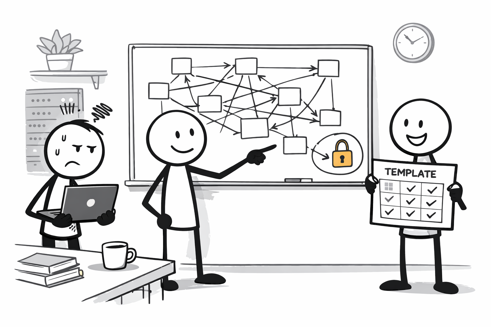
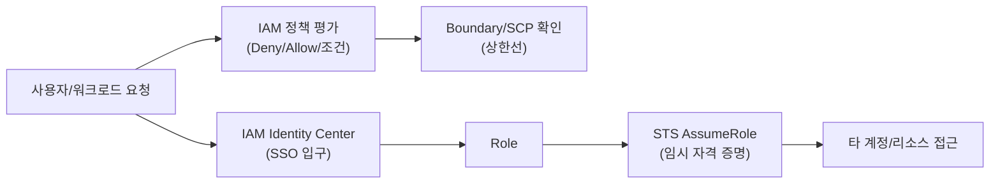

# Day 01 - IAM/STS foundations (접근 제어: IAM/STS/Organizations)

## Quick Links

- [오늘의 이야기](#오늘의-이야기)
- [Timeline](#timeline-오늘-학습-타임라인)
- [Flow](#flow-서비스-연결-흐름)
- [Reading](#reading-서비스별-theory)
- [Quiz](#quiz)
- [References](../../references/README.md)

## 오늘의 이야기

아침에 팀 채널에 “어제까지 되던 배포가 오늘은 `AccessDenied` 난다”는 메시지가 올라옵니다. 누군가 IAM 정책을 하나 더 붙이면 해결될 것 같지만, 이런 날은 오히려 **IAM 정책 평가 순서**부터 다시 봐야 합니다. 기본이 Deny고, Explicit Deny는 무조건 이기고, permissions boundary나 Organizations의 SCP 같은 “상한선”에 걸리면 Allow를 아무리 붙여도 뚫리질 않거든요. 그래서 우리는 먼저 “누가(Principal) / 어디에(리소스) / 어떤 조건으로” 막혔는지부터 정리합니다.

그다음은 사람과 시스템을 분리합니다. 사람은 IAM User로 장기 키를 나눠 갖기보다 **IAM Identity Center로 SSO**를 태우고, 역할(Role)로 들어오게 만들죠. 시스템 간 접근이나 교차 계정 운영은 더더욱 **STS AssumeRole**이 기본입니다. “키를 공유하자”는 선택지는 실무에서도 시험에서도 냄새가 납니다. 외부 파트너가 역할을 AssumeRole 하는 시나리오라면, trust policy와 permission policy를 헷갈리지 않게 나누고, 필요하면 ExternalId 같은 조건으로 사고를 줄입니다. 오늘의 결론은 단순해요. 권한 문제는 “정책 더 붙이기”가 아니라 **경계(상한선)와 역할 전환(AssumeRole)로 안전하게 설계**하는 겁니다.

이 흐름을 한 번 더 실무식으로 말해보면 이렇습니다. “사람 로그인”은 Identity Center로 표준화하고, 팀은 그룹으로 묶어서 Role에 붙입니다. “서비스 간 호출”은 STS로 잠깐 빌려 쓰는 자격 증명으로 만들고, 필요하면 session policy로 범위를 더 줄입니다. 그리고 Organizations를 쓰는 순간부터는 SCP가 계정/OU 단위로 상한선을 만들기 때문에, 권한이 안 풀릴 때는 IAM 정책을 붙이기 전에 “우리가 상한선에 걸린 건 아닌지”부터 보는 게 습관이 됩니다. 시험에서도 똑같아요. “SCP로 Allow하자”나 “User 키를 발급하자” 같은 답이 달콤하게 보이면, 그게 바로 오늘 Day에서 잡아야 하는 함정 포인트입니다.

## Timeline (오늘 학습 타임라인)

```mermaid
gantt
  title Learning Timeline
  dateFormat  HH:mm
  axisFormat  %H:%M
  section Day
  워밍업 - 정책 평가 3줄 :t1, 00:00, 10m
  Reading :t2, after t1, 110m
  미니 실습 - AssumeRole 흐름 상상 :t3, after t2, 30m
  Trap drill - 상한선/Trust 혼동 :t4, after t3, 60m
  Quiz :t5, after t4, 30m
```

## Flow (서비스 연결 흐름)

## Reading (서비스별 theory)

- [IAM (정책 평가 + 최소 권한)](01-iam.md)
- [STS (AssumeRole: 임시 자격 증명)](02-sts.md)
- [Organizations + OU/SCP (멀티계정 거버넌스)](03-organizations-scp.md)
- [IAM Identity Center (SSO: 사용자 입구 표준화)](04-identity-center.md)

> 먼저 규칙(Decision Rules)을 읽고, 필요한 챕터를 골라 깊게 들어가면 흐름이 덜 끊긴다.

## Quiz

- [Day 01 Quiz](03-quiz.md)

## Back

- `../README.md`
