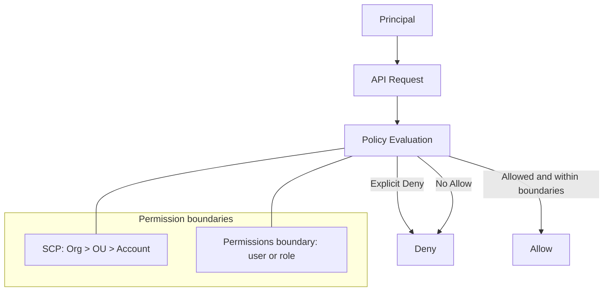

# IAM: Least Privilege 를 설계하는 단위

## Deep Dive

- When to use
  - 권한을 “사람(Identity)” 또는 “워크로드(역할)”에 부여해야 할 때
  - 서비스 간 호출(예: Lambda -> S3)에 장기 키 없이 권한을 위임해야 할 때
- When not to use
  - 애플리케이션 코드에 액세스 키를 하드코딩하는 방식으로 IAM을 쓰지 않는다.
- 핵심 모델
  - Principal(주체) = 사용자/역할/서비스(예: ec2.amazonaws.com)
  - Action/Resource/Condition으로 정책을 구성
  - ABAC: 태그 기반 조건(`aws:ResourceTag/*`, `aws:PrincipalTag/*`)으로 확장
- 시험에서 자주 헷갈리는 포인트
  - “그룹은 리소스에 붙지 않는다.” 그룹은 사용자 권한 관리를 위한 컨테이너다.
  - “역할(role)은 임시 자격 증명”을 통해 사용된다. (STS)
- Exam must-know (포인트 + Why + 대안)
  - Key point: “AccessDenied”는 대부분 “Allow가 없어서”가 아니라 “Explicit Deny/경계/리소스 정책”에 막힌 케이스다.
  - Why: 정책 평가는 기본 Deny이며, Explicit Deny는 어떤 Allow보다 우선한다. 또한 SCP/permissions boundary 같은 상한선은 IAM Allow로 뚫을 수 없다.
  - Alternative: 교차 계정/워크로드 접근은 액세스 키 공유가 아니라 STS AssumeRole(=role 기반 임시 자격증명)로 설계한다.

## TL;DR (한 줄 정리)

- IAM의 정답은 “Allow 더 붙이기”가 아니라 **평가 규칙 + Deny/상한선 + (필요 시) 리소스 정책**을 먼저 보는 것이다.

## Back

- `../01-theory.md`
