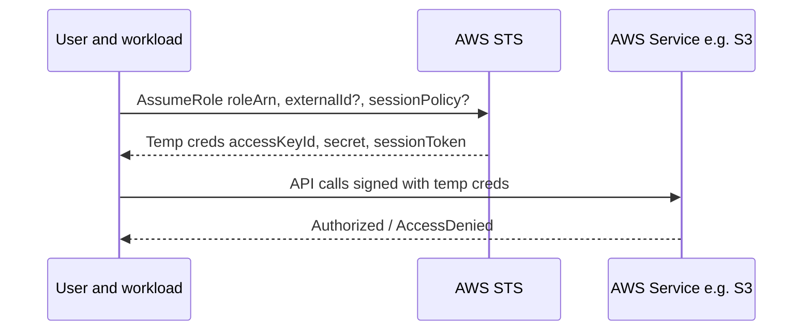

# STS: AssumeRole 로 “키 공유”를 제거한다

## Deep Dive

- What it is
  - 역할을 인수(Assume)해 “임시” 액세스 키/시크릿/세션 토큰을 발급받는 서비스
- When to use
  - 교차 계정 액세스 (prod 계정 리소스를 ops 계정에서 관리)
  - 임시 권한 부여 (운영자 on-call, break-glass)
  - 워크로드가 다른 서비스에 접근 (권한 위임)
- Security deep points (시험 포인트)
  - Trust policy(역할 신뢰 정책)가 “누가 이 역할을 Assume할 수 있는지”를 정의
  - ExternalId: 제3자(파트너) 교차계정 접근에서 confused deputy 완화
  - Session policy: AssumeRole 시점에 권한을 “추가로 제한”할 수 있음

## TL;DR (한 줄 정리)

- “키 공유” 신호가 보이면 대부분 **Role + STS AssumeRole(임시 자격 증명)**이 정답 방향이다.

## Back

- `../01-theory.md`
