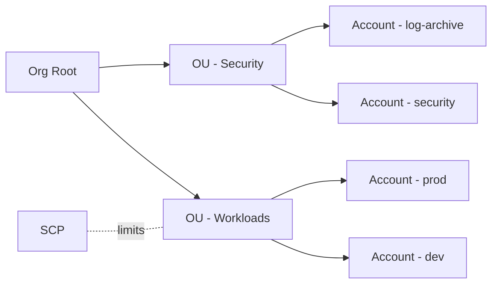

# Organizations/SCP: 멀티계정의 “상한선”

## Deep Dive

- SCP는 “허용 가능한 최대 범위”를 제한한다.
- SCP는 권한을 부여하지 않는다. (SCP로 Allow 해도 IAM에 Allow가 없으면 Deny)
- 권장 멀티계정 기본 형태(개념)
  - Security/Log archive 계정 분리
  - Workload 계정(prod/stage/dev) 분리

## TL;DR (한 줄 정리)

- SCP는 “부여”가 아니라 **상한선**이라서, 한 번 막히면 IAM Allow로 뚫을 수 없다.

## Back

- `../01-theory.md`
