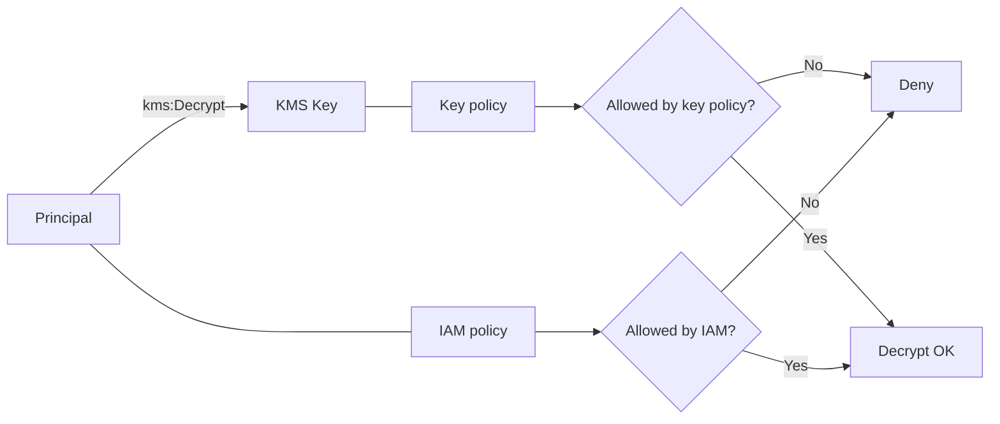

# KMS (key policy가 관문인 암호화 통제)

## 소개 (이게 뭔가요?)

- KMS는 키를 직접 배포하지 않고, **암호화/복호화 작업을 API로 위임**하게 만드는 중앙 키 관리 계층이다.
- 시험에서는 “암호화 통제”를 묻는 척하면서, 실제로는 **권한(정책) 문제**를 묻는 경우가 많다.

## 고객 사례 (스토리, 600~1000자)

보안팀이 “모든 데이터는 KMS로 암호화하세요”라고 했다. 팀은 S3에 SSE-KMS를 켰고, Secrets Manager도 KMS로 암호화했다. 그런데 배포 후부터 `AccessDenied`가 터진다. 개발자는 “S3 권한은 줬는데요?”라고 말하지만, 로그를 보면 문제는 S3가 아니라 KMS 호출에서 막힌다. 더 난감한 건, KMS는 ‘직접 호출’뿐 아니라 ‘다른 서비스가 대신 호출’하는 경로가 많다는 것이다. 즉, 누가 복호화를 요청하는지(사용자? 서비스? 역할?)가 바뀌면 권한도 달라진다.

처음엔 IAM policy에 `kms:Decrypt`을 추가하는데, 그래도 안 된다. 여기서 key policy를 봐야 한다. KMS는 key policy가 실제 gate 역할을 하는 경우가 많아서, IAM Allow가 있어도 key policy가 막으면 실패한다. “키 사용을 조직 표준으로 통제”하려면 key policy가 중심이 된다. 결국 해결은 단순히 권한을 더 주는 게 아니라, **(1) 호출 주체가 누구인지**, **(2) key policy에 그 주체가 포함되는지**, **(3) 서비스 통합(S3/Secrets)이 ‘대행 호출’하는지**를 순서대로 확인하는 것이다. 암호화는 ‘설정’이 아니라 ‘정책’ 문제로 귀결된다는 감각이 생기면, 같은 유형의 문제를 빠르게 푼다.

지금 장애의 원인은 “S3 권한 부족”일까요, 아니면 “KMS key policy의 관문”일까요?

## Impact 범위 (어디에 영향을 주나?)

- Security: 키 사용 통제(누가 어떤 데이터에 대해 encrypt/decrypt 가능한지)를 표준화
- Operations: SSE-KMS/Secrets에서 `AccessDenied` 트러블슈팅의 중심

## Exam Guide (Badges)

Exam guide mapping (details)

- Domain: Domain 1: Design Secure Architectures
- Task focus: 암호화/KMS 통제(키 정책, 서비스 통합 시 권한)

## Why This Matters (시험/실무에서 걸리는 지점)

- “IAM Allow는 있는데도 실패”가 보이면, KMS는 key policy가 관문일 수 있다.
- “서비스가 KMS를 대신 호출”하는 경로를 이해하면 함정이 풀린다.

## Core Concepts

- KMS는 key policy가 실제 gate 역할을 하는 문제가 많다.
- 서비스 통합(S3/Secrets/EBS)은 “대행 호출”이 끼어든다.

## Deep Dive

- When to use
  - 중앙에서 키 사용을 통제해야 할 때(조직/계정 표준)
  - SSE-KMS, Secrets, EBS 암호화처럼 AWS 서비스와 통합될 때
- When not to use
  - 암호화를 “앱에서 직접 구현”해야 한다면(특수 요구) KMS만으로는 끝나지 않는다(설계 범위 확장).
- Key policy vs IAM policy (시험 필수)
  - IAM policy: “이 주체가 kms:Decrypt을 호출할 수 있다”는 의도
  - Key policy: “이 키가 이 주체의 요청을 허용한다”는 실제 gate 역할을 하는 경우가 많음
  - 결론: IAM Allow가 있어도 key policy가 막으면 실패할 수 있다
- Grants(개념)
  - 일시적/위임형 권한 부여로 등장할 수 있다(서비스 통합/권한 위임의 힌트).
- Exam must-know (포인트 + Why + 대안)
  - Key point: “SSE-KMS/Secrets/EBS 암호화”는 결국 KMS API 권한 문제로 귀결될 수 있다.
  - Why: 데이터 키(또는 키 작업)는 KMS에서 발급/복호화되며, 호출 주체(직접 호출 vs 서비스 대행)와 key policy가 최종 관문이 된다.
  - Alternative: “키 공유/하드코딩” 요구가 보이면 Secrets Manager/role 기반 위임으로 설계를 재정렬한다.

## Quick Comparison Table

| Topic | Option 1 | Option 2 | Notes |
|---|---|---|---|
| 정책 관문 | Key policy | IAM policy | KMS 문제는 key policy가 관문인 경우가 많다 |
| 통합 암호화 | SSE-KMS/Secrets 암호화 | 앱 직접 암호화 | 시험에서는 관리형/통합형이 정답 후보가 많다 |

## Exam Traps (확장)

- 더 많은 연계/고급 함정: `../../exam-trap-bank.md`
- “KMS는 IAM만 보면 된다”는 오답 유도(특히 key policy)
- “SSE-KMS는 S3만 권한 주면 된다”는 오답 유도(대행 호출)

## Exam Trap Drill (O/X, 1~3분)

- “S3 GetObject는 Allow인데 SSE-KMS 객체만 AccessDenied” → 어디를 먼저 확인할까?

## TL;DR (한 줄 정리)

- KMS는 “IAM Allow”보다 **key policy가 관문**인 문제가 많다.

## References

- References index: `../../references/README.md`
- Exam guide (SAA-C03): `../../references/exam-guide.md`
- Glossary: `../../references/glossary.md`
- AWS services list: `../../references/aws-services.md`
- Exam keypoints: `../../exam-keypoints.md`
- Exam trap bank: `../../exam-trap-bank.md`

## Back

- `./README.md`
