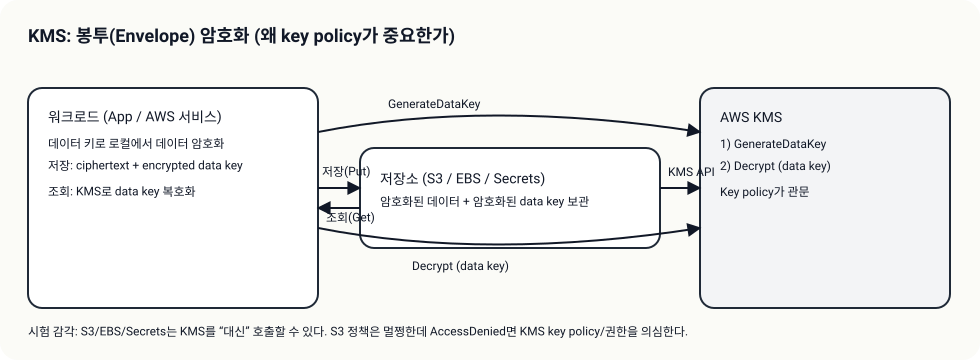
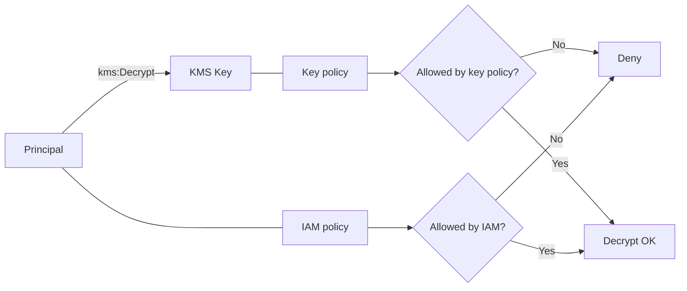
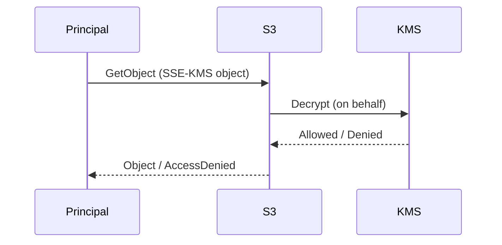

# KMS + Secrets 패턴

## 소개 (이게 뭔가요?)

- KMS는 “키를 직접 들고 다니지 않게” 해주는 중앙 키 관리 계층이다.
- Secrets Manager/Parameter Store는 “시크릿을 코드 밖으로” 빼서 안전하게 보관/회수/회전하게 돕는다.

## Impact 범위 (어디에 영향을 주나?)

- Security: 암호화 at-rest + 키/시크릿 접근 통제의 정답을 가른다.
- Operations: `AccessDenied`의 원인이 “S3 권한”이 아니라 “KMS key policy”인 경우가 많다.

## Exam Guide (Badges)

Exam guide mapping (details)

- Domain: Domain 1: Design Secure Architectures
- Task focus:
  - 1.1 Design secure access to AWS resources (권한/정책 경계)
  - 1.3 Determine appropriate data security controls (암호화/시크릿)

## Why This Matters (시험/실무에서 걸리는 지점)

- KMS는 “IAM Allow가 있는데도” 막힐 수 있다: **key policy**가 최종 관문인 문제가 많다.
- 시크릿을 코드/환경변수/S3에 두라는 선택지는 대개 오답이다(관리형 서비스 우선).

## Core Concepts

- 데이터 보호 통제 3종 세트(시험형 사고)
  - Encryption at rest: KMS/SSE-KMS/Secrets encryption
  - Access control: IAM/리소스 정책/경계
  - Audit: CloudTrail(누가 키/시크릿을 썼는지)
- KMS가 “정책”에 민감한 이유
  - 암호화/복호화는 KMS API 호출로 귀결되고, KMS는 key policy를 중심으로 통제한다.
  - 다른 서비스(S3, EBS, Secrets Manager)가 KMS를 “호출 대행”할 때도 권한 경계가 중요하다.

## Deep Dive

### KMS: key policy가 핵심(그리고 함정)

- When to use
  - 중앙에서 키 사용을 통제해야 할 때(조직/계정 표준)
  - SSE-KMS, Secrets, EBS 암호화처럼 AWS 서비스와 통합될 때
- When not to use
  - 암호화를 “앱에서 직접 구현”해야 한다면(특수 요구) KMS만으로는 끝나지 않는다(설계 범위 확장).
- Key policy vs IAM policy (시험 필수)
  - IAM policy: “이 주체가 kms:Decrypt을 호출할 수 있다”는 의도
  - Key policy: “이 키가 이 주체의 요청을 허용한다”는 실제 gate 역할을 하는 경우가 많음
  - 결론: IAM Allow가 있어도 key policy가 막으면 실패할 수 있다(문제에서 AccessDenied 힌트로 자주 등장)
- Grants(개념)
  - 일시적/위임형 권한 부여로 등장할 수 있다(서비스 통합/권한 위임의 힌트).
- Exam must-know (포인트 + Why + 대안)
  - Key point: “SSE-KMS/Secrets/EBS 암호화”는 결국 KMS API 권한 문제로 귀결될 수 있다.
  - Why: 데이터 키(또는 키 작업)는 KMS에서 발급/복호화되며, 호출 주체(직접 호출 vs 서비스 대행)와 key policy가 최종 관문이 된다.
  - Alternative: “키 공유/하드코딩” 요구가 보이면 KMS가 아니라 Secrets Manager/role 기반 위임으로 설계를 재정렬한다.

### Secrets Manager vs Parameter Store(SecureString)

- Secrets Manager가 시험에서 자주 정답인 이유
  - rotation/통합 관리(요구사항에 rotation이 있으면 강력 힌트)
  - 시크릿 수명/교체 운영을 “서비스”로 처리
- Parameter Store(SecureString)의 포지션
  - 단순 구성 값/파라미터에 적합(특히 애플리케이션 설정)
  - 시크릿 운영 기능이 요구되면 Secrets Manager가 더 자연스럽다.
- Exam must-know (포인트 + Why + 대안)
  - Key point: “자동 rotation/통합 운영” 요구가 있으면 Secrets Manager가 정답 후보가 된다.
  - Why: rotation은 단순 저장이 아니라 교체/검증/롤백까지 포함한 운영 기능이며, 문제 문장에 “주기적 교체”가 등장하면 의도적으로 분리해 묻는 경우가 많다.
  - Alternative: “경량 파라미터”만 요구하면 Parameter Store로 충분하지만, 시크릿 수명 관리가 요구되면 Secrets Manager로 전환한다.

## S3 SSE-KMS: “S3 권한만 주면 되지 않나요?” 함정

- SSE-KMS로 암호화된 S3 객체는 “S3 GetObject 권한” 외에 “KMS Decrypt 권한”이 연동될 수 있다.
- 시험에서는 다음 형태로 출제
  - “S3 정책은 맞는데 AccessDenied가 난다” -> KMS 권한/키 정책을 의심

## Quick Comparison Table

| Scenario | Best choice | Why | Common trap |
|---|---|---|---|
| 시크릿 rotation 요구 | Secrets Manager | 운영 기능/통합 | Parameter Store만으로 해결하려 함 |
| 단순 설정 값 | Parameter Store | 경량/단순 | 시크릿까지 한곳에 무작정 몰기 |
| S3 객체 보관 암호화 | SSE-KMS | 중앙 키 통제 | S3 권한만 주면 된다고 착각 |

## Exam Traps

- “KMS는 IAM만 보면 된다”는 오답 유도: key policy가 포인트다.
- “SSE-KMS는 S3만 권한 주면 된다”는 오답 유도: KMS decrypt 경로가 있다.
- “시크릿을 S3/코드/환경변수에 저장” 같은 답안이 보이면 거의 오답(요구사항 따라 예외는 있지만 SAA는 대부분 관리형 선택).

## TL;DR (한 줄 정리)

- “암호화/시크릿 + AccessDenied”가 보이면 **KMS key policy(관문) + 적절한 시크릿 저장소(Secrets Manager/Parameter Store) + 서비스 통합 권한(S3 SSE-KMS)** 조합부터 의심한다.
