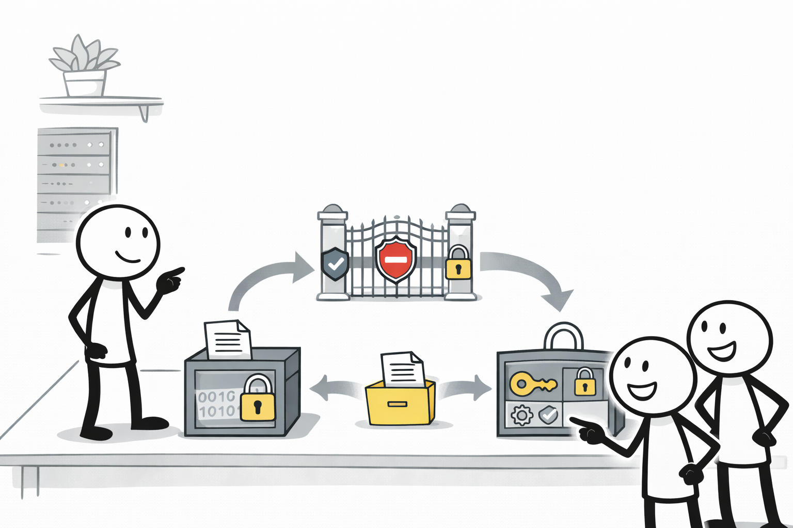
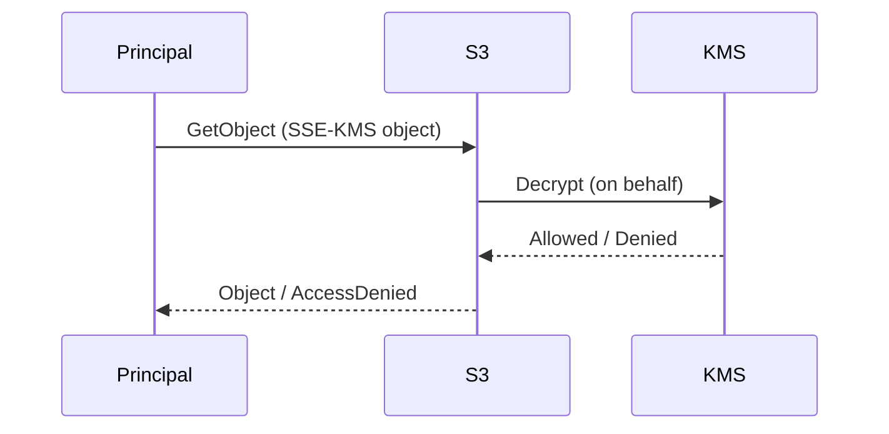

# S3 SSE-KMS (대행 호출로 인한 AccessDenied 함정)

## 소개 (이게 뭔가요?)

- SSE-KMS는 S3 객체를 저장할 때 KMS 키로 암호화하는 방식이다.
- 함정은 “S3 권한만 주면 끝”이 아니라, **KMS 권한/키 정책**이 같이 얽힌다는 점이다.

## 고객 사례 (스토리, 600~1000자)

팀이 보안 요구로 S3에 SSE-KMS를 켰다. 권한도 잘 준 줄 알았다. 버킷 정책과 IAM 정책에서 `s3:GetObject`를 허용했고, 테스트도 통과했다. 그런데 운영에서만 특정 경로의 객체를 읽을 때 `AccessDenied`가 터진다. 팀은 또 S3 정책을 의심해 Allow를 더 붙이려 한다. 하지만 로그를 보면 S3가 “KMS로 복호화”를 시도하는 순간에 막힌다. 즉, 사용자는 S3에 요청했지만, 실제로는 S3가 KMS를 ‘대신 호출’하고 있었던 것이다.

여기서 해결의 방향이 바뀐다. “누가 KMS를 호출하는가?”를 봐야 한다. 사용자가 직접 KMS를 호출하는 게 아니라, S3 서비스가 특정 키로 Decrypt를 수행해야 한다. 그러면 (1) 객체가 어떤 KMS 키로 암호화됐는지, (2) 그 키의 key policy가 S3의 대행 호출을 허용하는지, (3) 호출 주체(역할/서비스)가 kms:Decrypt 권한을 갖는지를 같이 확인해야 한다. 이 감각이 없으면 시험에서도 “S3는 맞는데 AccessDenied” 유형에 걸린다.

즉, 문제는 ‘암호화’를 켰기 때문이 아니라, 암호화가 만들어낸 “추가 관문(KMS)”을 통과하지 못해서 생긴다. 이 관문을 의식하면 같은 유형을 반복해서 맞출 수 있다.

지금 문제에서 “S3는 맞는데 안 된다”는 문장이 보이나요? 그럼 무엇을 먼저 의심해야 할까요?

## Impact 범위 (어디에 영향을 주나?)

- Security: 저장 시 암호화 표준화(SSE-KMS)와 키 통제(KMS)가 같이 움직인다
- Operations: AccessDenied 원인을 S3에서만 찾으면 해결이 늦어진다

## Exam Guide (Badges)

Exam guide mapping (details)

- Domain: Domain 1: Design Secure Architectures
- Task focus: 저장 시 암호화(SSE-KMS) + 권한/KMS 연동 함정

## Why This Matters (시험/실무에서 걸리는 지점)

- “S3 정책은 맞는데 AccessDenied”는 KMS 연동 함정을 의도적으로 묻는 경우가 많다.

## Core Concepts

- SSE-KMS 객체 접근은 “S3 → (대행) KMS Decrypt” 경로가 생길 수 있다.

## Deep Dive

### 왜 SSE-KMS는 “S3만” 보면 안 되는가

SSE-KMS의 핵심은 암호화 자체가 아니라 **권한 평가 경로가 2단계로 늘어난다**는 점이다.

1) S3에서 `GetObject`를 허용해야 하고  
2) S3가 대행 호출하는 KMS `Decrypt`도 **통과**해야 한다

그래서 “S3 권한은 맞는데 특정 객체만 `AccessDenied`”는 KMS 관문을 떠올리라는 강한 시험 신호다.

### 실무/시험에서 가장 많이 막히는 지점

- **KMS key policy가 gate**가 되는 경우가 있다. IAM에 `kms:Decrypt`을 줘도, key policy가 막으면 실패할 수 있다.
- 객체가 어느 키로 암호화됐는지부터 확인해야 한다(키가 다르면 정책도 다르다).

### 암호화 옵션 비교(자주 나오는 선택 문제)

| 옵션 | 장점 | 주의/함정 | 신호 |
|---|---|---|---|
| SSE-S3 | 설정/운영 단순 | 키 통제/감사 요구가 강하면 부족 | “기본 암호화만” |
| **SSE-KMS** | 키 통제/감사/정책 가능 | **권한/키 정책**으로 `AccessDenied` 함정 | “KMS로 암호화”, “키 통제” |
| SSE-C | 고객 제공 키 | 운영/키 관리 부담 큼 | 특수 케이스 |

### 비용/최적화 포인트(현업 Best Practice)

SSE-KMS는 요청이 많아지면 KMS 호출도 늘 수 있다. “대량 다운로드/캠페인” 같은 신호가 붙으면, 암호화를 유지하면서도 **비용 드라이버(KMS 호출)**를 의식해야 한다.

### 핵심 정리 (Deep Dive)

- SSE-KMS 문제는 “S3 Allow를 더 준다”가 아니라 **KMS(키/권한/키 정책)** 관문을 먼저 의심하는 문제다.
- “특정 객체만” 안 되는 경우는 **객체가 어떤 키로 암호화됐는지**부터 좁히면 해결이 빨라진다.

## Quick Comparison Table

| Symptom | Likely root | First check |
|---|---|---|
| S3는 Allow인데 AccessDenied | KMS key policy/Decrypt 경로 | 객체의 KMS 키 + key policy |

## Exam Traps (확장)

- 더 많은 연계/고급 함정: `../../exam-trap-bank.md`
- “SSE-KMS인데 S3 권한만 주면 된다”는 오답 유도

## Exam Trap Drill (O/X, 1~3분)

- “S3 GetObject는 되는데 SSE-KMS 객체만 안 된다” → KMS 관련해서 무엇을 먼저 볼까?

## TL;DR (한 줄 정리)

- SSE-KMS에서 막히면 “S3만” 보지 말고 **KMS(권한/키 정책)**를 같이 본다.

## Back

- `./README.md`
