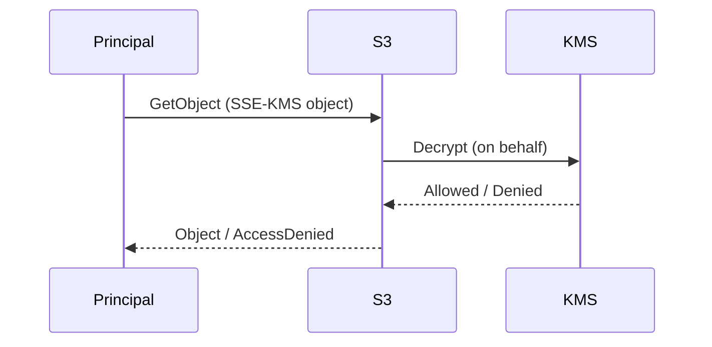

# S3 SSE-KMS (대행 호출로 인한 AccessDenied 함정)

## 소개 (이게 뭔가요?)

- SSE-KMS는 S3 객체를 저장할 때 KMS 키로 암호화하는 방식이다.
- 함정은 “S3 권한만 주면 끝”이 아니라, **KMS 권한/키 정책**이 같이 얽힌다는 점이다.

## 고객 사례 (스토리, 600~1000자)

팀이 보안 요구로 S3에 SSE-KMS를 켰다. 권한도 잘 준 줄 알았다. 버킷 정책과 IAM 정책에서 `s3:GetObject`를 허용했고, 테스트도 통과했다. 그런데 운영에서만 특정 경로의 객체를 읽을 때 `AccessDenied`가 터진다. 팀은 또 S3 정책을 의심해 Allow를 더 붙이려 한다. 하지만 로그를 보면 S3가 “KMS로 복호화”를 시도하는 순간에 막힌다. 즉, 사용자는 S3에 요청했지만, 실제로는 S3가 KMS를 ‘대신 호출’하고 있었던 것이다.

여기서 해결의 방향이 바뀐다. “누가 KMS를 호출하는가?”를 봐야 한다. 사용자가 직접 KMS를 호출하는 게 아니라, S3 서비스가 특정 키로 Decrypt를 수행해야 한다. 그러면 (1) 객체가 어떤 KMS 키로 암호화됐는지, (2) 그 키의 key policy가 S3의 대행 호출을 허용하는지, (3) 호출 주체(역할/서비스)가 kms:Decrypt 권한을 갖는지를 같이 확인해야 한다. 이 감각이 없으면 시험에서도 “S3는 맞는데 AccessDenied” 유형에 걸린다.

즉, 문제는 ‘암호화’를 켰기 때문이 아니라, 암호화가 만들어낸 “추가 관문(KMS)”을 통과하지 못해서 생긴다. 이 관문을 의식하면 같은 유형을 반복해서 맞출 수 있다.

지금 문제에서 “S3는 맞는데 안 된다”는 문장이 보이나요? 그럼 무엇을 먼저 의심해야 할까요?

## Impact 범위 (어디에 영향을 주나?)

- Security: 저장 시 암호화 표준화(SSE-KMS)와 키 통제(KMS)가 같이 움직인다
- Operations: AccessDenied 원인을 S3에서만 찾으면 해결이 늦어진다

## Exam Guide (Badges)

Exam guide mapping (details)

- Domain: Domain 1: Design Secure Architectures
- Task focus: 저장 시 암호화(SSE-KMS) + 권한/KMS 연동 함정

## Why This Matters (시험/실무에서 걸리는 지점)

- “S3 정책은 맞는데 AccessDenied”는 KMS 연동 함정을 의도적으로 묻는 경우가 많다.

## VAKOG Anchors

- V(Visual): 아래 시퀀스 다이어그램에서 “누가 KMS를 부르는지”를 본다.
- A(Auditory): “S3 권한 + KMS 권한/키 정책”을 한 문장으로 말한다.
- O(Olfactory, smell test): AccessDenied를 보고 S3 Allow만 추가하는 답은 냄새가 난다.
- G(Gustatory, taste test): 30초 내에 원인 후보를 2개로 좁힌다.

## Core Concepts

- SSE-KMS 객체 접근은 “S3 → (대행) KMS Decrypt” 경로가 생길 수 있다.

## Deep Dive

- SSE-KMS로 암호화된 S3 객체는 “S3 GetObject 권한” 외에 “KMS Decrypt 권한”이 연동될 수 있다.
- 시험에서는 다음 형태로 출제된다:
  - “S3 정책은 맞는데 AccessDenied가 난다” -> KMS 권한/키 정책을 의심

## Quick Comparison Table

| Symptom | Likely root | First check |
|---|---|---|
| S3는 Allow인데 AccessDenied | KMS key policy/Decrypt 경로 | 객체의 KMS 키 + key policy |

## Exam Traps (5-8)

- “SSE-KMS인데 S3 권한만 주면 된다”는 오답 유도

## Taste Test (1~3분)

- “S3 GetObject는 되는데 SSE-KMS 객체만 안 된다” → KMS 관련해서 무엇을 먼저 볼까?

## TL;DR (한 줄 정리)

- SSE-KMS에서 막히면 “S3만” 보지 말고 **KMS(권한/키 정책)**를 같이 본다.

## Back

- `./00-theory-index.md`
