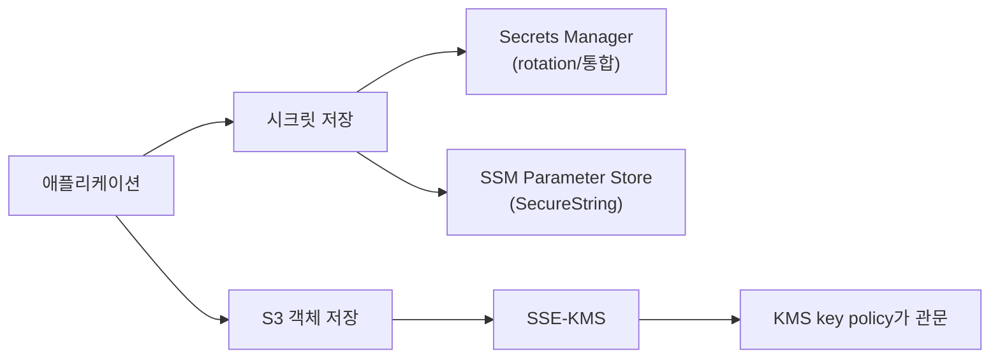

# Day 02 - KMS + Secrets patterns (데이터 보호: KMS/Secrets/S3 SSE-KMS)

## Quick Links

- [오늘의 이야기](#오늘의-이야기)
- [Timeline](#timeline-오늘-학습-타임라인)
- [Flow](#flow-서비스-연결-흐름)
- [Reading](#reading-서비스별-theory)
- [Quiz](#quiz)
- [References](../../references/README.md)

## 오늘의 이야기

점심쯤 운영 채널에 이런 말이 올라옵니다. “S3에 파일 업로드는 되는데, 다운로드만 하면 또 `AccessDenied`가 떠요.” 그래서 로그를 따라가 보면, S3 권한은 분명히 줬는데도 막혀 있죠. 이럴 때 흔한 함정이 **S3만 보고 끝내는 것**이에요. 오늘의 주인공은 KMS입니다. SSE-KMS는 결국 KMS `Decrypt`/`GenerateDataKey` 같은 호출로 이어지고, 여기서 **KMS key policy**가 관문 역할을 할 수 있습니다. 그래서 “IAM Allow만 있으면 된다”는 생각이 깨지기 시작합니다.

그리고 또 하나, 배포 파이프라인에서 시크릿을 어디에 둘지 결정해야 합니다. 그냥 SSM Parameter Store(SecureString)에 넣어도 되지만, rotation이나 운영 편의(자동 교체/통합)가 요구되면 **Secrets Manager**가 더 자연스럽습니다. 반대로 단순 설정값은 Parameter Store가 가볍고요. 오늘은 이렇게 정리하면 편해요. “데이터 보호”는 암호화(KMS)만이 아니라, **시크릿 보관(Secrets Manager/Parameter Store)과 S3 SSE-KMS 같은 통합 지점**에서 권한이 어떻게 엮이는지까지 한 번에 보는 겁니다. 실무에서도 시험에서도, `AccessDenied`는 대개 “권한 하나 더”가 아니라 “경계 하나 더”를 의미하니까요.

특히 KMS는 “키를 어디에 두나”보다 “누가 어떤 조건으로 쓰나”가 더 중요합니다. 키 정책(key policy)이 관문이 되는 순간이 있고, 서비스가 KMS를 대신 호출할 때는 권한이 생각보다 더 촘촘히 맞아야 해요. 그래서 SSE-KMS 문제를 풀 때는 S3 권한만 보지 말고, KMS 권한 경로까지 같이 따라가야 합니다. 시크릿도 마찬가지로, “일단 저장”이 아니라 “교체/감사/권한 분리”까지 포함해서 운영 가능한 형태로 고르는 게 포인트예요. 오늘 Day는 결국 KMS, Secrets Manager, Parameter Store, 그리고 S3 SSE-KMS를 한 줄로 연결해주는 날입니다.

## Timeline (오늘 학습 타임라인)

```mermaid
gantt
  title Learning Timeline
  dateFormat  HH:mm
  axisFormat  %H:%M
  section Day
  워밍업 - 암호화/접근/감사 3종 세트 :t1, 00:00, 10m
  Reading :t2, after t1, 120m
  미니 정리 - Secrets vs Parameter :t3, after t2, 30m
  Trap drill - SSE-KMS AccessDenied :t4, after t3, 50m
  Quiz :t5, after t4, 30m
```

## Flow (서비스 연결 흐름)

## Reading (서비스별 theory)

- [KMS (key policy가 관문인 암호화 통제)](01-kms.md)
- [Secrets Manager vs Parameter Store(SecureString)](02-secrets-vs-parameter-store.md)
- [S3 SSE-KMS (대행 호출로 인한 AccessDenied 함정)](03-s3-sse-kms.md)

## Quiz

- [Day 02 Quiz](04-quiz.md)

## Back

- `../README.md`
