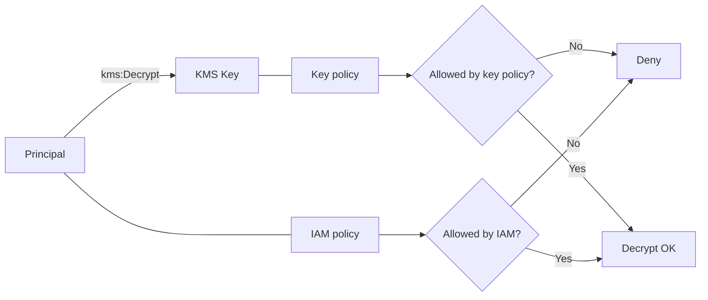

# KMS: key policy가 핵심(그리고 함정)

## Deep Dive

- When to use
  - 중앙에서 키 사용을 통제해야 할 때(조직/계정 표준)
  - SSE-KMS, Secrets, EBS 암호화처럼 AWS 서비스와 통합될 때
- When not to use
  - 암호화를 “앱에서 직접 구현”해야 한다면(특수 요구) KMS만으로는 끝나지 않는다(설계 범위 확장).
- Key policy vs IAM policy (시험 필수)
  - IAM policy: “이 주체가 kms:Decrypt을 호출할 수 있다”는 의도
  - Key policy: “이 키가 이 주체의 요청을 허용한다”는 실제 gate 역할을 하는 경우가 많음
  - 결론: IAM Allow가 있어도 key policy가 막으면 실패할 수 있다(문제에서 AccessDenied 힌트로 자주 등장)
- Grants(개념)
  - 일시적/위임형 권한 부여로 등장할 수 있다(서비스 통합/권한 위임의 힌트).
- Exam must-know (포인트 + Why + 대안)
  - Key point: “SSE-KMS/Secrets/EBS 암호화”는 결국 KMS API 권한 문제로 귀결될 수 있다.
  - Why: 데이터 키(또는 키 작업)는 KMS에서 발급/복호화되며, 호출 주체(직접 호출 vs 서비스 대행)와 key policy가 최종 관문이 된다.
  - Alternative: “키 공유/하드코딩” 요구가 보이면 KMS가 아니라 Secrets Manager/role 기반 위임으로 설계를 재정렬한다.

## TL;DR (한 줄 정리)

- KMS는 “IAM Allow”보다 **key policy가 관문**인 문제가 많다.

## Back

- `../01-theory.md`
