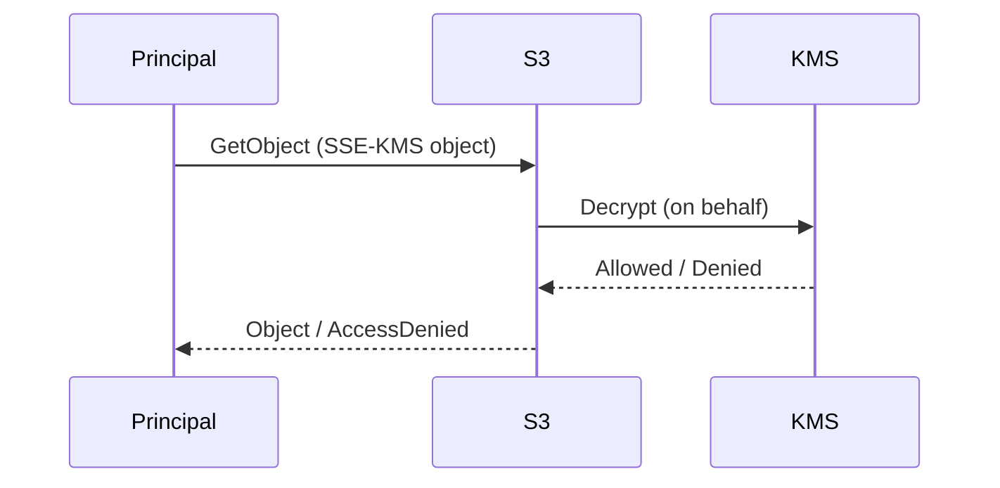

# S3 SSE-KMS: “S3 권한만 주면 되지 않나요?” 함정

## 핵심 함정

- SSE-KMS로 암호화된 S3 객체는 “S3 GetObject 권한” 외에 “KMS Decrypt 권한”이 연동될 수 있다.
- 시험에서는 다음 형태로 출제된다:
  - “S3 정책은 맞는데 AccessDenied가 난다” -> KMS 권한/키 정책을 의심

## TL;DR (한 줄 정리)

- SSE-KMS에서 막히면 “S3만” 보지 말고 **KMS(권한/키 정책)**를 같이 본다.

## Back

- `../01-theory.md`
