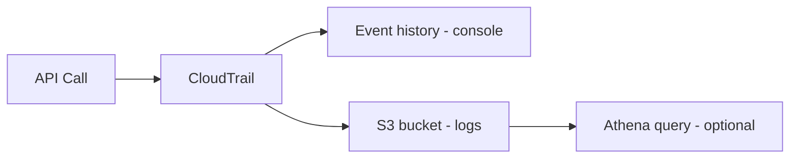

# CloudTrail (누가/언제/무엇을 했나: 행위의 근거)

## 소개 (이게 뭔가요?)

- CloudTrail은 AWS API 호출(행위)을 기록해서 “누가 무엇을 했는지”를 재구성할 수 있게 한다.
- 사고/장애 대응에서 “근거 자료”가 필요할 때 가장 먼저 나오는 서비스다.

## 고객 사례 (스토리, 600~1000자)

새벽에 알림이 떴다. “보안 그룹 인바운드가 0.0.0.0/0으로 열렸습니다.” 팀은 즉시 묻는다. “누가 열었지? 언제? 콘솔로 했나, IaC로 했나?” 애플리케이션 로그에는 아무것도 없다. 인프라 변경은 앱 로그 밖에서 일어난다. 감사팀은 “근거를 남겨야 한다”고 하고, 운영팀은 “다음 번엔 더 빨리 찾자”고 한다.

여기서 CloudTrail이 역할을 한다. CloudTrail은 ‘행위’의 영수증이다. 누가 어떤 API를 호출했는지, 어떤 역할(Role)로 했는지, 어떤 소스 IP/세션으로 했는지 단서를 준다. 시험에서도 “누가 삭제했는지/누가 정책을 바꿨는지”는 CloudTrail 축이다. 다만 범위가 있고 비용도 있다. 기본은 관리 이벤트 중심이고, S3 객체 단위(Data events)는 필요할 때만 켜는 트레이드오프다. 그리고 “장기 보관/감사 체계”가 요구되면 Event history만으로는 부족해서 Trail로 S3에 저장해야 한다. 결국 CloudTrail은 단순 로그가 아니라 ‘질문에 답할 수 있는 근거’다.

그리고 이 근거는 “사고가 난 다음”이 아니라 “사고가 나기 전부터” 준비돼 있어야 한다. Trail로 장기 보관을 해두지 않으면, 나중에 찾고 싶어도 남아 있지 않을 수 있다.

당신이 지금 답해야 하는 질문이 “누가 했나?”라면, 어떤 로그가 필요할까요?

## Impact 범위 (어디에 영향을 주나?)

- Security/Compliance: 감사(Audit) 근거 자료의 핵심
- Operations: 변경 원인 추적(Who did what) 속도를 좌우

## Exam Guide (Badges)

Exam guide mapping (details)

- Domain: Domain 1: Design Secure Architectures
- Task focus: 감사/추적(행위 로그) 설계

## Why This Matters (시험/실무에서 걸리는 지점)

- “누가 변경했나”는 CloudTrail로 푼다.
- “로그를 켜자”가 아니라 “어떤 이벤트를 어떤 범위로”가 선택 포인트다.

## Core Concepts

- Event history: 최근 이벤트 빠른 확인(기본 제공)
- Trail: S3로 장기 보관/검색/감사 체계 구축(조직 표준)

## Deep Dive

- What it captures(개념)
  - 관리 이벤트(Management events): 대부분의 제어 plane API 호출
  - (필요 시) 데이터 이벤트(Data events): 예: S3 object-level API (요구사항/비용/범위가 다름)
- Event history vs Trail
  - Event history: 콘솔에서 최근 이벤트를 빠르게 확인(기본 제공 범위)
  - Trail: S3로 장기 보관/검색/감사 체계 구축(조직 표준)
- 시험 포인트
  - “누가 삭제했는지/누가 정책을 바꿨는지”는 CloudTrail
  - “S3 데이터 이벤트를 켤지 말지”는 비용/요구사항 트레이드오프
- Exam must-know (포인트 + Why + 대안)
  - Key point: “누가 이 변경을 했나”는 CloudTrail, “현재/과거 구성 상태가 어땠나”는 Config다.
  - Why: CloudTrail은 API 호출(행위)의 증거이고, Config는 리소스 구성(상태)의 스냅샷/이력이다.
  - Alternative: “탐지/알림” 요구가 명시되면 GuardDuty/Security Hub 같은 탐지/집계 계층을 붙인다.

## Quick Comparison Table

| Question | Best tool | Why |
|---|---|---|
| 누가 정책을 바꿨나 | CloudTrail | 행위(API 호출) 근거 |

## Exam Traps (확장)

- 더 많은 연계/고급 함정: `../../exam-trap-bank.md`
- “감사 요구”인데 CloudTrail 대신 앱 로그만 보는 답
- 데이터 이벤트를 무조건 켜는 답(요구/비용 트레이드오프 무시)

## Exam Trap Drill (O/X, 1~3분)

- “누가 보안 그룹을 열었는지 알고 싶다” → 어떤 도구?

## TL;DR (한 줄 정리)

- “누가/언제/무엇을 했나”는 CloudTrail로 푼다.

## References

- Internal references:
  - [References index](../../references/README.md)
  - [Exam guide (SAA-C03)](../../references/exam-guide.md)
  - [Glossary](../../references/glossary.md)
  - [AWS services list](../../references/aws-services.md)
  - [Exam keypoints](../../exam-keypoints.md)
  - [Exam trap bank](../../exam-trap-bank.md)

- Official AWS documentation:
  - [AWS CloudTrail User Guide](https://docs.aws.amazon.com/awscloudtrail/latest/userguide/cloudtrail-user-guide.html)

## Back

- `./README.md`
