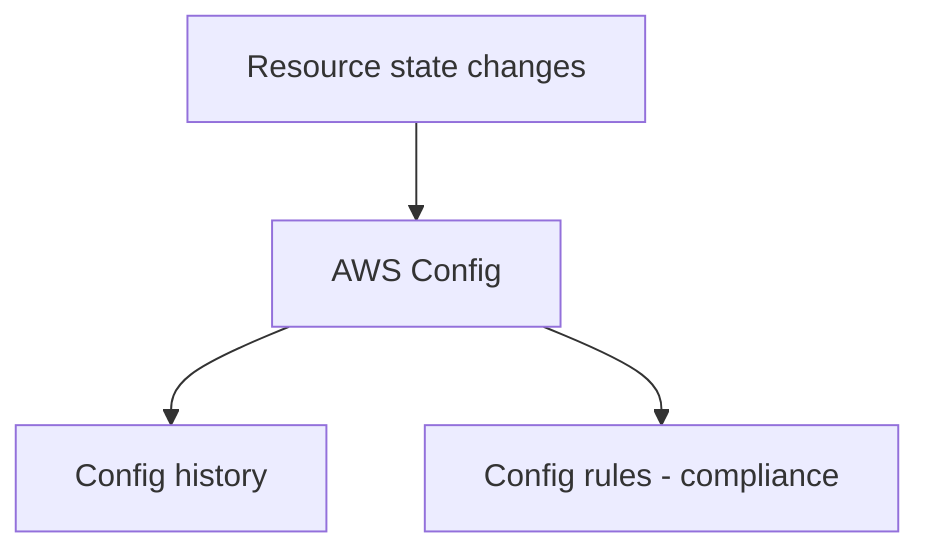

# AWS Config (구성 상태 + 준수/규칙 위반)

## 소개 (이게 뭔가요?)

- Config는 “리소스가 어떤 구성 상태였는지”를 시간축으로 기록하고, 규칙 기반 준수 평가를 할 수 있게 한다.
- CloudTrail이 행위라면, Config는 상태다.

## 고객 사례 (스토리, 600~1000자)

감사팀이 요구했다. “우리 계정에서 퍼블릭 S3가 생기면 바로 잡혀야 합니다. 그리고 지난 3개월 동안 어떤 리소스가 규칙을 위반했는지 보고서가 필요해요.” 운영팀은 CloudTrail을 떠올렸지만, CloudTrail은 “누가 무엇을 했나”에는 강하지만 “현재 구성이 규칙을 위반했는가”를 바로 답하기는 어렵다. 예를 들어 보안 그룹이 0.0.0.0/0을 열고 있는지, 특정 태그가 빠졌는지 같은 질문은 ‘행위’보다 ‘상태’다.

Config를 쓰면 상태를 기준으로 규칙을 만들고, 위반을 평가할 수 있다. 누가 바꿨는지까지 필요하면 CloudTrail을 붙이면 된다. 결국 감사/준수 요구는 “행위 로그만”으로 끝나지 않고, 리소스 상태를 기준으로 판단하는 흐름이 필요하다. 시험에서도 “준수/규칙 위반”이라는 문장이 나오면 Config가 정답 후보로 올라간다. 반대로 “누가 바꿨나?”까지 묻는다면 CloudTrail과 조합해야 한다.

그리고 이 차이는 “보고서”를 만들 때 더 크게 느껴진다. 하루 단위/주 단위로 “규칙 위반 리소스 목록”을 내야 한다면, 행위 로그를 뒤지는 것보다 상태/준수 평가가 훨씬 자연스럽다. 그래서 Config는 ‘감사팀 질문에 답하는 도구’로 자주 등장한다.

지금 문제의 핵심이 “누가 했다”가 아니라 “지금 상태가 규칙을 어겼나”인가요?

## Impact 범위 (어디에 영향을 주나?)

- Compliance: 규칙 기반 준수(위반) 판단의 핵심 도구
- Operations: 상태 이력/변경 추적(구성 중심)으로 원인 분석을 돕는다

## Exam Guide (Badges)

Exam guide mapping (details)

- Domain: Domain 1: Design Secure Architectures
- Task focus: 준수/규칙 위반(Config) vs 행위 추적(CloudTrail)

## Why This Matters (시험/실무에서 걸리는 지점)

- “준수/규칙 위반”은 Config 축이다.
- “누가 바꿨나”는 CloudTrail 축이다.

## Core Concepts

## Deep Dive

- What it captures(개념)
  - 리소스 구성(configuration items) 변경 이력
  - 규칙 기반 준수 평가(Config rules)
- CloudTrail과의 차이(시험형 문장)
  - CloudTrail: “행위(Who did what)”
  - Config: “상태(What is the current/was the configuration)”
- Exam must-know (포인트 + Why + 대안)
  - Key point: “준수/규칙 위반” 문장이 있으면 Config(규칙/준수)가 정답 후보로 올라간다.
  - Why: 준수는 이벤트(행위)보다 리소스의 속성/구성 기준으로 판단된다.
  - Alternative: “누가 그 설정을 바꿨는지”까지 묻는다면 CloudTrail을 함께 써야 한다.

### Best Practices (운영/감사 관점)

- 준수는 “한 번 점검”이 아니라 **지속 평가**가 핵심이다. 문제에서 “주기적으로 보고”, “지속적으로 위반 탐지”가 나오면 Config rules 쪽으로 기운다.
- “위반을 발견했으면 자동으로 고친다” 같은 문장이 보이면, Config 단독이 아니라 **자동 조치(remediation)** 흐름까지 묻는 문제일 수 있다.
- 조직이 커지면 계정 단위가 아니라 “여러 계정의 준수 현황을 한 곳에서” 보고 싶어한다. 이때는 **집계(aggregator)** 성격의 키워드가 함께 등장할 수 있다.

### 핵심 정리 (Deep Dive)

- Config는 “상태/준수”, CloudTrail은 “행위/주체”다. 둘을 섞으면 소거가 어려워진다.

## Quick Comparison Table

| Question | Best tool | Why |
|---|---|---|
| 현재 구성이 기준 위반인가 | Config | 상태/준수 평가 |

## Exam Traps (확장)

- 더 많은 연계/고급 함정: `../../exam-trap-bank.md`
- “준수”인데 CloudTrail만 고르는 답

## Exam Trap Drill (O/X, 1~3분)

- “현재 보안 그룹 규칙이 정책 위반인지” → CloudTrail? Config?

## TL;DR (한 줄 정리)

- “현재/과거 구성 상태가 어땠나”와 “준수/규칙 위반”은 Config 축이다.

## Back

- `./README.md`
