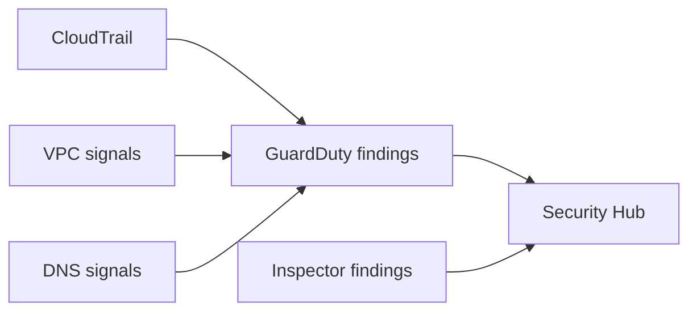

# Detection services (GuardDuty / Security Hub / Inspector)

## 소개 (이게 뭔가요?)

- CloudTrail/Config가 “근거(로그/상태)”라면, GuardDuty/Security Hub/Inspector는 “발견(findings)을 만들고 모으는” 탐지 계층이다.

## 고객 사례 (스토리, 600~1000자)

감사 로그는 쌓이는데, 문제는 “누가 봐서” 이상을 판단하느냐다. 운영팀은 이미 바쁘고, 보안팀은 “의심스러운 행위를 자동으로 찾아서 알림을 보내라”고 한다. 예를 들어 크리덴셜이 유출됐을 때의 이상 API 호출, 의심스러운 DNS 조회, VPC에서의 비정상 트래픽 같은 것들이다. CloudTrail만으로는 ‘찾아주지’ 않는다. 그냥 기록만 남는다.

이때 GuardDuty는 여러 신호 소스(CloudTrail, VPC Flow Logs, DNS 등)에서 이상 패턴을 분석해 findings를 만든다. Security Hub는 다양한 보안 결과를 집계하고 표준화해서 “한 곳에서 관리”하게 해준다. Inspector는 인프라/워크로드의 취약점/구성 평가 축에서 등장한다. 시험에서는 이들을 “로그 저장소”로 착각하게 만드는 선택지가 나온다. 하지만 역할은 다르다. 기록은 CloudTrail/Config, 탐지는 GuardDuty, 집계는 Security Hub, 취약점 평가는 Inspector다. 요구사항 문장에서 “탐지/알림/집계”가 나오면, 이제 로그만으로 끝나지 않는다는 신호다.

지금 문장에 “탐지/알림/위협”이 들어 있나요? 그럼 어떤 계층이 필요할까요?

## Impact 범위 (어디에 영향을 주나?)

- Security: 이상 징후를 findings로 만들고 대응 체계를 붙인다
- Operations: “로그를 보는 사람” 의존을 줄인다

## Exam Guide (Badges)

Exam guide mapping (details)

- Domain: Domain 1: Design Secure Architectures
- Task focus: 탐지/집계/취약점 서비스(개념 연결)

## Why This Matters (시험/실무에서 걸리는 지점)

- “탐지/알림” 요구는 CloudTrail 자체가 아니라 탐지 계층을 붙이라는 신호다.

## VAKOG Anchors

- V(Visual): 아래 흐름도로 “소스 → 탐지 → 집계”를 본다.
- A(Auditory): “기록은 CloudTrail, 탐지는 GuardDuty”를 말로 고정한다.
- O(Olfactory, smell test): “GuardDuty가 로그를 저장한다” 같은 문장은 냄새가 난다.
- G(Gustatory, taste test): 문장 하나 보고 ‘탐지 계층’ 필요 여부를 판정한다.

## Core Concepts

## Deep Dive

- GuardDuty: 위협 탐지(여러 로그 소스 기반) 후 findings 생성
- Security Hub: 다양한 보안 결과를 집계/표준화/점수화(허브)
- Inspector: 취약점/구성 평가(선택지로 출제될 수 있음)

## Quick Comparison Table

| Need | Best tool | Why |
|---|---|---|
| 이상 징후 탐지 | GuardDuty | 탐지 엔진 + findings |
| 결과 집계 | Security Hub | 여러 findings 표준화/집계 |
| 취약점 평가 | Inspector | 취약점/구성 평가 축 |

## Exam Traps (5-8)

- 탐지 서비스를 “로그 저장소”로 착각하게 만드는 선택지

## Taste Test (1~3분)

- “의심스러운 활동을 탐지하고 알림” → CloudTrail만으로 충분한가?

## TL;DR (한 줄 정리)

- “탐지/알림/집계”는 CloudTrail 자체가 아니라 **GuardDuty → Security Hub** 같은 계층을 붙여서 푼다.

## Back

- `./00-theory-index.md`
