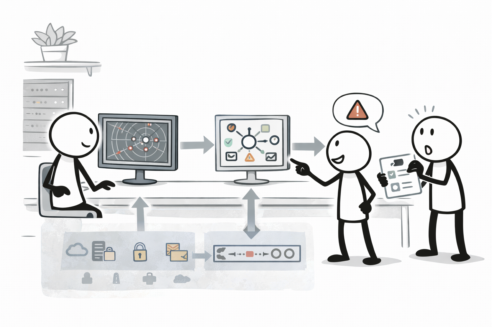
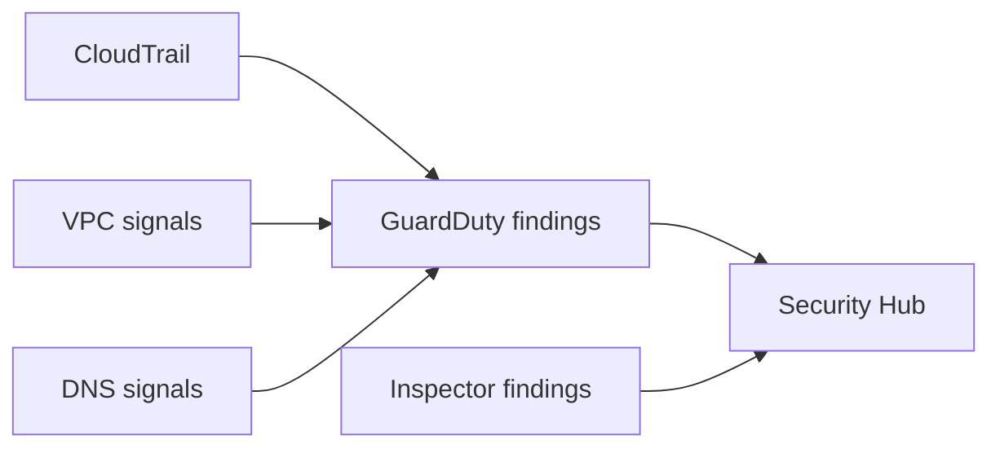

# Detection services (GuardDuty / Security Hub / Inspector)

## 소개 (이게 뭔가요?)

- CloudTrail/Config가 “근거(로그/상태)”라면, GuardDuty/Security Hub/Inspector는 “발견(findings)을 만들고 모으는” 탐지 계층이다.

## 고객 사례 (스토리, 600~1000자)

감사 로그는 쌓이는데, 문제는 “누가 봐서” 이상을 판단하느냐다. 운영팀은 이미 바쁘고, 보안팀은 “의심스러운 행위를 자동으로 찾아서 알림을 보내라”고 한다. 예를 들어 크리덴셜이 유출됐을 때의 이상 API 호출, 의심스러운 DNS 조회, VPC에서의 비정상 트래픽 같은 것들이다. CloudTrail만으로는 ‘찾아주지’ 않는다. 그냥 기록만 남는다.

이때 GuardDuty는 여러 신호 소스(CloudTrail, VPC Flow Logs, DNS 등)에서 이상 패턴을 분석해 findings를 만든다. Security Hub는 다양한 보안 결과를 집계하고 표준화해서 “한 곳에서 관리”하게 해준다. Inspector는 인프라/워크로드의 취약점/구성 평가 축에서 등장한다. 시험에서는 이들을 “로그 저장소”로 착각하게 만드는 선택지가 나온다. 하지만 역할은 다르다. 기록은 CloudTrail/Config, 탐지는 GuardDuty, 집계는 Security Hub, 취약점 평가는 Inspector다. 요구사항 문장에서 “탐지/알림/집계”가 나오면, 이제 로그만으로 끝나지 않는다는 신호다.

지금 문장에 “탐지/알림/위협”이 들어 있나요? 그럼 어떤 계층이 필요할까요?

## Impact 범위 (어디에 영향을 주나?)

- Security: 이상 징후를 findings로 만들고 대응 체계를 붙인다
- Operations: “로그를 보는 사람” 의존을 줄인다

## Exam Guide (Badges)

Exam guide mapping (details)

- Domain: Domain 1: Design Secure Architectures
- Task focus: 탐지/집계/취약점 서비스(개념 연결)

## Why This Matters (시험/실무에서 걸리는 지점)

- “탐지/알림” 요구는 CloudTrail 자체가 아니라 탐지 계층을 붙이라는 신호다.

## Core Concepts

## Deep Dive

### “로그/근거”와 “탐지/결과”를 분리하기

시험에서 가장 흔한 함정은 “로그를 모으면 탐지가 된다”로 착각하게 만드는 것이다.

- **근거를 남기는 계층**: CloudTrail(행위/API), Config(상태/구성), (옵션) VPC Flow Logs
- **탐지/평가해서 결과(findings)를 만드는 계층**: GuardDuty / Inspector / Macie 등
- **결과를 모아 한 곳에서 관리하는 계층**: Security Hub

즉, GuardDuty/Security Hub는 “로그 저장소”가 아니라 **findings를 만들고/모으는 계층**이다.

### 서비스별 “언제 이렇게/저렇게”

| 서비스 | 언제 쓰나(문장 신호) | 핵심 출력 |
|---|---|---|
| GuardDuty | “의심스러운 API/DNS/네트워크 활동 탐지”, “위협 징후 자동 알림” | 위협 탐지 findings |
| Inspector | “취약점 스캔”, “CVE/패치”, “컨테이너/서버 취약점” | 취약점 findings |
| Security Hub | “여러 보안 결과를 한 곳에서”, “표준화/집계/대시보드” | 통합 보안 허브 |
| (자주 등장) Macie | “S3의 민감정보/PII 탐지” | 데이터 분류 findings |

### Best Practices (운영 관점)

- “탐지”는 끝이 아니라 시작이다. 보통 findings를 **EventBridge/SNS**로 연결해 티켓/알림 흐름을 만든다.
- “누가/언제/무엇을 했나” 질문은 탐지 서비스가 아니라 **CloudTrail** 축이라는 점을 고정해두면 소거가 빨라진다.

### 핵심 정리 (Deep Dive)

- “탐지/알림” 신호 → GuardDuty(또는 해당 도메인의 탐지 서비스)
- “집계/표준화” 신호 → Security Hub
- “취약점/CVE” 신호 → Inspector

## Quick Comparison Table

| Need | Best tool | Why |
|---|---|---|
| 이상 징후 탐지 | GuardDuty | 탐지 엔진 + findings |
| 결과 집계 | Security Hub | 여러 findings 표준화/집계 |
| 취약점 평가 | Inspector | 취약점/구성 평가 축 |
| S3 민감정보 탐지 | Macie | 데이터 분류/PII 탐지 |

## Exam Traps (확장)

- 더 많은 연계/고급 함정: `../../exam-trap-bank.md`
- 탐지 서비스를 “로그 저장소”로 착각하게 만드는 선택지

## Exam Trap Drill (O/X, 1~3분)

- “의심스러운 활동을 탐지하고 알림” → CloudTrail만으로 충분한가?

## TL;DR (한 줄 정리)

- “탐지/알림/집계”는 CloudTrail 자체가 아니라 **GuardDuty → Security Hub** 같은 계층을 붙여서 푼다.

## References

- Internal references:
  - [References index](../../references/README.md)
  - [Exam guide (SAA-C03)](../../references/exam-guide.md)
  - [Glossary](../../references/glossary.md)
  - [AWS services list](../../references/aws-services.md)
  - [Exam keypoints](../../exam-keypoints.md)
  - [Exam trap bank](../../exam-trap-bank.md)

- Official AWS documentation:
  - [AWS KMS Developer Guide](https://docs.aws.amazon.com/kms/latest/developerguide/overview.html)
  - [AWS CloudTrail User Guide](https://docs.aws.amazon.com/awscloudtrail/latest/userguide/cloudtrail-user-guide.html)
  - [AWS Config Developer Guide](https://docs.aws.amazon.com/config/latest/developerguide/WhatIsConfig.html)
  - [Amazon VPC User Guide](https://docs.aws.amazon.com/vpc/latest/userguide/what-is-amazon-vpc.html)
  - [Amazon S3 User Guide](https://docs.aws.amazon.com/AmazonS3/latest/userguide/Welcome.html)
  - [Search: S3 SSE-KMS](https://docs.aws.amazon.com/search/doc-search.html?searchQuery=S3%20SSE-KMS)
  - [Amazon GuardDuty User Guide](https://docs.aws.amazon.com/guardduty/latest/ug/what-is-guardduty.html)
  - [Amazon Inspector User Guide](https://docs.aws.amazon.com/inspector/latest/user/what-is-inspector.html)
  - [AWS Security Hub User Guide](https://docs.aws.amazon.com/securityhub/latest/userguide/what-is-securityhub.html)
  - [Amazon Macie User Guide](https://docs.aws.amazon.com/macie/latest/user/what-is-macie.html)

## Back

- `./README.md`
