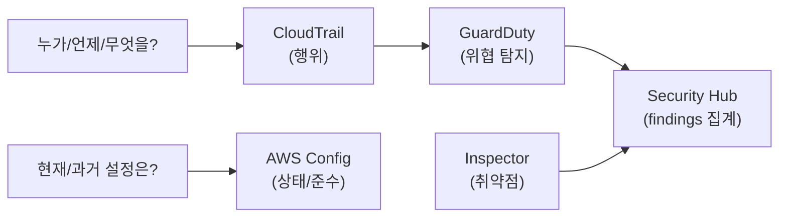

# Day 03 - CloudTrail/Config + detection services (감사/준수/탐지)

## Quick Links

- [오늘의 이야기](#오늘의-이야기)
- [Timeline](#timeline-오늘-학습-타임라인)
- [Flow](#flow-서비스-연결-흐름)
- [Reading](#reading-서비스별-theory)
- [Quiz](#quiz)
- [References](../../references/README.md)

## 오늘의 이야기

오후에 감사 요청이 하나 들어옵니다. “지난주에 누가 보안 그룹을 열었는지, 그리고 지금도 규칙이 기준을 지키고 있는지 한 번에 보여주세요.” 여기서부터 혼동이 시작되죠. 로그를 잘 켜놨는데도, 질문이 “누가 했나”인지 “상태가 뭐였나”인지 섞여 있으면 답이 느려집니다. 오늘은 이걸 사무실 언어로 딱 나눠요. **CloudTrail은 행위**입니다. 누가 언제 어떤 API를 호출했는지, 즉 ‘사건의 근거’를 남깁니다. 반면 **AWS Config는 상태**입니다. 리소스가 어떤 설정이었는지, 규칙 위반(compliance)이 있었는지를 쭉 따라가죠.

그 위에 “탐지”가 얹힙니다. 이상 징후를 찾아 findings를 만들려면 GuardDuty가 자연스럽고, 여러 계정/리전/서비스에서 올라온 findings를 한눈에 모으고 표준화하려면 Security Hub가 편합니다. 그리고 “취약점 스캔”이라는 단어가 나오면 Inspector가 떠야 해요. 결국 오늘의 실전 포인트는 하나입니다. 문제 문장을 읽고 먼저 분리합니다. **행위는 CloudTrail, 상태·준수는 Config, 위협 탐지는 GuardDuty, 집계는 Security Hub, 취약점은 Inspector.** 이렇게만 나눠도 정답 후보가 확 줄어들고, 실무에서도 “로그를 어디서 봐야 하지?”가 빨리 정리됩니다.

실무에서 자주 하는 실수는 “다 켜두면 되지”로 끝내는 겁니다. CloudTrail을 켠다고 규정 준수가 자동으로 되는 건 아니고(Config rules/준수 평가가 필요), Config를 켠다고 누가 바꿨는지가 자동으로 설명되진 않아요(그건 CloudTrail의 영역). 또 Security Hub는 ‘탐지 엔진’이라기보다 findings를 모으고 기준(표준/컨트롤)에 맞춰 정리하는 역할이 크기 때문에, GuardDuty/Inspector 같은 소스와 함께 보는 그림이 더 자연스럽습니다. 오늘 Day는 이 관계도를 머릿속에 그려놓고, 시험 문장에서 “audit/compliance/detection/vulnerability” 신호가 보일 때 한 번에 매칭하는 감각을 만드는 데 초점을 둡니다.

## Timeline (오늘 학습 타임라인)

```mermaid
gantt
  title Learning Timeline
  dateFormat  HH:mm
  axisFormat  %H:%M
  section Day
  워밍업 - 행위/상태/탐지 :t1, 00:00, 10m
  Reading :t2, after t1, 110m
  미니 정리 - 문장 신호 매칭 :t3, after t2, 30m
  Trap drill - CloudTrail/Config 혼동 :t4, after t3, 60m
  Quiz :t5, after t4, 30m
```

## Flow (서비스 연결 흐름)

## Reading (서비스별 theory)

- [CloudTrail (누가/언제/무엇을 했나: 행위의 근거)](01-cloudtrail.md)
- [AWS Config (구성 상태 + 준수/규칙 위반)](02-config.md)
- [Detection services (GuardDuty / Security Hub / Inspector)](03-detection-services.md)

> “행위(CloudTrail) vs 상태(Config) vs 탐지/집계(GuardDuty/Security Hub)”를 분리해서 읽으면 소거가 빨라진다.

## Quiz

- [Day 03 Quiz](03-quiz.md)

## Back

- `../README.md`
